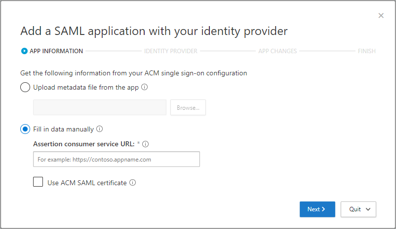
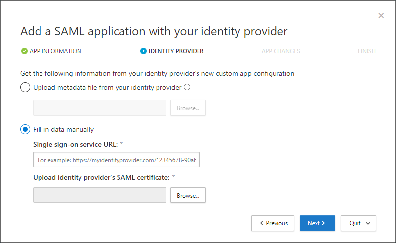
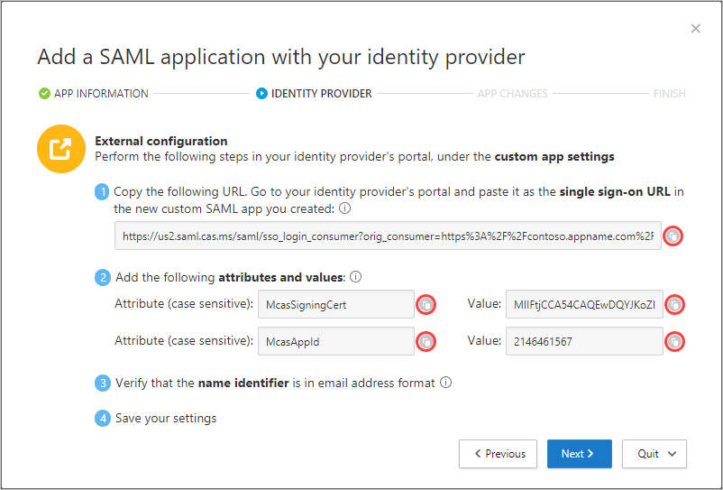
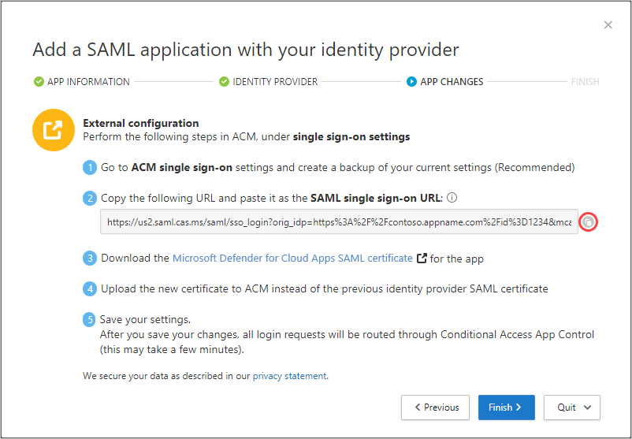
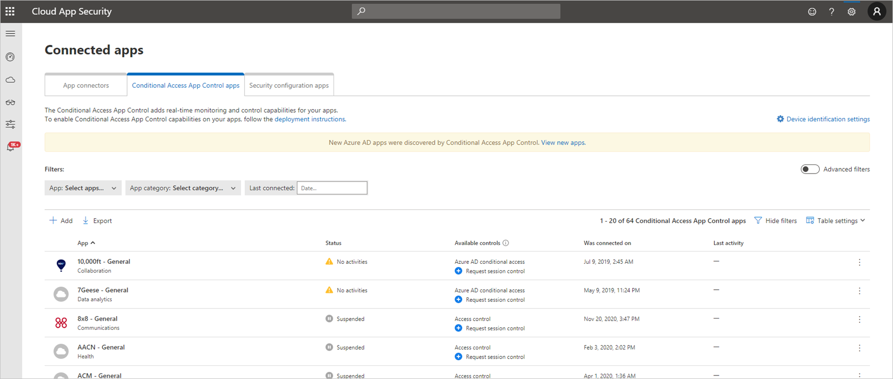
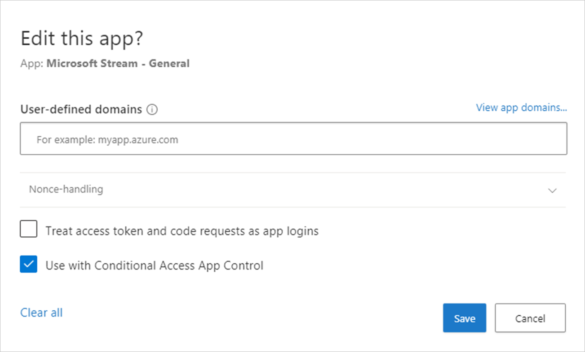

# Classic portal: Deploy Conditional Access App Control for custom apps with non-Microsoft identity providers

[!INCLUDE [Banner for top of topics](includes/classic-banner.md)]

Session controls in Microsoft Defender for Cloud Apps can be configured to work with any web apps. This article describes how to onboard and deploy custom line-of-business apps, non-featured SaaS apps, and on-premises apps hosted via the Microsoft Entra application proxy with session controls. It provides steps to route app sessions from other IdP solutions to Defender for Cloud Apps. For Microsoft Entra ID, see [Deploy Conditional Access App Control for custom apps using Microsoft Entra ID](classic-proxy-deployment-any-app.md).

Access and session controls in Microsoft Defender for Cloud Apps work with applications from the Cloud app catalog and with custom applications.

[!INCLUDE [classic-pre-onboarded-apps](includes/classic-pre-onboarded-apps.md)]

## Prerequisites

### Add admins to the app onboarding/maintenance list

1. In the menu bar of Defender for Cloud Apps, select the settings cog  and select **Settings**.

1. Under **Conditional Access App Control**, select **App onboarding/maintenance**.

1. Enter the user principal name or email for the users that will be onboarding the app, and then select **Save**.

    

### Check for necessary licenses

- Your organization must have the following licenses to use Conditional Access App Control:

  - The license required by your identity provider (IdP) solution
  - Microsoft Defender for Cloud Apps

- Apps must be configured with single sign-on
- Apps must use the following authentication protocols:

    |IdP|Protocols|
    |---|---|
    |Other|SAML 2.0|

## To deploy any app

Follow these steps to configure any app to be controlled by Defender for Cloud Apps Conditional Access App Control.

1. **[Configure your IdP to work with Defender for Cloud Apps](#step-1-configure-your-idp-to-work-with-defender-for-cloud-apps)**

1. **[Configure the app that you are deploying](#conf-app)**

1. **[Verify that the app is working correctly](#verify-app)**

1. **[Enable the app for use in your organization](#enable-app)**

> [!NOTE]
> To deploy Conditional Access App Control for Microsoft Entra apps, you need a valid [license for Microsoft Entra ID P1 or higher](/azure/active-directory/license-users-groups) as well as a Defender for Cloud Apps license.

## Step 1: Configure your IdP to work with Defender for Cloud Apps

> [!NOTE]
> For examples of how to configure IdP solutions, see:
>
> - [Configure your PingOne IdP](proxy-idp-pingone.md)
> - [Configure your AD FS IdP](proxy-idp-adfs.md)
> - [Configure your Okta IdP](proxy-idp-okta.md)

1. In Defender for Cloud Apps, browse to **Investigate** > **Connected apps** > **Conditional Access App Control apps**.

1. Select the plus sign (**+**), and in the pop-up, select the app you want to deploy, and then select **Start Wizard**.
1. On the **APP INFORMATION** page, fill out the form using the information from your app's single sign-on configuration page, and then select **Next**.
    - If your IdP provides a single sign-on metadata file for the selected app, select **Upload metadata file from the app** and upload the metadata file.
    - Or, select **Fill in data manually** and provide the following information:
        - **Assertion consumer service URL**
        - If your app provides a SAML certificate, select **Use <app_name> SAML certificate** and upload the certificate file.

    

1. On the **IDENTITY PROVIDER** page, use the provided steps to set up a new application in your IdP's portal, and then select **Next**.
    1. Go to your IdP's portal and create a new custom SAML app.
    1. Copy the single sign-on configuration of the existing `<app_name>` app to the new custom app.
    1. Assign users to the new custom app.
    1. Copy the apps single sign-on configuration information. You'll need it in the next step.

    

    > [!NOTE]
    > These steps may differ slightly depending on your identity provider. This step is recommended for the following reasons:
    >
    > - Some identity providers do not allow you to change the SAML attributes or URL properties of a gallery app
    > - Configuring a custom app enables you to test this application with access and session controls without changing the existing behavior for your organization.

1. On the next page, fill out the form using the information from your app's single sign-on configuration page, and then select **Next**.
    - If your IdP provides a single sign-on metadata file for the selected app, select **Upload metadata file from the app** and upload the metadata file.
    - Or, select **Fill in data manually** and provide the following information:
        - **Assertion consumer service URL**
        - If your app provides a SAML certificate, select **Use <app_name> SAML certificate** and upload the certificate file.

    

1. On the next page, copy the following information, and then select **Next**. You'll need the information in the next step.

    - Single sign-on URL
    - Attributes and values

    

1. In your IdP's portal, do the following:
    > [!NOTE]
    > The settings are commonly found in IdP portal's custom app settings page.

    1. **Recommended** - Create a backup of your current settings.
    1. Replace the single sign-on URL field value with the Defender for Cloud Apps SAML single sign-on URL you noted earlier.
        > [!NOTE]
        > Some providers may refer to the single sign-on URL as the *Reply URL*.
    1. Add the attributes and values you made a note of earlier to the app's properties.
        > [!NOTE]
        >
        > - Some providers may refer to them as *User attributes* or *Claims*.
        > - When creating a new SAML app, the Okta Identity Provider limits attributes to 1024 characters. To mitigate this limitation, first create the app without the relevant attributes. After creating the app, edit it, and then add the relevant attributes.

    1. Verify that the name identifier is in the email address format.
    1. Save your settings.
1. On the **APP CHANGES** page, do the following, and then select **Next**. You'll need the information in the next step.

    - Copy the Single sign-on URL
    - Download the Defender for Cloud Apps SAML certificate

    

1. In your app's portal, on the single sign-on settings, do the following:
    1. **Recommended** - Create a backup of your current settings.
    1. In the single sign-on URL field, enter the Defender for Cloud Apps single sign-on URL you made a note of earlier.
    1. Upload the Defender for Cloud Apps SAML certificate you downloaded earlier.
    > [!NOTE]
    >
    > - After saving your settings, all associated login requests to this app will be routed through Conditional Access App Control.
    > - The Defender for Cloud Apps SAML certificate is valid for one year. After it expires, a new certificate will need to be generated.

## Step 2: Add the app manually and install certificates, if necessary

Applications in the app catalog are automatically populated into the table under Connected Apps. Check that the app you want to deploy is recognized by navigating there.

1. In the menu bar of Defender for Cloud Apps, select the settings cog , and select the **Conditional Access App Control** tab to access a table of applications that can be configured with access and session policies.

    

1. Select the **App: Select apps…** dropdown menu to filter and search for the app you want to deploy.

    

1. If you don't see the app there, you'll have to manually add it.

### How to manually add an unidentified app

1. In the banner, select **View new apps**.

    

1. In the list of new apps, for each app that you're onboarding, select the **+** sign, and then select **Add**.

    > [!NOTE]
    > If an app does not appear in the Defender for Cloud Apps app catalog, it will appear in the dialog under unidentified apps along with the login URL. When you click the + sign for these apps, you can onboard the application as a custom app.

    

### To add domains for an app

Associating the correct domains to an app allows Defender for Cloud Apps to enforce policies and audit activities.

For example, if you've configured a policy that blocks downloading files for an associated domain, file downloads by the app from that domain will be blocked. However, file downloads by the app from domains not associated with the app won't be blocked and the action won't be audited in the activity log.
> [!NOTE]
> Defender for Cloud Apps still adds a suffix to domains not associated with the app to ensure a seamless user experience.

1. From within the app, on the Defender for Cloud Apps admin toolbar, select **Discovered domains**.
    > [!NOTE]
    > The admin toolbar is only visible to users with permissions to onboard or maintenance apps.
1. In the Discovered domains panel, make a note of domain names or export the list as a .csv file.
    > [!NOTE]
    > The panel displays a list of discovered domains that are not associated in the app. The domain names are fully qualified.
1. Go to Defender for Cloud Apps, in the menu bar, select the settings cog  and select **Conditional Access App Control**.
1. In the list of apps, on the row in which the app you're deploying appears, choose the three dots at the end of the row, and then under **APP DETAILS**, choose **Edit**.
    > [!TIP]
    > To view the list of domains configured in the app, select **View app domains**.
1. In **User-defined domains**, enter all the domains you want to associate with this app, and then select **Save**.
    > [!NOTE]
    > You can use the * wildcard character as a placeholder for any character. When adding domains, decide whether you want to add specific domains (`sub1.contoso.com`,`sub2.contoso.com`) or multiple domains (`*.contoso.com`).

### Install root certificates

1. Repeat the following steps to install the **Current CA** and **Next CA** self-signed root certificates.
    1. Select the certificate.
    1. Select **Open**, and when prompted select **Open** again.
    1. Select **Install certificate**.
    1. Choose either **Current User** or **Local Machine**.
    1. Select **Place all certificates in the following store** and then select **Browse**.
    1. Select **Trusted Root Certificate Authorities** and then select **OK**.
    1. Select **Finish**.

    > [!NOTE]
    > For the certificates to be recognized, once you have installed the certificate, you must restart the browser and go to the same page.

1. Select **Continue**.
1. Check that the application is available in the table.

    

## Step 3: Verify that the app is working correctly

To verify that the application is being proxied, first perform either a hard sign-out of browsers associated with the application or open a new browser with incognito mode.

Open the application and perform the following checks:

- Check that the URL contains the `.mcas` suffix
- Visit all pages within the app that are part of a user's work process and verify that the pages render correctly.
- Verify that the behavior and functionality of the app isn't adversely affected by performing common actions such as downloading and uploading files.
- Review the list of domains associated with the app. For more information, see [Add the domains for the app](#add-domains).

If you encounter errors or issues, use the admin toolbar to gather resources such as `.har` files and recorded sessions for filing a support ticket.

## Step 4: Enable the app for use in your organization

Once you're ready to enable the app for use in your organization's production environment, do the following steps.

1. In Defender for Cloud Apps, select the settings cog , and then select **Conditional Access App Control**.
1. In the list of apps, on the row in which the app you're deploying appears, choose the three dots at the end of the row, and then choose **Edit app**.
1. Select **Use with Conditional Access App Control** and then select **Save**.

    

## Next steps

> [!div class="nextstepaction"]
> [« PREVIOUS: Deploy Conditional Access App Control for catalog apps](classic-proxy-deployment-aad.md)

> [!div class="nextstepaction"]
> [NEXT: How to create a session policy »](session-policy-aad.md)

## See also

> [!div class="nextstepaction"]
> [Introduction to Conditional Access App Control](proxy-intro-aad.md)

> [!div class="nextstepaction"]
> [Troubleshooting access and session controls](troubleshooting-proxy.md)

[!INCLUDE [Open support ticket](includes/classic-support.md)]
