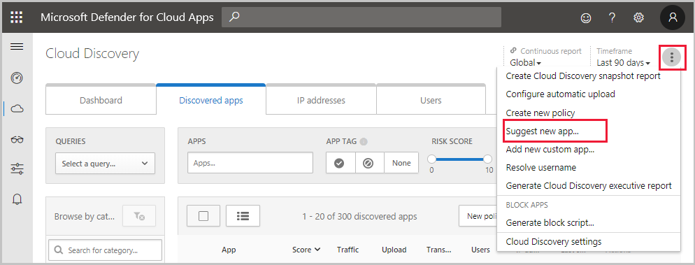
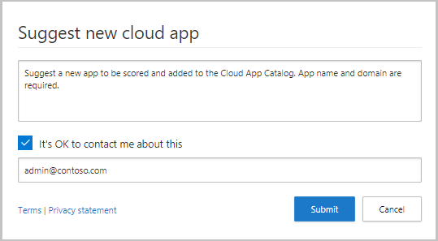
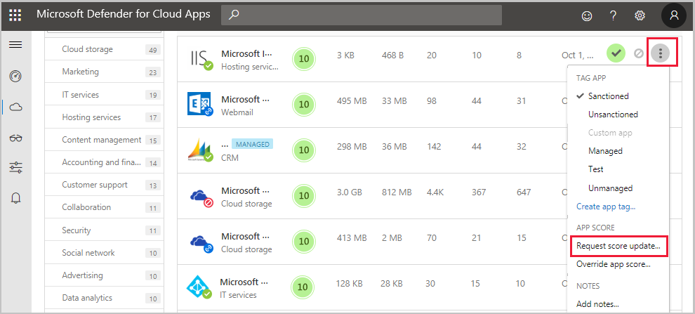
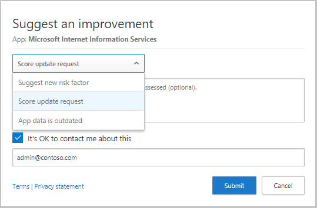
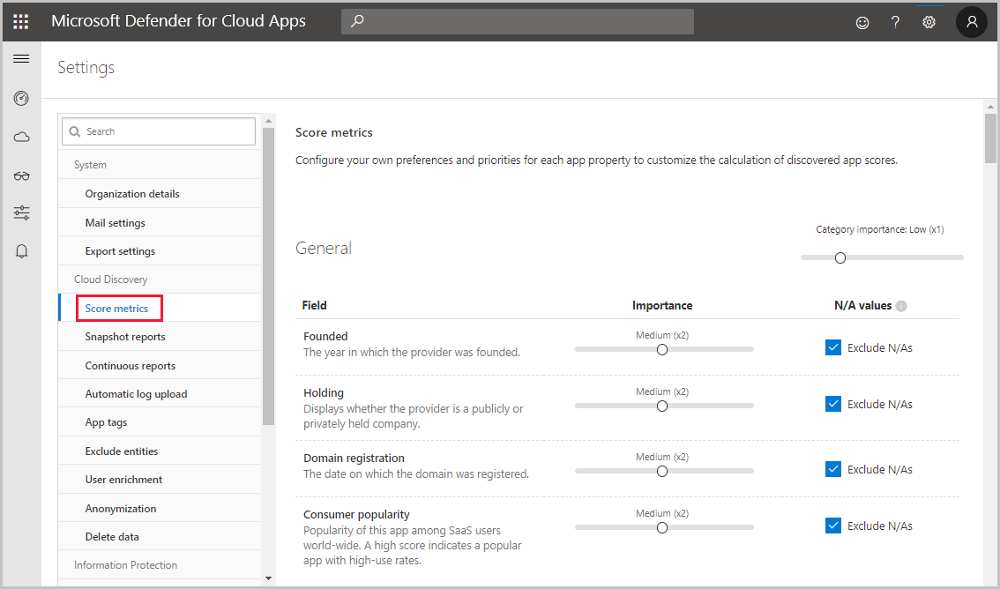

# Classic portal: Working with the risk score

[!INCLUDE [Banner for top of topics](includes/classic-banner.md)]

The Cloud App Catalog gives you a full picture of what Cloud Discovery identifies. Cloud Discovery analyzes your traffic logs against the Microsoft Defender for Cloud Apps cloud app catalog of over 31,000 cloud apps. The apps are ranked and scored based on more than 90 risk factors to provide you with ongoing visibility into cloud use, Shadow IT, and the risk Shadow IT poses to your organization. This article provides instructions for how to use and customize the Defender for Cloud Apps app risk score.

## The Cloud App Catalog

The **Cloud app catalog** rates risk for your cloud apps based on regulatory certification, industry standards, and best practices. Four complementary processes run in the Cloud app catalog to keep it up-to-date:

1. Automated data extraction directly from the cloud app. The extraction is for attributes such as SOC 2 compliance, terms of service, sign-in URL, privacy policy, and HQ location.
2. Automated advanced data extraction for data by the Defender for Cloud Apps algorithms (for attributes such as HTTP security headers).
3. Continuous analysis by the Defender for Cloud Apps cloud analyst team (for attributes such as encryption at rest).
4. Customer-based revision requests, based on customer submission requests for changes to the Cloud app catalog. All requests are reviewed by our cloud analyst team and updated based on their findings.

The demand by business units for cloud apps as a solution to their changing needs is growing. The Cloud app catalog enables you to wisely choose which apps fit your organization's security requirements. The catalog keeps you up-to-date with the latest security standards, vulnerabilities, and breaches.

For example, say you want to compare CRM apps and make sure they're adequately secured. You can use the Cloud app catalog page to filter for relevant apps you want:

1. In the **Cloud app catalog** page, under **Browse by category** select **CRM**.
2. Use the **Advanced** filters and set **Compliance risk factor** for **SOC 2** equals **True**.
3. Set **Compliance risk factor** for **ISO 27001** equals **True**.
4. Select **Security risk factor** for **Data-at-rest-encryption** doesn't equal **Not supported** and **N/A**.
5. Set **Security risk factor** for **Admin audit trail** equals **True**.
6. Select **Security risk factor** for **User audit trail** equals **True**.

After the results are filtered, you can review the relevant apps and find the one that best fits your needs.

## Cloud App Catalog filters

There are basic and advanced Cloud App Catalog filters. To build a complex filter, use the advanced option, which includes all of the following filters:

- **App tags**: Tags enable you to customize the Cloud App Catalog. You can select from either **Sanctioned**, **Unsanctioned**, or create custom tags for apps. These tags can then be used as filters. Filters are useful for deeper diving into specific types of apps that you want to investigate.
- **Apps and domains**: Enables you to search for specific apps or apps used in specific domains.
- **Categories**: The categories filter, which is located on the left of the page, enables you to search for types of apps according to app categories. For example Social network apps, Cloud storage apps, and more types of apps. You can select more than one category at a time or a single category. Then, apply the basic or advanced filters on top of the categories.
- **Compliance risk factor**: Lets you search for a specific standards, certification, and compliance that the app may comply with. Examples include HIPAA, ISO 27001, SOC 2, and PCI-DSS.
- **General risk factor**: Lets you search for general risk factors such as consumer popularity, data center locale, and more.
- **Legal risk factor**: Lets you filter based on all the regulations and policies that are in-place. Using legal risk factors helps ensure data protection and privacy of the app's users, such as GDPR, DMCA, and data retention policy.
- **Risk score**: Lets you filter apps by risk score that you can focus on. For example, reviewing only risky apps.
- **Security risk factor**: Enables you to filter based on specific security measures. Measures include encryption at rest, multi-factor authentication, and others.

## Suggesting a change

If you find a new app in your environment that hasn't been scored by Defender for Cloud Apps, you can request a review of the app. You can also request a review for a new risk factor, a score update, or app data that is outdated.

**To suggest a new app:**

1. At the top of the **Discovered apps** page, select the three dots and then choose **Suggest new app**.

    

2. In the **Suggest new cloud app** pop-up, fill in details about the new app. Include the name and domain of the app.

    

3. We recommend selecting the checkbox to enable Defender for Cloud Apps analysts to contact you in case additional information about the app is needed.

**To update a risk factor, score, or update app data:**

1. In the **Cloud App Catalog** page, in the app row you want to update, select the three dots at the end of the row and choose **Request score update**.

    

2. In the **Suggest an improvement** pop-up, select whether you want to request a score update, suggest a new risk factor or update app data.

    

3. We recommend selecting the checkbox to enable Defender for Cloud Apps analysts to contact you in case additional information about the app is needed. Filling in contact information allows you to be updated when the analysis is complete.

## Customizing the risk score

Cloud Discovery provides you with important data regarding the credibility and reliability of the cloud apps that are used across the environment. Within the portal, each discovered app is displayed along with a total score. The score represents the Defender for Cloud Apps assessment of this particular app's maturity of use for enterprises. The total score of any given app is a weighted average of four subscores relating to the four subcategories which Defender for Cloud Apps considers when assessing reliability:

- **General** - This category refers to basic facts about the company that produces the app, including its domain, founding year, and popularity. These fields are meant to show the company's stability on the most basic level.

- **Security** - The security category accounts for all standards dealing with the physical security of the data used by the discovered app. This category includes fields such as multi-factor authentication, encryption, data classification, and data ownership.

- **Compliance** - This category displays which common best-practice compliance standards are upheld by the company that produces the app. The list of specifications includes standards such as HIPAA, CSA, and PCI-DSS.

- **Legal** - This category displays which apps have which regulations and policies in-place to ensure data protection and privacy of the app's users such as GDPR, DMCA, and data retention policy.

Each of the categories is composed of many specific properties. According to the Defender for Cloud Apps scoring algorithm, each property receives a preliminary score between 0 and 10, depending on the value. True/False values will receive 10 or 0 accordingly. However, continuous properties, such as domain age, will receive a certain value within the spectrum. The score of each property is weighted against all other existing fields in the category to create the category's subscore. If you encounter an unscored app, it usually indicates an app whose properties are unknown and is therefore unscored.

It's important to take a minute to review and modify the default weights given to the Cloud Discovery score configuration. By default, all the various parameters evaluated are given equal weight. If there are certain parameters that are more or less important to your organization, it's important to change them as follows:

1. In the portal, under the settings icon, select **Settings**.

2. Under **Cloud Discovery**, select **Score metrics**. Slide the **Importance** to change the weight of the field or the risk category. Importance can be set to **Ignored**, **Low**, **Medium**, **High**, or **Very High**.

3. Additionally, you can set whether certain values are either not available or not applicable in the score calculation. When included, N/A values have a negative contribution to the calculated score.

    

All the information needed to understand how the Defender for Cloud Apps risk scores are stacking up is available in the Defender for Cloud Apps portal. To better understand a risk factor's weight in a specific risk category, use the "i" button to the right of each field name in the app's profile. This provides information about how exactly Defender for Cloud Apps scores a specific risk factor. The score is the value of the risk factor on a scale of 1-10 + its weight in the risk category:

To understand a risk category's weight in an app's total score, hover over the risk category score:

## Overriding the risk score

To override the risk score, in the **Discovered apps** table or in the **Cloud app catalog**, select the three dots to the right of any app and choose **Override app score**.
You can override the risk score of an app without changing the way it's weighted so that you get immediate results for your organization. For example, The risk score of an LOB app you use is 8. However, the app is sanctioned and encouraged by your organization. You might want to change the risk score to 10 for the LOB app.

After you update the score, you can include app notes to make your business justification for modifying this app score clear to other administrators.

You can also add notes to make the justification of the change clear when anyone reviews the app.

## Next steps

> [!div class="nextstepaction"]
> [Daily activities to protect your cloud environment](classic-daily-activities-to-protect-your-cloud-environment.md)

[!INCLUDE [Open support ticket](includes/classic-support.md)]
