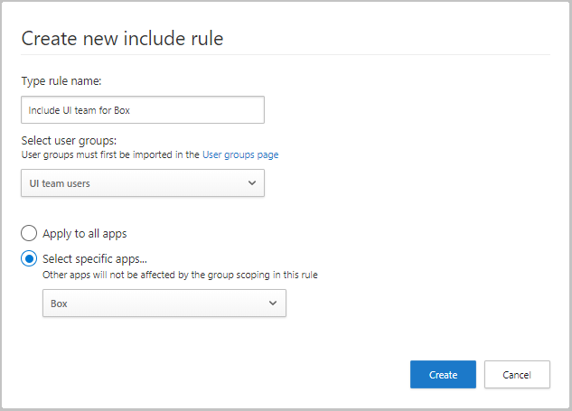

# Classic portal: Scoped deployment

[!INCLUDE [Banner for top of topics](includes/banner.md)]

Microsoft Defender for Cloud Apps enables you to scope your deployment. Scoping allows you to select certain user groups to be monitored for apps or excluded from monitoring.

## Include or exclude user groups

You may not want to use Microsoft Defender for Cloud Apps for all the users in your organization. Scoping is especially useful when you want to limit your deployment because of license restrictions. You may also need to limit because of compliance regulations requiring you not monitor users from certain countries/regions. For example, use scoped deployment to only monitor US-based employees. Alternatively, you can avoid showing any activities for your users based in Germany.

- To scope your deployment, you must first [import user groups](user-groups.md) to Microsoft Defender for Cloud Apps. By default, you'll see the following groups:

  - **Application** user group -  A built-in group that enables you to see activities performed by Microsoft 365 and Azure AD applications.

  - **External users** group - All users who aren't members of any of the managed domains you configured for your organization.

- Setting an include rule will automatically exclude all groups not within the included group. For example, if you set a rule to include all members of the US-office groups, any groups who aren't part of that group won't be monitored.

- Excluded user groups override included user groups. Meaning that if you include the user group "UK-employees" but exclude "Marketing", marketing members from the UK won't be monitored even if they're members of the group **UK-employees**.

1. In the menu bar, select the settings cog and select **Scoped deployment**.

    

2. To scope your deployment to include or exclude specific groups, you must first [import user groups](user-groups.md) into Microsoft Defender for Cloud Apps.

3. To set specific groups to be monitored by Microsoft Defender for Cloud Apps, in the **Include** tab, select the plus icon.
    

4. In the **Create new include rule** dialog, do the following steps:

    1. Under **Type rule name**, give the rule a descriptive name.
    2. Under **Select user groups**, select all the groups you want to monitor with Defender for Cloud Apps.
    3. Select whether you want to apply this rule to all connected apps or only to **Specific apps**. If you select **Specific apps**, the rule will only affect monitoring of the apps you select. For example, if you select the group **UI team users** and **Box**, Defender for Cloud Apps will only monitor Box activity for users in your UI team users group and for all other apps, Defender for Cloud Apps will monitor all activities for all users.

        

5. To set specific groups to be excluded from monitoring, in the **Exclude** tab, select the plus icon.

   

6. In the **Create new Exclude rule** dialog, set the following parameters:

    1. Under **Type rule name**, give the rule a descriptive name.
    Under **Select user groups**, select all the groups you don't want Defender for Cloud Apps to monitor.
    2. Select whether you want to apply this rule to all connected apps or only to **Specific apps**. If you select **Specific apps**, Defender for Cloud Apps will stop monitoring the group you selected only for the apps you select. That means that if you select the group **UI team users** and **Active Directory**, Defender for Cloud Apps will monitor all user activity except Active Directory activities that are performed by UI team users.

       

## Example results for include and exclude rules

The include and exclude rules you create work together to scope the overall monitoring performed by Microsoft Defender for Cloud Apps. Here's an example of include and exclude rules you can create, and the final result of what Microsoft Defender for Cloud Apps monitors after these rules are running.

If you create the following rules:

- Exclude user group "Germany all users"
- Include for user group "Global sales" only Microsoft 365 activities
- Include for user group "Sales managers" only Power BI activities
- Salesforce is connected to Microsoft Defender for Cloud Apps and no rules are set for it

The following user activities are monitored:

|User|Group membership|Activities monitored|
|----|----|----|
|Adriana|Germany all users Global sales Sales managers|None|
|Alain|Global sales|Microsoft 365 and all subapps except Power BI|
|Cornel|Global sales Sales managers|Microsoft 365 and all subapps|
|Raymond|Sales managers|Power BI only|

> [!NOTE]
> Other apps will not be affected by the group scoping in these rules.
> In the example, for Salesforce, all activities are monitored for all user groups.

## Next steps

> [!div class="nextstepaction"]
> [Set up Cloud Discovery](set-up-cloud-discovery.md)

[!INCLUDE [Open support ticket](includes/support.md)]  
