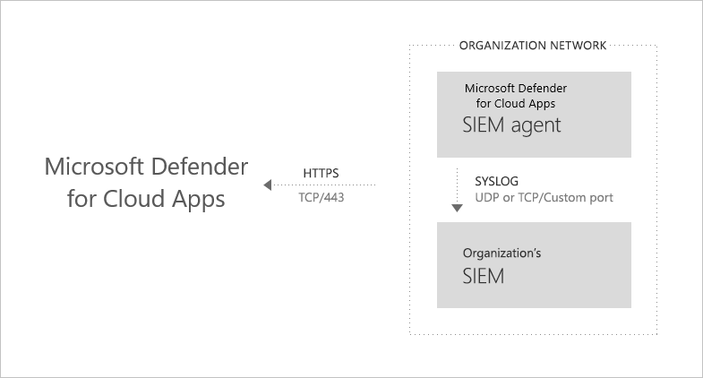
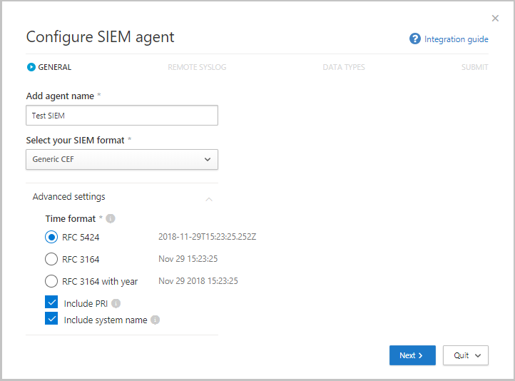
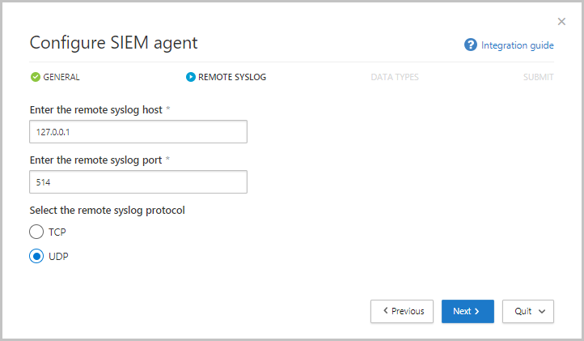
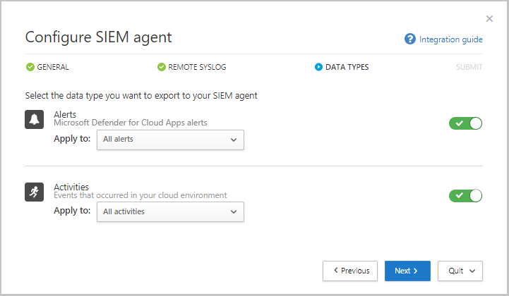
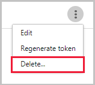

# Classic portal: Generic SIEM integration

[!INCLUDE [Banner for top of topics](includes/banner.md)]

You can integrate Microsoft Defender for Cloud Apps with your generic SIEM server to enable centralized monitoring of alerts and activities from connected apps. As new activities and events are supported by connected apps, visibility into them is then rolled out into Microsoft Defender for Cloud Apps. Integrating with a SIEM service allows you to better protect your cloud applications while maintaining your usual security workflow, automating security procedures, and correlating between cloud-based and on-premises events. The Microsoft Defender for Cloud Apps SIEM agent runs on your server and pulls alerts and activities from Microsoft Defender for Cloud Apps and streams them into the SIEM server.

When you first integrate your SIEM with Defender for Cloud Apps, activities and alerts from the last two days will be forwarded to the SIEM and all activities and alerts (based on the filter you select) from then on. If you disable this feature for an extended period, then re-enable, the past two days of alerts and activities are forwarded and then all alerts and activities from then on.

Additional integration solutions include:

* **Microsoft Sentinel** - A scalable, cloud-native SIEM and SOAR for native integration. For information about integrating with Microsoft Sentinel, see [Microsoft Sentinel integration](siem-sentinel.md).
* **Microsoft security graph API** - An intermediary service (or broker) that provides a single programmatic interface to connect multiple security providers. For more information, see [Security solution integrations using the Microsoft Graph Security API](/graph/security-integration#list-of-connectors-from-microsoft).

> [!IMPORTANT]
> If you are integrating Microsoft Defender for Identity in Defender for Cloud Apps and both services are configured to send alert notifications to a SIEM, you'll start to receive duplicate SIEM notifications for the same alert. One alert will be issued from each service and they will have different alert IDs. To avoid duplication and confusion, make sure to handle the scenario. For example, decide where you intend to perform alert management, and then stop SIEM notifications being sent from the other service.

## Generic SIEM integration architecture

The SIEM agent is deployed in your organization's network. When deployed and configured, it pulls the data types that were configured (alerts and activities) using Defender for Cloud Apps RESTful APIs.
The traffic is then sent over an encrypted HTTPS channel on port 443.

Once the SIEM agent retrieves the data from Defender for Cloud Apps, it sends the Syslog messages to your local SIEM. Defender for Cloud Apps uses the network configurations you provided during the setup (TCP or UDP with a custom port).

## Supported SIEMs

Defender for Cloud Apps currently supports Micro Focus ArcSight and generic CEF.

## How to integrate

Integrating with your SIEM is accomplished in three steps:

1. Set it up in the Defender for Cloud Apps portal.
2. Download the JAR file and run it on your server.
3. Validate that the SIEM agent is working.

### Prerequisites

* A standard Windows or Linux server (can be a virtual machine).
* OS: Windows or Linux
* CPU: 2
* Disk space: 20 GB
* RAM: 2 GB
* The server must be running Java 8. Earlier versions aren't supported.
* Transport Layer Security (TLS) 1.2+. Earlier versions aren't supported.
* Set your firewall as described in [Network requirements](network-requirements.md)

## Integrating with your SIEM

### Step 1: Set it up in the Defender for Cloud Apps portal

1. In the [Defender for Cloud Apps portal](https://portal.cloudappsecurity.com/), under the **Settings** cog, select **Security extensions**.

1. On the **SIEM agents** tab, select "add" (**+**), and then choose **Generic SIEM**.

    

1. In the wizard, select **Start Wizard**.
1. In the wizard, fill in a name, and **Select your SIEM format** and set any **Advanced settings** that are relevant to that format. Select **Next**.

    

1. Type in the IP address or hostname of the **Remote syslog host** and the **Syslog port number**. Select TCP or UDP as the Remote Syslog protocol.
    You can work with your security admin to get these details if you don't have them. Select **Next**.

    

1. Select which data types you want to export to your SIEM server for **Alerts** and **Activities**. Use the slider to enable and disable them, by default, everything is selected. You can use the **Apply to** drop-down to set filters to send only specific alerts and activities to your SIEM server. Select **Edit and preview results** to check that the filter works as expected. Select **Next**.

   

1. Copy the token and save it for later.
    Select **Finish** and leave the Wizard. Go back to the SIEM page to see the SIEM agent you added in the table. It will show that it's **Created** until it's connected later.

> [!NOTE]
> Any token you create is bound to the admin who created it. This means that if the admin user is removed from Defender for Cloud Apps, the token will no longer be valid. A generic SIEM token provides read-only permissions to the only required resources. No other permissions are granted a part of this token.

### Step 2: Download the JAR file and run it on your server

1. In the [Microsoft Download Center](https://go.microsoft.com/fwlink/?linkid=838596), after accepting the [software license terms](https://go.microsoft.com/fwlink/?linkid=862491), download the .zip file and unzip it.

1. Run the extracted file on your server:

    `java -jar mcas-siemagent-0.87.20-signed.jar [--logsDirectory DIRNAME] [--proxy ADDRESS[:PORT]] --token TOKEN`

> [!NOTE]
>
> * The file name may differ depending on the version of the SIEM agent.
> * Parameters in brackets [  ] are optional, and should be used only if relevant.
> * It is recommended to run the JAR during server startup.
>   * Windows: Run as a scheduled task and make sure that you configure the task to **Run whether the user is logged on or not** and that you uncheck the **Stop the task if it runs longer than** checkbox.
>   * Linux: Add the run command with an **&** to the rc.local file. For example: `java -jar mcas-siemagent-0.87.20-signed.jar [--logsDirectory DIRNAME] [--proxy ADDRESS[:PORT]] --token TOKEN &`

Where the following variables are used:

* DIRNAME is the path to the directory you want to use for local agent debug logs.
* ADDRESS[:PORT] is the proxy server address and port that the server uses to connect to the internet.
* TOKEN is the SIEM agent token you copied in the previous step.

You can type -h at any time to get help.

#### Sample activity logs

The following are sample activity logs sent to your SIEM:

>`2017-11-22T17:50:04.000Z CEF:0|MCAS|SIEM_Agent|0.111.85|EVENT_CATEGORY_LOGOUT|Log out|0|externalId=1511373015679_167ae3eb-ed33-454a-b548-c2ed6cea6ef0 rt=1511373004000 start=1511373004000 end=1511373004000 msg=Log out suser=admin@contoso.com destinationServiceName=ServiceNow dvc=13.82.149.151 requestClientApplication= cs1Label=portalURL cs1=https://contoso.portal.cloudappsecurity.com/#/audits?activity.id\=eq(1511373015679_167ae3eb-ed33-454a-b548-c2ed6cea6ef0,) cs2Label=uniqueServiceAppIds cs2=APPID_SERVICENOW cs3Label=targetObjects cs3=admin@contoso.com,admin@contoso.com,admin@contoso.com cs4Label=policyIDs cs4= c6a1Label="Device IPv6 Address" c6a1=`
>
>`2017-11-28T19:40:15.000Z CEF:0|MCAS|SIEM_Agent|0.112.68|EVENT_CATEGORY_VIEW_REPORT|View report|0|externalId=1511898027370_e272cd5f-31a3-48e3-8a6a-0490c042950a rt=1511898015000 start=1511898015000 end=1511898015000 msg=View report: ServiceNow Report 23 suser=admin@contoso.com destinationServiceName=ServiceNow dvc= requestClientApplication= cs1Label=portalURL cs1=https://contoso.portal.cloudappsecurity.com/#/audits?activity.id\=eq(1511898027370_e272cd5f-31a3-48e3-8a6a-0490c042950a,) cs2Label=uniqueServiceAppIds cs2=APPID_SERVICENOW cs3Label=targetObjects cs3=23,sys_report,admin@contoso.com,admin@contoso.com,admin@contoso.com cs4Label=policyIDs cs4= c6a1Label="Device IPv6 Address" c6a1=`
>
>`2017-11-28T19:25:34.000Z CEF:0|MCAS|SIEM_Agent|0.112.68|EVENT_CATEGORY_DELETE_OBJECT|Delete object|0|externalId=1511897141625_7558b33f-218c-40ff-be5d-47d2bdd6b798 rt=1511897134000 start=1511897134000 end=1511897134000 msg=Delete object: ServiceNow Object f5122008db360300906ff34ebf96198a suser=admin@contoso.com destinationServiceName=ServiceNow dvc= requestClientApplication= cs1Label=portalURL cs1=https://contoso.portal.cloudappsecurity.com/#/audits?activity.id\=eq(1511897141625_7558b33f-218c-40ff-be5d-47d2bdd6b798,) cs2Label=uniqueServiceAppIds cs2=APPID_SERVICENOW cs3Label=targetObjects cs3=,,admin@contoso.com,admin@contoso.com,admin@contoso.com cs4Label=policyIDs cs4= c6a1Label="Device IPv6 Address" c6a1=`
>
>`2017-11-27T20:40:14.000Z CEF:0|MCAS|SIEM_Agent|0.112.49|EVENT_CATEGORY_CREATE_USER|Create user|0|externalId=1511815215873_824f8f8d-2ecd-439b-98b1-99a1adf7ba1c rt=1511815214000 start=1511815214000 end=1511815214000 msg=Create user: user 747518c0db360300906ff34ebf96197c suser=admin@contoso.com destinationServiceName=ServiceNow dvc= requestClientApplication= cs1Label=portalURL cs1=https://contoso.portal.cloudappsecurity.com/#/audits?activity.id\=eq(1511815215873_824f8f8d-2ecd-439b-98b1-99a1adf7ba1c,) cs2Label=uniqueServiceAppIds cs2=APPID_SERVICENOW cs3Label=targetObjects cs3=,747518c0db360300906ff34ebf96197c,sys_user,admin@contoso.com,admin@contoso.com,admin@contoso.com cs4Label=policyIDs cs4= c6a1Label="Device IPv6 Address" c6a1=`
>
>`2017-11-27T20:41:20.000Z CEF:0|MCAS|SIEM_Agent|0.112.49|EVENT_CATEGORY_DELETE_USER|Delete user|0|externalId=1511815287798_bcf60601-ecef-4207-beda-3d2b8d87d383 rt=1511815280000 start=1511815280000 end=1511815280000 msg=Delete user: user 233490c0db360300906ff34ebf9619ef suser=admin@contoso.com destinationServiceName=ServiceNow dvc= requestClientApplication= cs1Label=portalURL cs1=https://contoso.portal.cloudappsecurity.com/#/audits?activity.id\=eq(1511815287798_bcf60601-ecef-4207-beda-3d2b8d87d383,) cs2Label=uniqueServiceAppIds cs2=APPID_SERVICENOW cs3Label=targetObjects cs3=,233490c0db360300906ff34ebf9619ef,,admin@contoso.com,admin@contoso.com,admin@contoso.com cs4Label=policyIDs cs4= c6a1Label="Device IPv6 Address" c6a1=`
>
>`2017-11-28T19:24:55.000Z LAB-EUW-ARCTEST CEF:0|MCAS|SIEM_Agent|0.112.68|EVENT_CATEGORY_DELETE_OBJECT|Delete object|0|externalId=1511897117617_5be018ee-f676-4473-a9b5-5982527409be rt=1511897095000 start=1511897095000 end=1511897095000 msg=Delete object: ServiceNow Object b1709c40db360300906ff34ebf961923 suser=admin@contoso.com destinationServiceName=ServiceNow dvc= requestClientApplication= cs1Label=portalURL cs1=https://contoso.portal.cloudappsecurity.com/#/audits?activity.id\=eq(1511897117617_5be018ee-f676-4473-a9b5-5982527409be,) cs2Label=uniqueServiceAppIds cs2=APPID_SERVICENOW cs3Label=targetObjects cs3=,,admin@contoso.com,admin@contoso.com,admin@contoso.com cs4Label=policyIDs cs4= c6a1Label="Device IPv6 Address" c6a1=`

The following text is an alerts logfile example:

>`2017-07-15T20:42:30.531Z CEF:0|MCAS|SIEM_Agent|0.102.17|ALERT_CABINET_EVENT_MATCH_AUDIT|myPolicy|3|externalId=596a7e360c204203a335a3fb start=1500151350531 end=1500151350531 msg=Activity policy ''myPolicy'' was triggered by ''admin@box-contoso.com'' suser=admin@box-contoso.com destinationServiceName=Box cn1Label=riskScore cn1= cs1Label=portalURL cs1=https://cloud-app-security.com/#/alerts/596a7e360c204203a335a3fb cs2Label=uniqueServiceAppIds cs2=APPID_BOX cs3Label=relatedAudits cs3=1500151288183_acc891bf-33e1-424b-a021-0d4370789660 cs4Label=policyIDs cs4=59f0ab82f797fa0681e9b1c7`
>
>`2017-07-16T09:36:26.550Z CEF:0|MCAS|SIEM_Agent|0.102.17|ALERT_CABINET_EVENT_MATCH_AUDIT|test-activity-policy|3|externalId=596b339b0c204203a33a51ae start=1500197786550 end=1500197786550 msg=Activity policy ''test-activity-policy'' was triggered by ''user@contoso.com'' suser=user@contoso.com destinationServiceName=Salesforce cn1Label=riskScore cn1= cs1Label=portalURL cs1=https://cloud-app-security.com/#/alerts/596b339b0c204203a33a51ae cs2Label=uniqueServiceAppIds cs2=APPID_SALESFORCE cs3Label=relatedAudits cs3=1500197720691_b7f6317c-b8de-476a-bc8f-dfa570e00349 cs4Label=policyIDs cs4=`
>
>`2017-07-16T09:17:03.361Z CEF:0|MCAS|SIEM_Agent|0.102.17|ALERT_CABINET_EVENT_MATCH_AUDIT|test-activity-policy3|3|externalId=596b2fd70c204203a33a3eeb start=1500196623361 end=1500196623361 msg=Activity policy ''test-activity-policy3'' was triggered by ''admin@contoso.com'' suser=admin@contoso.com destinationServiceName=Microsoft 365 cn1Label=riskScore cn1= cs1Label=portalURL cs1=https://cloud-app-security.com/#/alerts/596b2fd70c204203a33a3eeb cs2Label=uniqueServiceAppIds cs2=APPID_O365 cs3Label=relatedAudits cs3=1500196549157_a0e01f8a-e29a-43ae-8599-783c1c11597d cs4Label=policyIDs cs4=`
>
>`2017-07-16T09:17:15.426Z CEF:0|MCAS|SIEM_Agent|0.102.17|ALERT_CABINET_EVENT_MATCH_AUDIT|test-activity-policy|3|externalId=596b2fd70c204203a33a3eec start=1500196635426 end=1500196635426 msg=Activity policy ''test-activity-policy'' was triggered by ''admin@contoso.com'' suser=admin@contoso.com destinationServiceName=Microsoft 365 admin center cn1Label=riskScore cn1= cs1Label=portalURL cs1=https://cloud-app-security.com/#/alerts/596b2fd70c204203a33a3eec cs2Label=uniqueServiceAppIds cs2=APPID_O365_PORTAL cs3Label=relatedAudits cs3=1500196557398_3e102b20-d9fa-4f66-b550-8c7a403bb4d8 cs4Label=policyIDs cs4=59f0ab35f797fa9811e9b1c7`
>
>`2017-07-16T09:17:46.290Z CEF:0|MCAS|SIEM_Agent|0.102.17|ALERT_CABINET_EVENT_MATCH_AUDIT|test-activity-policy4|3|externalId=596b30200c204203a33a4765 start=1500196666290 end=1500196666290 msg=Activity policy ''test-activity-policy4'' was triggered by ''admin@contoso.com'' suser=admin@contoso.com destinationServiceName=Microsoft Exchange Online cn1Label=riskScore cn1= cs1Label=portalURL cs1=https://cloud-app-security.com/#/alerts/596b30200c204203a33a4765 cs2Label=uniqueServiceAppIds cs2=APPID_OUTLOOK cs3Label=relatedAudits cs3=1500196587034_a8673602-7e95-46d6-a1fe-c156c4709c5d cs4Label=policyIDs cs4=`
>
>`2017-07-16T09:41:04.369Z CEF:0|MCAS|SIEM_Agent|0.102.17|ALERT_CABINET_EVENT_MATCH_AUDIT|test-activity-policy2|3|externalId=596b34b10c204203a33a5240 start=1500198064369 end=1500198064369 msg=Activity policy ''test-activity-policy2'' was triggered by ''user2@test15-adallom.com'' suser=user2@test15-adallom.com destinationServiceName=Google cn1Label=riskScore cn1= cs1Label=portalURL cs1=https://cloud-app-security.com/#/alerts/596b34b10c204203a33a5240 cs2Label=uniqueServiceAppIds cs2=APPID_33626 cs3Label=relatedAudits cs3=1500197996117_fd71f265-1e46-4f04-b372-2e32ec874cd3 cs4Label=policyIDs cs4=`

#### Sample Defender for Cloud Apps alerts in CEF format

| Applicable to | CEF field name | Description |
| --- | --- | --- |
| Activities/Alerts | start | Activity or alert timestamp |
| Activities/Alerts | end | Activity or alert timestamp |
| Activities/Alerts | rt | Activity or alert timestamp |
| Activities/Alerts | msg | Activity or alert description as shown in the portal |
| Activities/Alerts | suser | Activity or alert subject user |
| Activities/Alerts | destinationServiceName | Activity or alert originating app, for example, Microsoft 365, Sharepoint, Box. |
| Activities/Alerts | cs\<X>Label | Each label has a different meaning, but the label itself explains it, for example, targetObjects. |
| Activities/Alerts | cs\<X> | The information corresponding to the label (the target user of the activity or alert as per the label example). |
| Activities | EVENT_CATEGORY_* | High-level category of the activity |
| Activities | \<ACTION> | The activity type, as displayed in the portal |
| Activities | externalId | Event ID |
| Activities | dvc | IP of the client device |
| Activities | requestClientApplication | User agent of the client device |
| Alerts | \<alert type> | For example, "ALERT_CABINET_EVENT_MATCH_AUDIT" |
| Alerts | \<name> | The matched policy name |
| Alerts | externalId | Alert ID |
| Alerts | src | IPv4 address of the client device |
| Alerts | c6a1 | IPv6 address of the client device |

### Step 3: Validate that the SIEM agent is working

1. Make sure the status of the SIEM agent in the Defender for Cloud Apps portal isn't **Connection error** or **Disconnected** and there are no agent notifications. It will show up as **Connection error** if the connection is down for more than two hours. The status shows as **Disconnected** if the connection is down for over 12 hours.
 

    Instead, the status should be connected, as seen here:
    

1. In your Syslog/SIEM server, make sure you see activities and alerts arriving from Defender for Cloud Apps.

## Regenerating your token

If you lose the token, you can always regenerate it by selecting the three dots at the end of the row for the SIEM agent in the table. Select **Regenerate token** to get a new token.

## Editing your SIEM agent

To edit the SIEM agent, select the three dots at the end of the row for the SIEM agent in the table, and select **Edit**. If you edit the SIEM agent, you don't need to rerun the .jar file, it updates automatically.

## Deleting your SIEM agent

To delete the SIEM agent, select the three dots at the end of the row for the SIEM agent in the table, and select **Delete**.

## Next steps

> [!div class="nextstepaction"]
> [Troubleshooting SIEM integration issues](troubleshooting-siem.md)

[!INCLUDE [Open support ticket](includes/support.md)]
