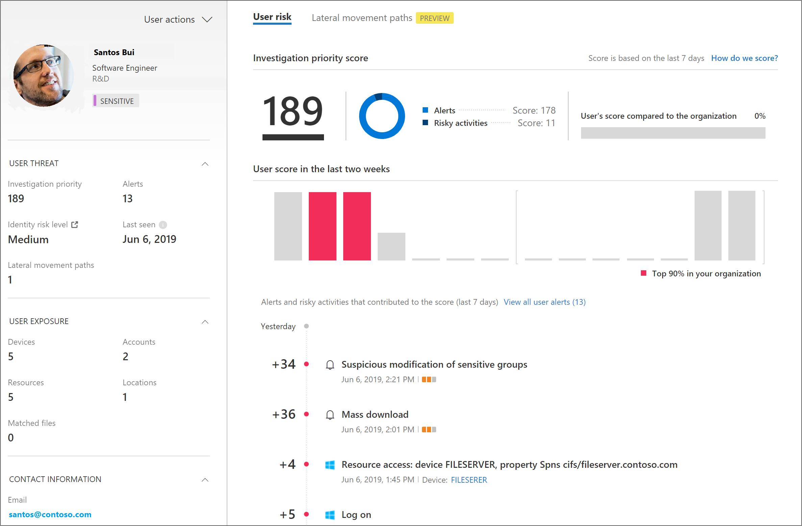
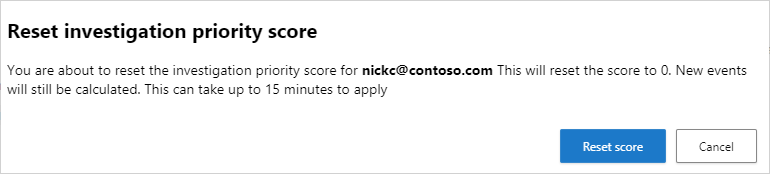

# Classic portal: Tutorial: Investigate risky users

[!INCLUDE [Banner for top of topics](includes/banner.md)]

Security operations teams are challenged to monitor user activity, suspicious or otherwise, across all dimensions of the identity attack surface, using multiple security solutions that often aren't connected. While many companies now have hunting teams to proactively identify threats in their environments, knowing what to look for across the vast amount of data can be a challenge. Microsoft Defender for Cloud Apps now simplifies this by taking away the need to create complex correlation rules, and lets you look for attacks that span across your cloud and on-premises network.

To help you focus on user identity, Microsoft Defender for Cloud Apps provides user entity behavioral analytics (UEBA) in the cloud. This can be extended to your on-premises environment by integrating with Microsoft Defender for Identity. After you integrate with Defender for Identity, you'll also gain context around user identity from its native integration with Active Directory.

Whether your trigger is an alert you see in the Defender for Cloud Apps dashboard, or whether you have information from a third-party security service, start your investigation from the Defender for Cloud Apps dashboard to deep dive into risky users.

In this tutorial, you'll learn how to use Defender for Cloud Apps to investigate risky users:

> [!div class="checklist"]
>
> - [Connect to the apps you want to protect](#connect-apps-protect)
> - [Identify top risky users](#identify)
> - [Further investigate users](#investigate)
> - [Protect your organization](#protect)

## Understand the investigation priority score

The investigation priority score is a score Defender for Cloud Apps gives to each user to let you know how risky a user is relative to other users in your organization.

Use the **Investigation priority score** to determine which users to investigate first. Defender for Cloud Apps builds user profiles for each user based on analytics that take time, peer groups, and expected user activity into consideration. Activity that is anomalous to a user's baseline is evaluated and scored. After scoring is complete, Microsoft's proprietary dynamic peer calculations and machine learning are run on the user activities to calculate the investigation priority for each user.

The **Investigation priority score** provides you with the ability to detect both malicious insiders, and external attackers moving laterally in your organizations, without having to rely on standard deterministic detections.

The investigation priority score is based on security alerts, abnormal activities, and potential business and asset impact related to each user to help you assess how urgent it is to investigate each specific user.

If you select the score value for an alert or an activity, you can view the evidence that explains how Defender for Cloud Apps scored the activity.

Every Azure AD user has a dynamic investigation priority score, that is constantly updated based on recent behavior and impact, built from data evaluated from Defender for Identity and Defender for Cloud Apps. You can now immediately understand who the real top risky users are, by filtering according to **Investigation priority score**, directly verify what their business impact is, and investigate all related activities – whether they're compromised, exfiltrating data, or acting as insider threats.

Defender for Cloud Apps uses the following to measure risk:

- **Alert scoring**  
The alert score represents the potential impact of a specific alert on each user. Alert scoring is based on severity, user impact, alert popularity across users, and all entities in the organization.

- **Activity scoring**  
The activity score determines the probability of a specific user performing a specific activity, based on behavioral learning of the user and their peers. Activities identified as the most abnormal receive the highest scores.

## Phase 1: Connect to the apps you want to protect

1. Connect at least one app to Microsoft Defender for Cloud Apps using the [API connectors](enable-instant-visibility-protection-and-governance-actions-for-your-apps.md). We recommend that you start by connecting [Microsoft 365](./connect-office-365.md).
1. Connect additional apps using the [proxy to achieve conditional access app control](proxy-deployment-aad.md).
1. To enable insights across your on-premises environment, configure Defender for Cloud Apps to [integrate with your Defender for Identity environment](mdi-integration.md).

## Phase 2: Identify top risky users

To identify who your riskiest users are in Defender for Cloud Apps:

1. Go to the Defender for Cloud Apps dashboard and look at the people identified in the **Top users by investigation priority** tile, and then one by one go to their user page to investigate them.  
The **investigation priority number**, found next to the user name, is a sum of all the user's risky activities over the last week.

   

1. Select a particular user to get to the **User** page.
    

1. Review the information in the User page to get an overview of the user and see if there are points at which the user  performed activities that were unusual for that user or were performed at an unusual time. The **User's score compared to the organization** represents which percentile the user is in based on their ranking in your organization - how high they are on the list of users you should investigate, relative to other users in your organization. The number will be red if a user is in or above the 90th percentile of risky users across your organization.  
The User page helps you answer the questions:
    - Who is the user?  
    Look at the left pane to get information about who the user is and what is known about them. This pane provides you with information about the user's role in your company and their department. Is the user a DevOps engineer who often performs unusual activities as part of their job? Is the user a disgruntled employee who just got passed over for a promotion?

    - Is the user risky?  
    Check out the top of the right pane so you know whether it's worth your while to investigate the user. What is the employee's [risk score](#risk-score)?
    - What's risk does the user present to your organization?  
    Look at the list in the bottom pane, which provides you with each activity and each alert related to the user to help you start understanding what type of risk the user represents. In the timeline, select each line so you can drill down deeper into the activity or alert itself. You can also select the number next to the activity so that you can understand the evidence that influenced the score itself.
    - What's the risk to other assets in your organization?  
    Select the **Lateral movement paths** tab to understand which paths an attacker can use to gain control of other assets in your organization. For example, even if the user you're investigating has a non-sensitive account, an attacker can use connections to the account to discover and attempt to compromise sensitive accounts in your network. For more information, see [Use Lateral Movement Paths](/defender-for-identity/investigate-lateral-movement-path).

  >[!NOTE]
  >It is important to remember that while the User page provides information for devices, resources, and accounts across all activities, the investigation priority score is the sum of all risky activities and alerts over the last 7 days.

### Reset user score

If the user was investigated and no suspicion for compromise was found, or for any reason you prefer to reset the user's investigation priority score, you can manually reset the score.

1. In the Defender for Cloud Apps dashboard, in the **Top users to investigate** tile, select the user you want to reset, or select **View all users to investigate**. Alternatively, under **Investigate** -> **Users and Accounts**, select the user with a value in the **Investigation priority** column.

    > [!NOTE]
    > Only users with a non-zero investigation priority score can be reset.

1. In the window that opens, select **View User page** in the upper right.

    

1. The user page will open in a new tab. Select the **Reset investigation priority score** link in the actions section in the top-right side of the page.

    

1. In the confirmation window, select **Reset score**.

    

## Phase 3: Further investigate users

When you investigate a user based on an alert or if you saw an alert in an external system, there may be activities that alone may not be cause for alarm, but when Defender for Cloud Apps aggregates them together with other activities, the alert may be an indication of a suspicious event.

When you investigate a user, you want to ask these questions about the activities and alerts you see:

- Is there a business justification for this employee to perform these activities? For example, if someone from Marketing is accessing the code base, or someone from Development accesses the Finance database, you should follow up with the employee to make sure this was an intentional and justified activity.

- Go to the **Activity log** to understand why this activity received a high score while others didn't. You can set the **Investigation priority** to **Is set** to understand which activities are suspicious. For example, you can filter based on Investigation priority for all activities that occurred in Ukraine. Then you can see whether there were other activities that were risky, where the user connected from, and you can easily pivot to other drill downs, such as recent non-anomalous cloud and on-prem activities, to continue your investigation.

## Phase 4: Protect your organization

If your investigation leads you to the conclusion that a user is compromised, follow these steps to mitigate the risk.

- Contact the user – Using the user contact information integrated with Defender for Cloud Apps from Active Directory, you can drill down into each alert and activity to resolve the user identity. Make sure the user is familiar with the activities.

- Directly from the [Defender for Cloud Apps portal](https://portal.cloudappsecurity.com/), select the **User actions** control and choose whether to require the user to sign in again, suspend the user, or confirm user compromised.

- In the case of a compromised identity, you can ask the user to reset their password, making sure the password meets best practice guidelines for length and complexity.
- If you drill down into an alert and determine that the activity shouldn't have triggered an alert, in the [Activity drawer](activity-filters.md), select the **Send us feedback** link so that we can be sure to fine-tune our alerting system with your organization in mind.
- After you remediate the issue, close the alert.

## See also

> [!div class="nextstepaction"]
> [Daily activities to protect your cloud environment](classic-daily-activities-to-protect-your-cloud-environment.md)

[!INCLUDE [Open support ticket](includes/support.md)]
