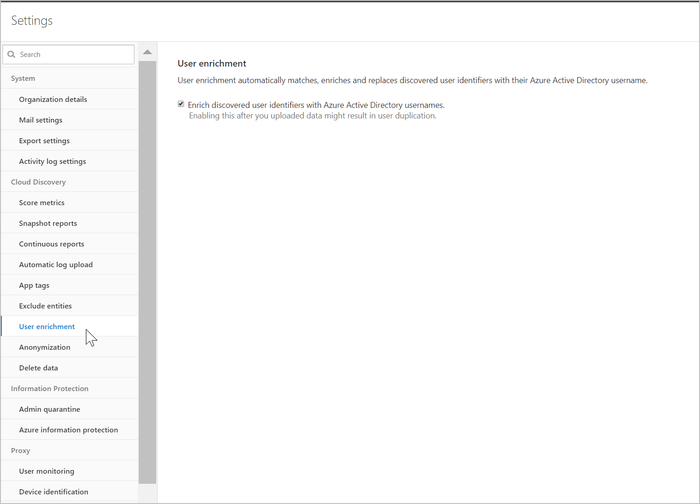

# Enrich cloud discovery data with Microsoft Entra usernames

Cloud discovery data can now be enriched with Microsoft Entra username data. When you enable this feature, the username, received in discovery traffic logs, is matched and replaced by the Microsoft Entra username. Cloud discovery enrichment enables the following features:

- You can investigate Shadow IT usage by Microsoft Entra user. The user will be shown with its UPN.
- You can correlate the Discovered cloud app use with the API collected activities.
- You can then create custom reports based on Microsoft Entra user groups. For example, a Shadow IT report for a specific Marketing department.

## Prerequisites

- Data source must provide username information
- [Microsoft 365 app connector](./connect-office-365.md) connected

## Enabling user data enrichment

1. In the Microsoft Defender Portal, select **Settings**. Then choose **Cloud Apps**.

1. Under **Cloud Discovery**, select **User enrichment**.

1. In the **User enrichment** tab, select **Enrich discovered user identifiers with Azure Active Directory usernames**. This option enables Defender for Cloud Apps to use Azure Active Directory data to enrich usernames by default.

    
   
## Next steps

> [!div class="nextstepaction"]
> [Control cloud apps with policies](control-cloud-apps-with-policies.md)

[!INCLUDE [Open support ticket](includes/support.md)]
