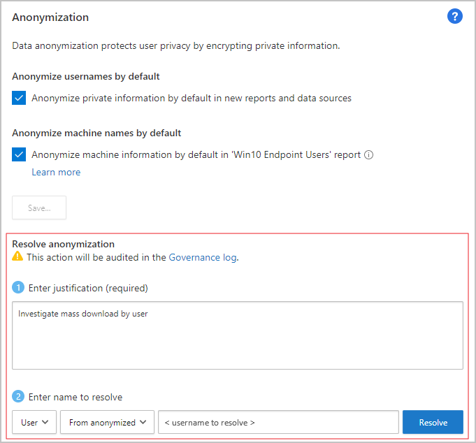
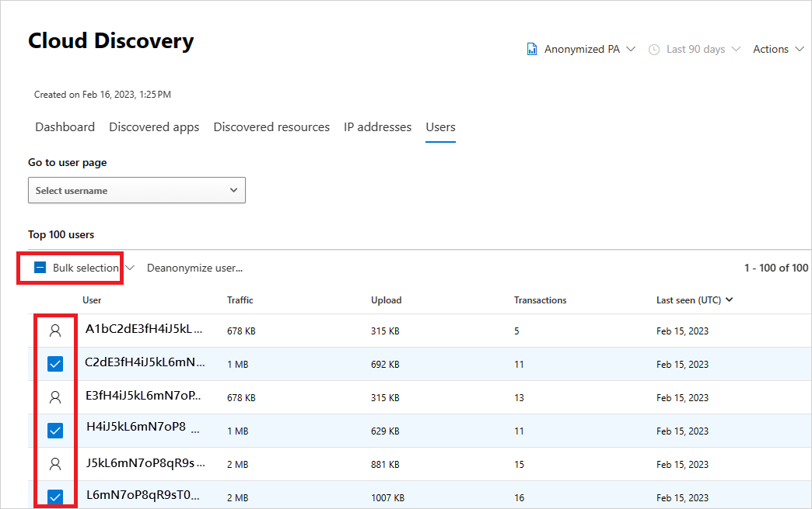

# Cloud Discovery data anonymization

[!INCLUDE [Banner for top of topics](includes/banner.md)]

Cloud Discovery data anonymization enables you to protect user privacy. Once the data log is uploaded to the Microsoft Defender for Cloud Apps portal, the log is sanitized and all username information is replaced with encrypted usernames. This way, all cloud activities are kept anonymous. When necessary, for a specific security investigation (for example, a security breach or suspicious user activity), admins can resolve the real username. If an admin has a reason to suspect a specific user, they can also look up the encrypted username of a known username, and then start investigating using the encrypted username. Each username conversion is audited in the portal's **Governance log**.

Key points:

- No private information is stored or displayed. Only encrypted information.
- Private data is encrypted using AES-128 with a dedicated key per tenant.
- Resolving usernames is done ad-hoc, per-username by deciphering a given encrypted username.
- Anonymization capabilities aren't supported when using the "Defender for Cloud Apps Proxy" stream.

## How data anonymization works

1. There are three ways to apply data anonymization:

    - You can set the data from a specific log file to be anonymized, by [creating a new snapshot report](create-snapshot-cloud-discovery-reports.md) and selecting **Anonymize private information**.  
    

    - You can set the data from an [automated upload for a new data source](discovery-docker.md) to be anonymized by selecting  **Anonymize private information** when you add the new data source.  
    

    - You can set the default in Defender for Cloud Apps to anonymize all data from both snapshot reports from uploaded log files and continuous reports from log collectors as follows:

        1. In the Microsoft 365 Defender portal, select **Settings**. Then choose **Cloud Apps**.

        1. Under **Cloud Discovery**, select **Anonymization**. To anonymize usernames by default, select **Anonymize private information by default in new reports and data sources**. You can also select **Anonymize device information by default in 'Defender-managed endpoints' report**. 

1. When anonymization is selected, Defender for Cloud Apps parses the traffic log and extracts specific data attributes.
1. Defender for Cloud Apps replaces the username with an encrypted username.
1. It then analyzes cloud usage data and generates Cloud Discovery reports based on the anonymized data.

    

1. For a specific investigation, such as an investigation of an anomalous usage alert, you can resolve the specific username in the portal and provide a business justification.

    > [!NOTE]
    > The following steps also work for device names on the **Devices** tab.

    **To resolve a single username**:

    1. Select the three dots at the end of the row of the user you want to resolve and select **Deanonymize user**.

        

    1. In the pop-up, enter the justification for resolving the username and then select **Resolve**. In the relevant row, the resolved username is displayed.

        > [!NOTE]
        > This action is audited.

        

    The following alternative way to resolve single usernames can also be used to look up the encrypted username of a known username.

    1. In the Microsoft 365 Defender portal, select **Settings**. Then choose **Cloud Apps**.

    1. Under **Cloud Discovery**, select **Anonymization**. Then, under **Anonymize and resolve usernames**  enter a justification for why you're doing the resolution.
    1. Under **Enter username to resolve**, select **From anonymized** and enter the anonymized username, or select **To anonymized** and enter the original username to resolve. Select **Resolve**.

        

    **To resolve multiple usernames**:

    1. Either select the checkboxes that appear when you hover over the user icons by the users you want to resolve or, in the top-left, corner select the **Bulk selection** checkbox.

        

    1. Select **Deanonymize user**.
    1. In the pop-up, enter the justification for resolving the username and then select **Resolve**. In the relevant rows, the resolved usernames are displayed.

        > [!NOTE]
        > This action is audited.

        

1. The action is audited in the portal's **Governance log**.

    

## Next steps

> [!div class="nextstepaction"]
> [Control cloud apps with policies](control-cloud-apps-with-policies.md)

[!INCLUDE [Open support ticket](includes/support.md)]
