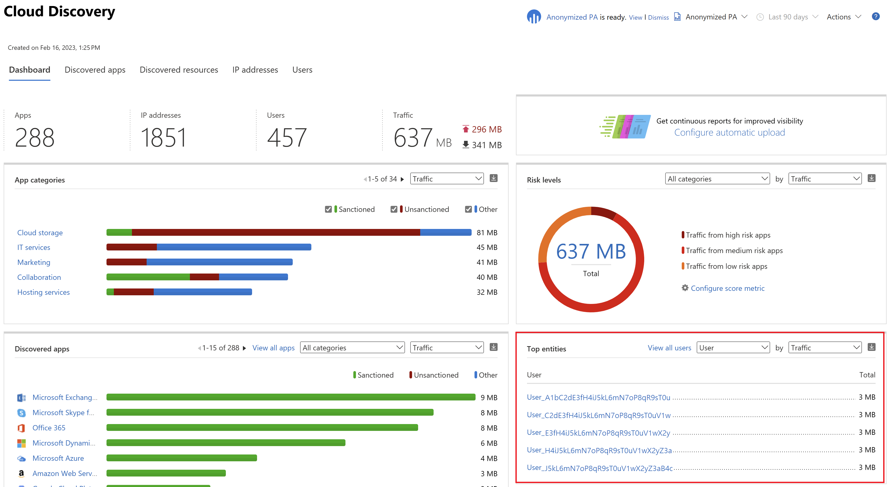

---
# required metadata

title: Anonymize user data in Cloud App Security
description: This article provides information about how to protect user privacy by anonymizing the usernames in your Cloud Discovery data.
keywords:
author: shsagir
ms.author: shsagir
manager: shsagir
ms.date: 01/29/2020
ms.topic: conceptual
ms.collection: M365-security-compliance
ms.prod:
ms.service: cloud-app-security
ms.technology:

# optional metadata

#ROBOTS:
#audience:
#ms.devlang:
ms.reviewer: reutam
ms.suite: ems
#ms.tgt_pltfrm:
ms.custom: seodec18

---
# Cloud Discovery data anonymization

*Applies to: Microsoft Cloud App Security*

Cloud Discovery data anonymization enables you to protect user privacy. Once the data log is uploaded to the Microsoft Cloud App Security portal, the log is sanitized and all username information is replaced with encrypted usernames. This way, all cloud activities are kept anonymous. When necessary, for a specific security investigation (for example, a security breach or suspicious user activity), admins can resolve the real username. If an admin has a reason to suspect a specific user, they can also look up the encrypted username of a known username, and then start investigating using the encrypted username. Each username conversion is audited in the portal’s **Governance log**.

Key points:

- No private information is stored or displayed. Only encrypted information.
- Private data is encrypted using AES-128 with a dedicated key per tenant.
- Resolving usernames is done ad-hoc, per-username by deciphering a given encrypted username.

## How data anonymization works

1. There are three ways to apply data anonymization:

    - You can set the data from a specific log file to be anonymized, by [creating a new snapshot report](create-snapshot-cloud-discovery-reports.md) and selecting **Anonymize private information**.  
    

    - You can set the data from an [automated upload for a new data source](configure-automatic-log-upload-for-continuous-reports.md) to be anonymized by selecting  **Anonymize private information** when you add the new data source.  
    

    - You can set the default in Cloud App Security to anonymize all data from both snapshot reports from uploaded log files and continuous reports from log collectors as follows:

    1. Under the Settings cog, select **Cloud Discovery settings**.

    2. In the Anonymization tab, to anonymize usernames by default, select **Anonymize private information by default in new reports and data sources**. You can also select **Anonymize machine information by default in 'Win10 Endpoint Users' report**.
    3. Click **Save**.

    

2. When anonymization is selected, Cloud App Security parses the traffic log and extracts specific data attributes.
3. Cloud App Security replaces the username with an encrypted username.
4. It then analyzes cloud usage data and generates Cloud Discovery reports based on the anonymized data.

    

5. For specific investigation, such as investigation of an anomalous usage alert, you can resolve the specific username in the portal and provide a business justification.
   This page can also be used to look up the encrypted username of a known username.

    1. Under the Settings cog, select **Cloud Discovery settings**.
    2. In the **Anonymization** tab, under **Anonymize and resolve usernames**  enter a justification for why you're doing the resolution.
    3. Under **Enter username to resolve**, select **From anonymized** and enter the anonymized username, or select **To anonymized** and enter the original username to resolve. Click **Resolve**.

    

6. The action is audited in the portal’s **Governance log**.

    

## Next steps

> [!div class="nextstepaction"]
> [Control cloud apps with policies](control-cloud-apps-with-policies.md)

[!INCLUDE [Open support ticket](includes/support.md)]
