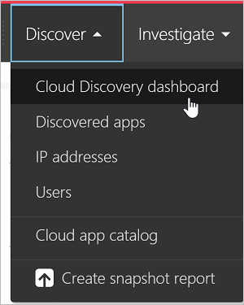
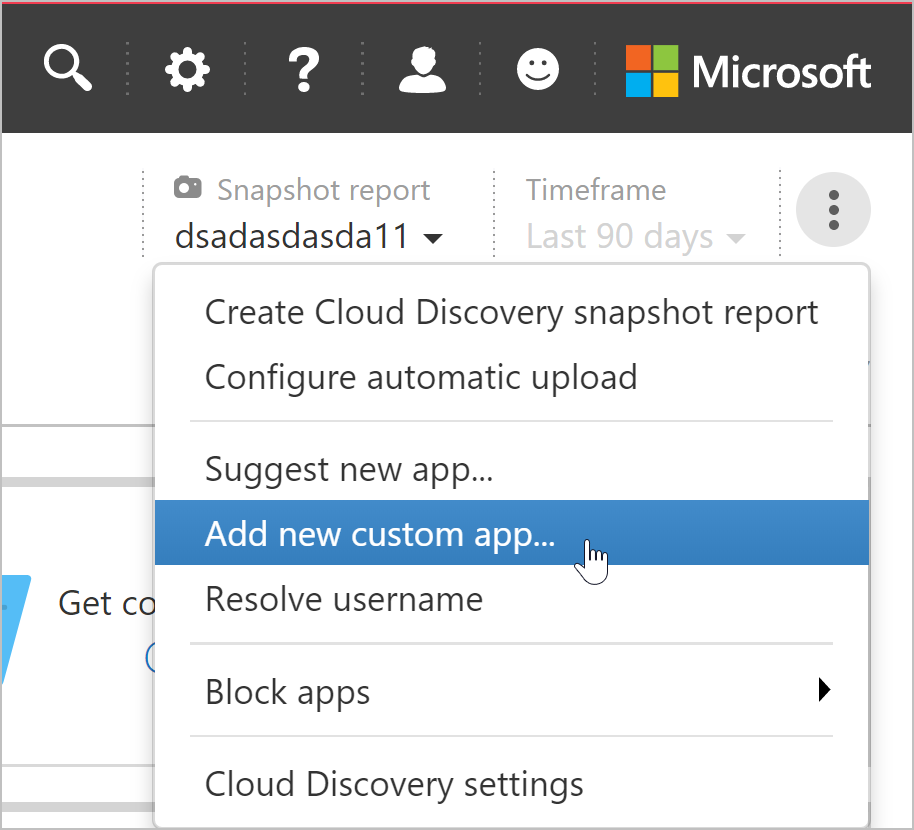
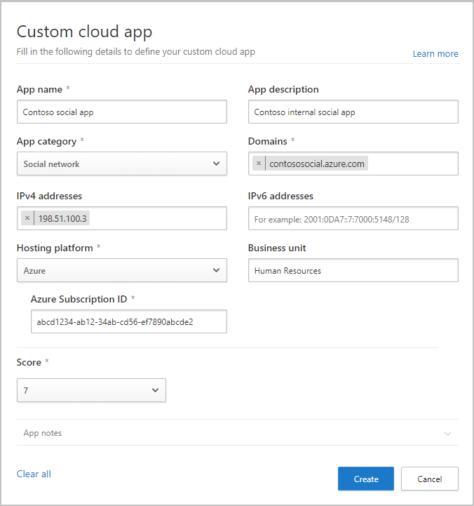

# Add custom apps to cloud discovery

Cloud discovery analyzes your traffic logs against the Defender for Cloud Apps catalog. Over 31,000 cloud apps are in the cloud app catalog. The catalog contains publicly available cloud apps only, for which Defender for Cloud Apps provides visibility and risk information.

To gain visibility into cloud apps that are excluded from the cloud app catalog, Defender for Cloud Apps enables you to discover use of custom cloud apps (LOB apps) that were developed or assigned specifically for your organization.

By adding a new custom cloud app, Defender for Cloud Apps can match uploaded firewall and proxy traffic log messages to the app and then provide you with visibility into the use of this app across your organization in the cloud discovery pages, such as how many users use the app, how many unique source IP addresses use it, and how much traffic is transmitted to and from the app.

## Add a new custom cloud app

1. In the Microsoft Defender Portal, under **Cloud Apps**, select **Cloud Discovery**. You should see the cloud discovery dashboard.

    

1. In the top right corner, select the **Action** menu and then select **Add new custom app**.

    

1. Fill in the fields to define the new app record that will be listed in the cloud app catalog and in cloud discovery after it's discovered in your firewall logs.

    

1. Under **Domains**, fill in the unique domains that are used when accessing the custom app. These domains are used to match traffic log messages to this app. If the data source you're using doesn't have app URL information, make sure you fill in the **IPv4** and **IPv6** address fields.
1. Add the **Hosting platform** and **Azure Subscription ID**. Optionally, specify the app's **Business unit**.
1. Assign a risk **Score** and add **App Notes** to help you track changes for this record.
1. Select **Create**.

After the app is created, it's available for you in the cloud app catalog.

At any time, you can select the three dots at the end of the row to edit or delete a custom app.

>[!NOTE]
> Custom apps are automatically tagged with the **Custom app** tag after you add them. This app tag cannot be removed.
In order to view all your custom apps, set the **App tag** filter to be equal to *Custom app*.

## Next steps

> [!div class="nextstepaction"]
> [User activity policies](user-activity-policies.md)

[!INCLUDE [Open support ticket](includes/support.md)]
