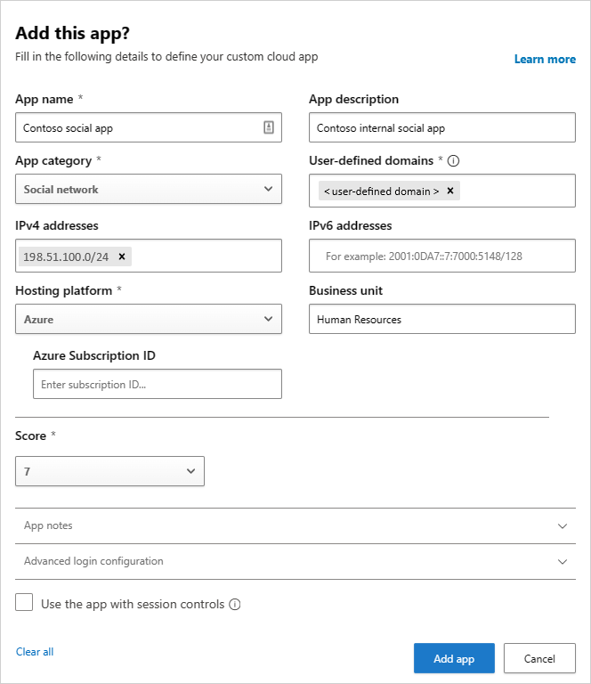

---
# required metadata

title: Add custom apps to Cloud Discovery in Cloud App Security
description: This topic provides information about how to add custom apps to Cloud Discovery in Cloud App Security to monitor Shadow IT.
keywords:
author: rkarlin
ms.author: rkarlin
manager: angrobe
ms.date: 12/10/2018
ms.topic: conceptual
ms.collection: M365-security-compliance
ms.prod:
ms.service: cloud-app-security
ms.technology:
ms.assetid: 98b0d841-b33d-4ae9-b48b-d9ee77785eaa

# optional metadata

#ROBOTS:
#audience:
#ms.devlang:
ms.reviewer: reutam
ms.suite: ems
#ms.tgt_pltfrm:
ms.custom: seodec18

---
# Add custom apps to Cloud Discovery

*Applies to: Microsoft Cloud App Security*
    
Cloud Discovery analyzes your traffic logs against Microsoft Cloud App Security's cloud app catalog. Over 16,000 cloud apps are in the cloud app catalog. The catalog contains publicly available cloud apps only, for which Cloud App Security provides visibility and risk information.

To gain visibility into cloud apps that are excluded from the Cloud App Catalog, Cloud App Security enables you to discover use of custom cloud apps (LOB apps) that were developed or assigned specifically for your organization.

By adding a new custom cloud app, Cloud App Security can match uploaded firewall and proxy traffic log messages to the app and then provide you with visibility into the use of this app across your organization in the Cloud Discovery pages, such as how many users use the app, how many unique source IP addresses use it, and how much traffic is transmitted to and from the app. 

## Add a new custom cloud app

1. In the Cloud App Security portal, click on **Discover** and then **Cloud Discovery dashboard**. 
  
   

2. In the top right corner, click the three dots and then select **Add new custom app**. 

   

3. Fill in the fields to define the new app record that will be listed in the Cloud App Catalog and in Cloud Discovery after it's discovered in your firewall logs.

   

4. Under **Domains**, fill in the unique domains that are used when accessing the custom app. These domains are used to match traffic log messages to this app. If the data source you're using doesn’t have app URL information, make sure you fill in the **IPv4** and **IPv6** address fields.
5. Add the **Hosting platform** and **Azure Subscription ID**. Optionally, specify the app's **Business unit**. 
6. Assign a risk **Score** and add **App Notes** to help you track changes for this record.
7. Click **Create**.

After the app is created, it's available for you in the Cloud App Catalog.

At any time, you can click the three dots at the end of the row to edit or delete a custom app.

>[!NOTE]
> Custom apps are automatically tagged with the **Custom app** tag after you add them. This app tag cannot be removed.
In order to view all your custom apps, set the **App tag** filter to be equal to ‘Custom app’. 
<!-- -	By default, custom apps have a risk score of 10, but you can use the **Override app score** action to change it at any time.-->

  
## Next steps 
[User activity policies](user-activity-policies.md)   

[Premier customers can also create a new support request directly in the Premier Portal.](https://premier.microsoft.com/)  
  
  
