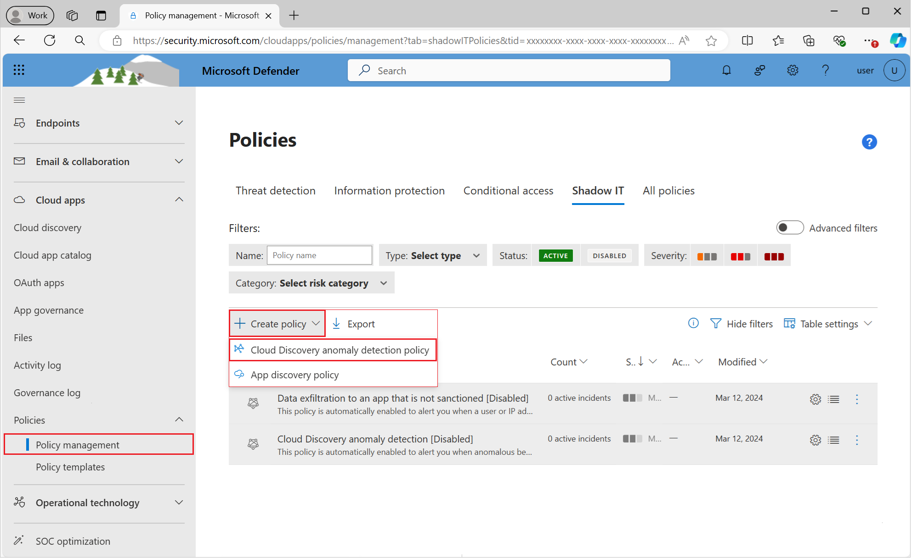

# Create cloud discovery policies

You can create app discovery policies to alert you when new apps are detected. Defender for Cloud Apps also searches all the logs in your cloud discovery for anomalies.

## Creating an app discovery policy

Discovery policies enable you to set alerts that notify you when new apps are detected within your organization.

1. In the Microsoft Defender Portal, under **Cloud Apps**, go to **Policies** -> **Policy management**. Then select the **Shadow IT** tab.

1. Select **Create policy** and then select **App discovery policy**.

    

1. Give your policy a name and description. If you want, you can base it on a template. For more information on policy templates, see [Control cloud apps with policies](control-cloud-apps-with-policies.md).

1. Set the **Severity** of the policy.

1. To set which discovered apps trigger this policy, add filters.

1. You can set a threshold for how sensitive the policy should be. Enable **Trigger a policy match if all the following occur on the same day**. You can set criteria that the app must exceed daily to match the policy. Select one of the following criteria:
    - Daily traffic
    - Downloaded data
    - Number of IP addresses
    - Number of transactions
    - Number of users
    - Uploaded data

1. Set a **Daily alert limit** under **Alerts**. Select if the alert is sent as an email. Then provide email addresses as needed.
    - Selecting **Save alert settings as the default for your organization** enables future policies to use the setting.
    - If you have a default setting, you can select **Use your organization's default settings**.

1. Select **Governance** actions to apply when an app matches this policy. It can tag policies as **Sanctioned**, **Unsanctioned**, **Monitored**, or a custom tag.

1. Select **Create**.

> [!NOTE]
>
> - Newly created discovery policies (or policies with updated continuous reports) trigger an alert once in 90 days per app per continuous report, regardless of whether there are existing alerts for the same app. So, for example, if you create a policy for discovering new popular apps, it may trigger additional alerts for apps that have already been discovered and alerted on.
> - Data from **snapshot reports** do not trigger alerts in app discovery policies.

For example, if you're interested in discovering risky hosting apps found in your cloud environment, set your policy as follows:

Set the policy filters to discover any services found in the **hosting services** category, and that have a risk score of 1, indicating they're highly risky.

Set the thresholds that should trigger an alert for a certain discovered app at the bottom. For instance, alert only if over 100 users in the environment used the app and if they downloaded a certain amount of data from the service. Additionally, you can set the limit of daily alerts you wish to receive.

## Cloud discovery anomaly detection

Defender for Cloud Apps searches all the logs in your cloud discovery for anomalies. For instance, when a user, who never used Dropbox before, suddenly uploads 600 GB to it, or when there are a lot more transactions than usual on a particular app. The anomaly detection policy is enabled by default. It's not necessary to configure a new policy for it to work. However, you can fine-tune which types of anomalies you want to be alerted about in the default policy.

1. In the Microsoft Defender Portal, under **Cloud Apps**, go to **Policies** -> **Policy management**. Then select the **Shadow IT** tab.

1. Select **Create policy** and select **Cloud Discovery anomaly detection policy**.

    

1. Give your policy a name and description. If you want, you can base it on a template, For more information on policy templates, see [Control cloud apps with policies](control-cloud-apps-with-policies.md).

1. To set which discovered apps trigger this policy, select **Add filters**.

    The filters are chosen from drop-down lists. To add filters, select **Add a filter**. To remove a filter, select the 'X'.

1. Under **Apply to** choose whether this policy applies **All continuous reports** or **Specific continuous reports**. Select whether the policy applies to **Users**, **IP addresses**, or both.

1. Select the dates during which the anomalous activity occurred to trigger the alert under **Raise alerts only for suspicious activities occurring after date.**

1. Set a **Daily alert limit** under **Alerts**. Select if the alert is sent as an email. Then provide email addresses as needed.
    - Selecting **Save alert settings as the default for your organization** enables future policies to use the setting.
    - If you have a default setting, you can select **Use your organization's default settings**.

1. Select **Create**.

    

## Related videos

> [!div class="nextstepaction"]
> [App discovery and log collector configuration webinar](webinars.md#on-demand-webinars)

## Next steps

> [!div class="nextstepaction"]
> [User activity policies](user-activity-policies.md)

[!INCLUDE [Open support ticket](includes/support.md)]
