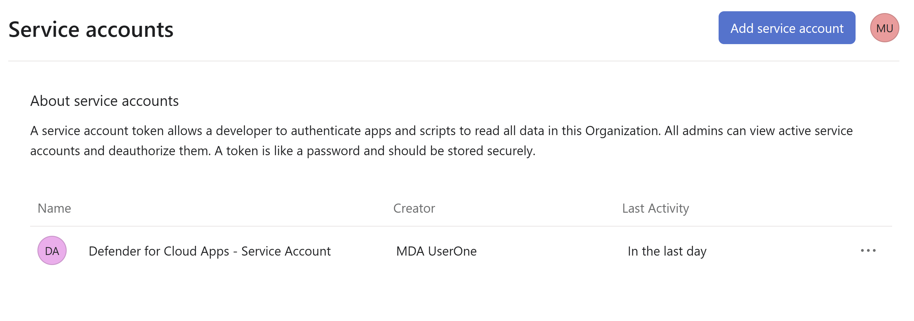
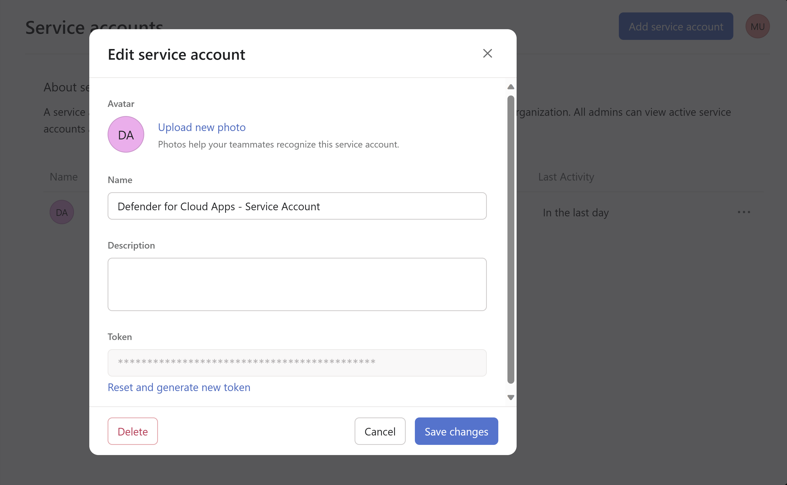

# Connect Asana to Microsoft Defender for Cloud Apps (Preview)

[!INCLUDE [Banner for top of topics](includes/banner.md)]

This article provides instructions for connecting Microsoft Defender for Cloud Apps to your existing Asana account using the App Connector APIs. This connection gives you visibility into and control over your organization's Asana use.

## Prerequisites

- An Asana enterprise account is a pre-requisite for this connection. You must be signed-in as an admin to Asana. 

## How to connect Asana to Defender for Cloud Apps

1. Sign into [Asana](https://app.asana.com/) portal with an admin account.

2. Navigate to **Admin Console>Apps>Service accounts** and click on your service account. If you don’t have a Service account, create one using the guidance provided [here](https://asana.com/guide/help/premium/service-accounts).

3. Copy the service account Token. You may have to **Reset and generate new token** to copy the token if you have an existing service account. 

4. Copy the workspace ID from the URL and save it for future reference.

5. In the [Microsoft Defender portal](https://security.microsoft.com), navigate to **Settings>Cloud Apps>Connected apps>App Connectors**.

6. Click on **Connect an app** and select **Asana.**

7. Provide an Instance name in the connection wizard and click on **Next.**
8. Enter the copied access token and workspace ID in API Key and workspace ID fields respectively. Once entered click on **Submit**.

9. Defender for Cloud Apps will start fetch Asana audit logs once connection is successfully established.

If you have any problems connecting the app, see [Troubleshooting App Connectors](/defender-cloud-apps/troubleshooting-api-connectors-using-error-messages).

## Next steps

> [!div class="nextstepaction"]
> [Control cloud apps with policies](control-cloud-apps-with-policies.md)

[!INCLUDE [Open support ticket](includes/support.md)]

