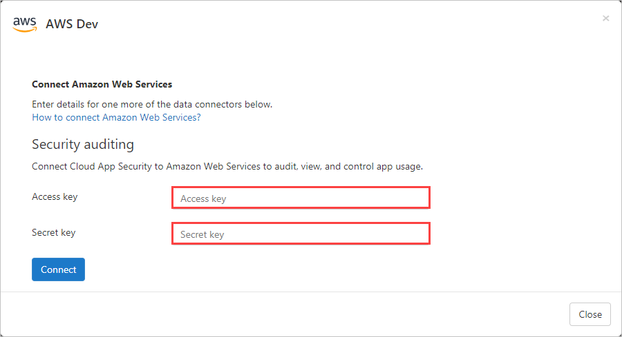
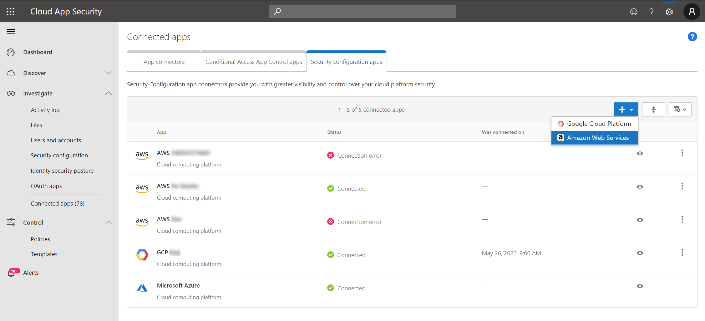
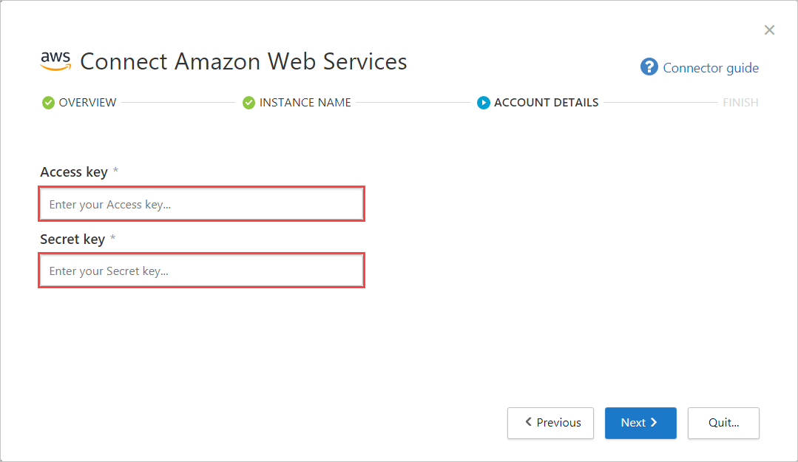

# Connect AWS to Microsoft Cloud App Security

[!INCLUDE [Banner for top of topics](includes/banner.md)]

This article provides instructions for connecting your existing Amazon Web Services (AWS) account to Microsoft Cloud App Security using the connector APIs. For information about how Cloud App Security protects AWS, see [Protect AWS](protect-aws.md).

You can connect one or both of the following AWS to Cloud App Security connections:

- **Security auditing**: This connection gives you visibility into and control over AWS app use.
- **Security configuration**: This connection gives you fundamental security recommendations based on the Center for Internet Security (CIS) benchmark for AWS.

Since you can add either or both of the connections, the steps in this article are written as independent instructions. If you've already added one of the connections, where relevant edit the existing configurations.

## How to connect AWS Security auditing to Cloud App Security

Use the following steps to configure your AWS auditing and then connect it to Cloud App Security.

### Step 1: Configure Amazon Web Services auditing

1. In your [Amazon Web Services console](https://console.aws.amazon.com/), under **Security, Identity & Compliance**, select **IAM**.

    

1. Select **Users** and then select **Add user**.

    

1. In the **Details** step, provide a new user name for Cloud App Security. Make sure that under **Access type** you select **Programmatic access** and select **Next Permissions**.<a name="set-permissions"></a>

    

1. Select **Attach existing policies directly**, and then **Create policy**.

    

1. Select the **JSON** tab:

    

1. Paste the following script into the provided area:

    ```json
    {
      "Version" : "2012-10-17",
      "Statement" : [{
          "Action" : [
            "cloudtrail:DescribeTrails",
            "cloudtrail:LookupEvents",
            "cloudtrail:GetTrailStatus",
            "cloudwatch:Describe*",
            "cloudwatch:Get*",
            "cloudwatch:List*",
            "iam:List*",
            "iam:Get*",
            "s3:ListAllMyBuckets",
            "s3:PutBucketAcl",
            "s3:GetBucketAcl",
            "s3:GetBucketLocation"
          ],
          "Effect" : "Allow",
          "Resource" : "*"
        }
      ]
     }
    ```

1. Select **Next: Tags**

     

1. Select **Next: Review**.

    

1. Provide a **Name** and select **Create policy**.

    

1. Back in the **Add user** screen, refresh the list if necessary, and select the user you created, and select **Next: Tags**.

    

1. Select **Next: Review**.

1. If all the details are correct, select **Create user**.

    

1. When you get the success message, select **Download .csv** to save a copy of the new user's credentials. You'll need these later.

    

    > [!NOTE]
    > After connecting AWS, you'll receive events for seven days prior to connection. If you just enabled CloudTrail, you'll receive events from the time you enabled CloudTrail.

### Step 2: Connect Amazon Web Services auditing to Cloud App Security

1. In the Cloud App Security portal, select **Investigate** and then **Connected apps**.

1. In the **App connectors** page, to provide the AWS connector credentials, do one of the following:

    **For a new connector**

    1. Select the plus sign (**+**) followed by **Amazon Web Services**.

        

    1. In the pop-up, provide a name for the connector, and then select **Connect Amazon Web Services**.

        

    1. On the Connect Amazon Web services page, select **Security auditing**, paste the **Access key** and **Secret key** from the .csv file into the relevant fields, and select **Connect**.

        

    **For an existing connector**

    1. In the list of connectors, on the row in which the AWS connector appears, select **Connect security auditing**.

        

    1. On the Connect Amazon Web Services page, paste the **Access key** and **Secret key** from the .csv file into the relevant fields, and select **Connect**.

        

1. Select **Test API** to make sure the connection succeeded.

    Testing may take a couple of minutes. When it's finished, you get a success or failure notification. After receiving a success notice, select **Done**.

## How to connect AWS security configuration to Cloud App Security

Connecting AWS security configuration gives you insights into fundamental security recommendations based on the Center for Internet Security (CIS) benchmark for AWS.

Follow these steps to connect AWS security configuration to Cloud App Security.

> [!div class="checklist"]
>
> - [Set up AWS Security Hub](#set-up-aws-security-hub)
> - [Connect AWS security configuration to Cloud App Security](#connect-aws-security-configuration-to-cloud-app-security)

### Set up AWS Security Hub

To view security recommendations for multiple regions, repeat the following steps for each relevant region.

> [!NOTE]
> If you are using a master account, repeat these steps to configure the master account and all connected member accounts across all relevant regions.

1. Enable [AWS Config](https://docs.aws.amazon.com/config/latest/developerguide/gs-console.html).
1. Enable [AWS Security Hub](https://docs.aws.amazon.com/securityhub/latest/userguide/securityhub-settingup.html).
1. Verify that there is data flowing to the Security Hub.

    > [!NOTE]
    > When you first enable Security Hub, it may take several hours for data to be available.

### Connect AWS Security configuration to Cloud App Security

Before you can connect AWS security configuration, make sure that you have [set up your AWS environment](#set-up-aws-security-hub) to collect fundamental security and compliance recommendations.

> [!NOTE]
> If you are using an [AWS master account](https://aws.amazon.com/security-hub/faqs/), use the following steps to connect the master account. Connecting your master account allows you to receive recommendations for all member accounts across all regions.

### Step 1: Configure Amazon Web Services security configuration

1. Follow the *How to connect AWS Security auditing* steps to get to the [permissions](#set-permissions) page.

1. On the permissions page, select **Attach existing policies directly**, apply the **AWSSecurityHubReadOnlyAccess** and **SecurityAudit** policies, and then select **Next Tags**.

    

1. Optional: Add tags to the user.

    

    > [!NOTE]
    > Adding tags to the user won't affect the connection.

1. Select **Next Review**.

1. If all the details are correct, select **Create user**.

    

1. When you get the success message, select **Download .csv** to save a copy of the **Access key ID** and the **Secret access key**. You'll need these later.

    

### Step 2: Connect Amazon Web Services security configuration to Cloud App Security

1. In Cloud App Security, select **Investigate**, and then select **Connected apps**.

1. In the **Security configuration apps** tab, select the plus button, and then select **Amazon Web Services**.

    

1. In the **Instance name** page, choose the instance type, and then select **Next**.

    - For an existing connector, choose the relevant instance.

        

    - For a new connector, provide a name for the instance.

        

1. In the **Account details** page, paste the **Access key** and **Secret key** from the .csv file into the relevant fields, and then select **Next**.

    

1. In the **Finished** page, make sure the connection succeeded, and then select **Finished**.

If you have any problems connecting the app, see [Troubleshooting App Connectors](troubleshooting-api-connectors-using-error-messages.md).

## Next steps

> [!div class="nextstepaction"]
> [Control cloud apps with policies](control-cloud-apps-with-policies.md)

[!INCLUDE [Open support ticket](includes/support.md)]
