---
# required metadata

title: Connect Amazon Web Services with Cloud App Security
description: This article provides information about how to connect your AWS app to Cloud App Security using the API connector for visibility and control over use.
keywords:
author: ShlomoSagir-MS
ms.author: shsagir
manager: ShlomoSagir-MS
ms.date: 8/1/2019
ms.topic: conceptual
ms.collection: M365-security-compliance
ms.prod:
ms.service: cloud-app-security
ms.technology:
ms.assetid: a6b4c745-cd5c-4458-819c-80cbe8b25f29

# optional metadata

#ROBOTS:
#audience:
#ms.devlang:
ms.reviewer: reutam
ms.suite: ems
#ms.tgt_pltfrm:
ms.custom: seodec18

---
# Connect AWS to Microsoft Cloud App Security

*Applies to: Microsoft Cloud App Security*

This article provides instructions for connecting your existing Amazon Web Services (AWS) account to Microsoft Cloud App Security using the connector APIs.

You can connect one or both of the following AWS to Cloud App Security connections:

- **Security auditing**: This connection gives you visibility into and control over AWS app use.
- **Security configuration**: This connection gives you fundamental security recommendations based on the Center for Internet Security (CIS) benchmark for AWS.

Since you can add either or both of the connections, the steps in this article are written as independent instructions. If you have already added one of the connections, where relevant edit the existing configurations.

## How to connect AWS Security auditing to Cloud App Security

1. In your [Amazon Web Services console](https://console.aws.amazon.com/), under **Security, Identity & Compliance**, click **IAM**.

    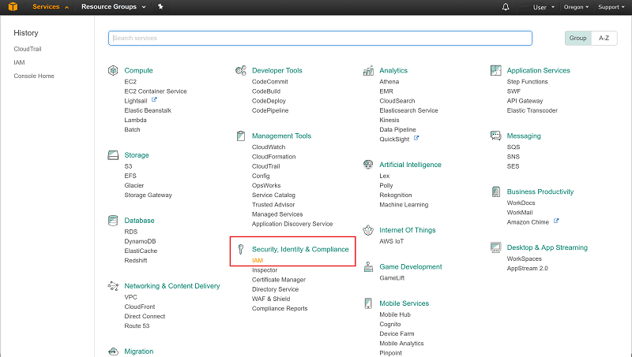

1. Select **Users** and then click **Add user**.

    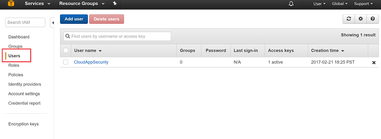

1. In the **Details** step, provide a new user name for Cloud App Security. Make sure that under **Access type** you select **Programmatic access** and click **Next Permissions**.<a name="set-permissions"></a>

    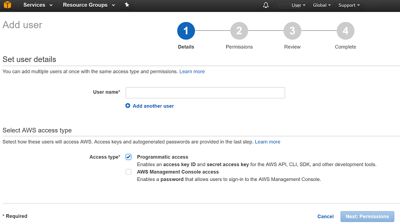

1. Click on the **JSON** tab:

    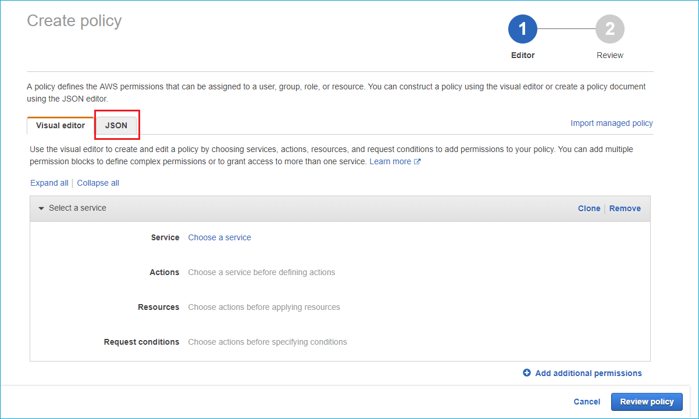

1. Paste the following script into the provided area:

    ```json
    {
      "Version" : "2012-10-17",
      "Statement" : [{
          "Action" : [
            "cloudtrail:DescribeTrails",
            "cloudtrail:LookupEvents",
            "cloudtrail:GetTrailStatus",
            "cloudwatch:Describe*",
            "cloudwatch:Get*",
            "cloudwatch:List*",
            "iam:List*",
            "iam:Get*",
            "s3:ListAllMyBuckets",
            "s3:PutBucketAcl",
            "s3:GetBucketAcl",
            "s3:GetBucketLocation"
          ],
          "Effect" : "Allow",
          "Resource" : "*"
        }
      ]
     }
    ```

     

1. Click **Review policy**.

1. Provide a **Name** and click **Create policy**.

    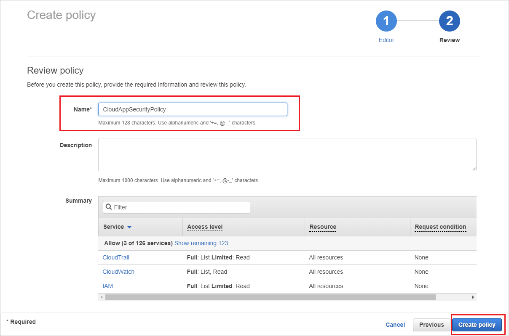

1. Back in the **Add user** screen, refresh the list if necessary, and select the user you created, and click **Next Review**.

    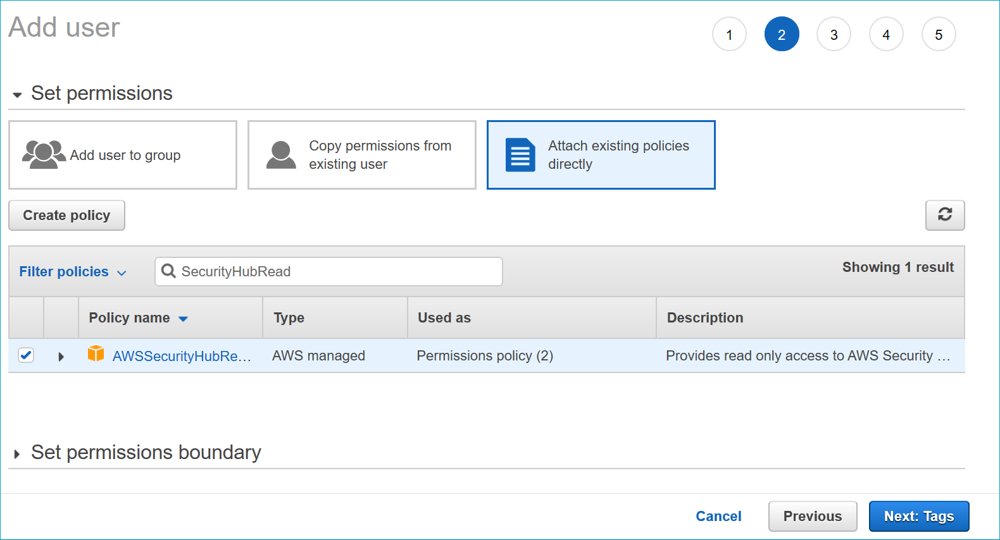

1. If all the details are correct, click **Create user**.

    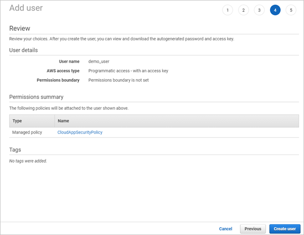

1. When you get the success message, click **Download .csv** to save a copy of the new user's credentials, you need these later.

    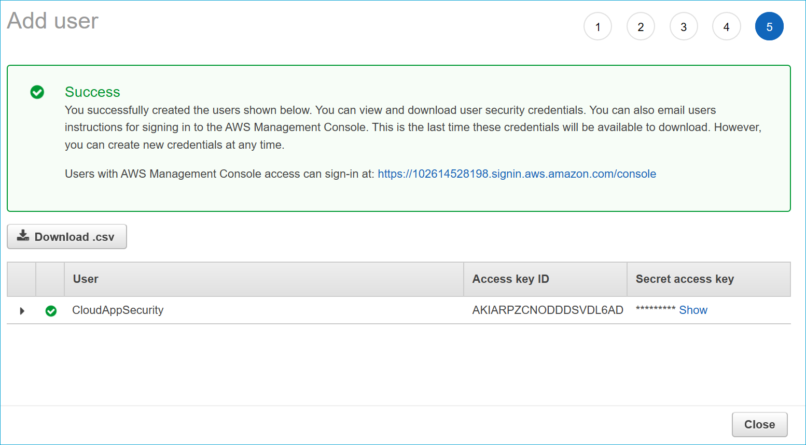

1. In the AWS console, click **Services** and then under **Management Tools** click **CloudTrail**.

    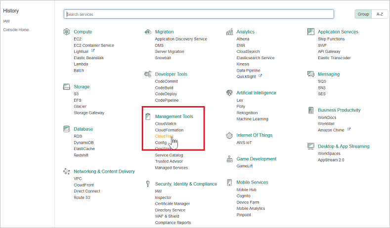

    If you haven't used CloudTrail before, click **Get Started** and set it up by providing a name and selecting the appropriate S3 bucket and click **Turn On**. To make sure you have complete coverage, set **Apply to all regions** to **Yes**.

    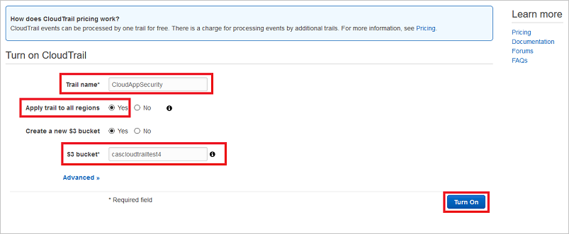

    You should see the new CloudTrail name in the **Trails** list.

    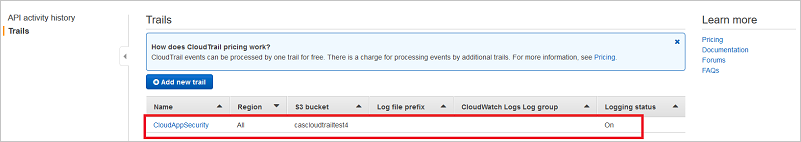

    > [!NOTE]
    > After connecting AWS, you'll receive events for seven days prior to connection. If you just enabled CloudTrail, you'll receive events from the time you enabled CloudTrail.

1. In the Cloud App Security portal, click **Investigate** and then **Connected apps**.

1. In the **App connectors** page, to provide the AWS connector credentials, do one of the following:

    **For a new connector**
    1. Click the plus sign followed by **Amazon Web Services**.

        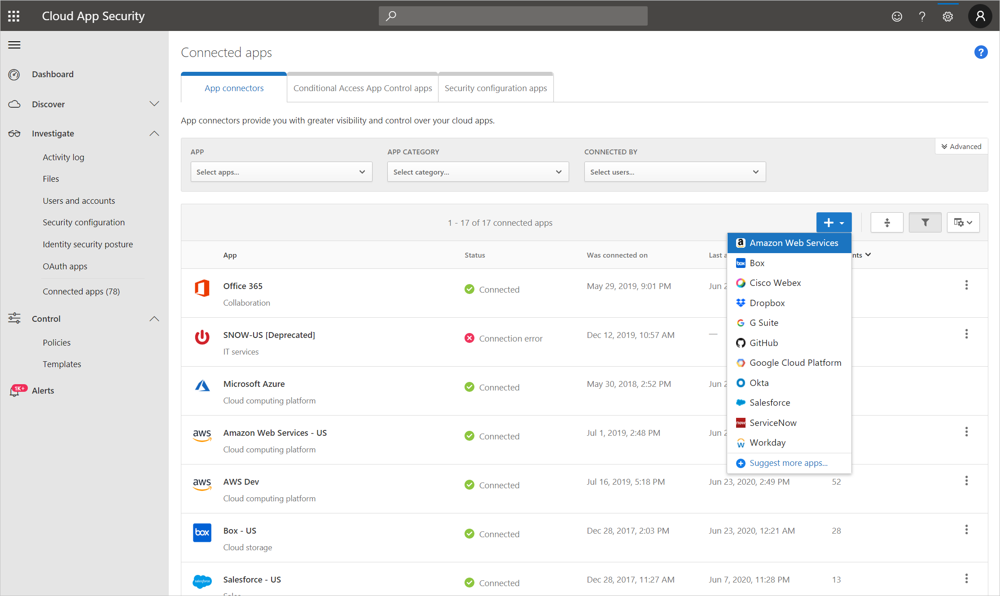

    1. In the pop-up, provide a name for the connector, and then click **Connect Amazon Web Services**.

        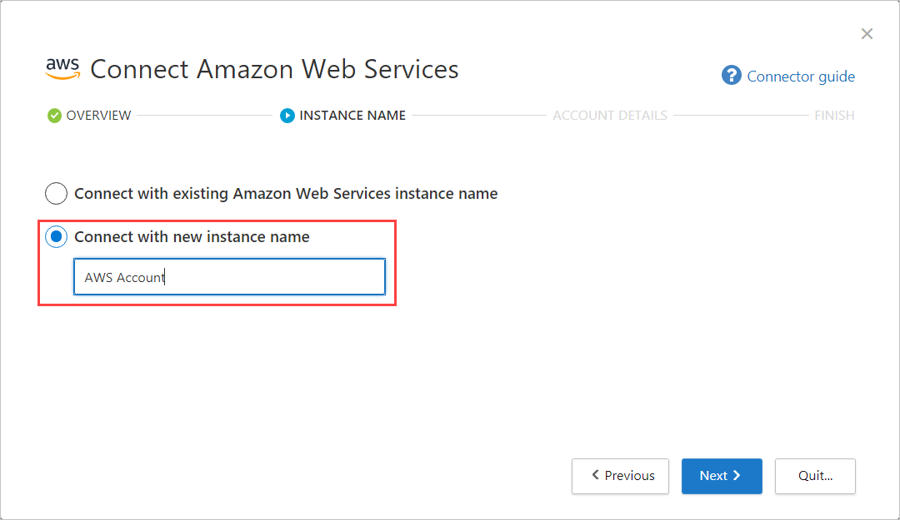

    1. On the Connect Amazon Web services page, select **Security auditing**, paste the **Access key** and **Secret key** from the .csv file into the relevant fields, and click **Connect**.

        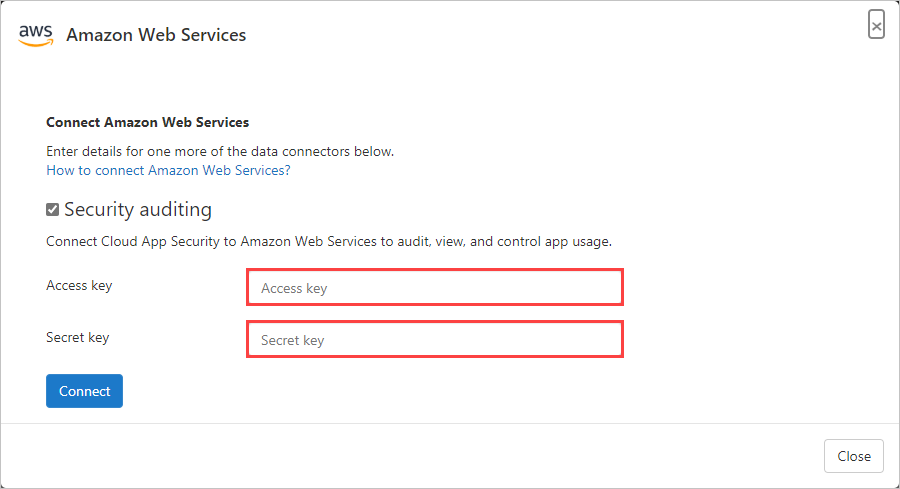

    **For an existing connector**
    1. In the list of connectors, on the row in which the AWS connector appears, click **Connect security auditing**.

    1. On the Connect Amazon Web Services page, paste the **Access key** and **Secret key** from the .csv file into the relevant fields, and click **Connect**.

1. Make sure the connection succeeded by clicking **Test API**.  

    Testing may take a couple of minutes. When it's finished, you get a Success or Failure notification. After receiving a success notice, click **Done**.

## How to connect AWS Security configuration to Cloud App Security

Follow the [How to connect AWS Security auditing](#how-to-connect-aws-security-auditing-to-cloud-app-security) steps to get to the [permissions](#set-permissions) page.

1. On the permissions page, click **Attach existing policies directly**, apply the **AWSSecurityHubReadOnlyAccess** and **SecurityAudit** policies, and then click **Next Tags**.

    

1. Optional: Add tags to the user.

    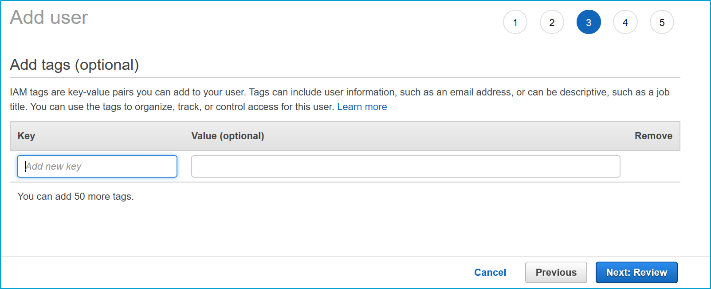

    > [!NOTE]
    > Adding tags to the user won't affect the connection.

1. Click **Next Review**.

1. If all the details are correct, click **Create user**.

    

1. When you get the success message, click **Download .csv** to save a copy of the **Access key ID** and the **Secret access key**, you need these later.

    

1. In the Cloud App Security portal, click **Investigate** and then **Connected apps**.

1. In the **App connectors** page, to provide the AWS connector credentials, do one of the following:

    **For a new connector**
    1. Click the plus sign followed by **Amazon Web Services**.<br>

        

    1. In the pop-up, provide a name for the connector, and then click **Connect Amazon Web Services**.

        

    1. On the Connect Amazon Web services page, select **Security configuration**, paste the **Access key** and **Secret key** from the .csv file into the relevant fields, and click **Connect**.

        

    **For an existing connector**
    1. In the list of connectors, on the row in which the AWS connector appears, click **Connect security configuration**.

        

    1. On the Connect Amazon Web Services page, paste the **Access key** and **Secret key** from the .csv file into the relevant fields, and click **Connect**.

        

1. Make sure the connection succeeded by clicking **Test API**.  

    Testing may take a couple of minutes. When it's finished, you get a Success or Failure notification. After receiving a success notice, click **Done**.

## Next steps

[Control cloud apps with policies](control-cloud-apps-with-policies.md)

[Premier customers can also create a new support request directly in the Premier Portal.](https://premier.microsoft.com/)