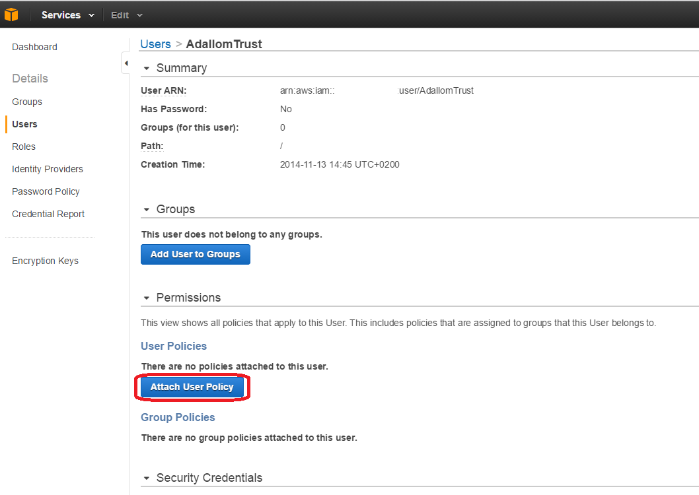
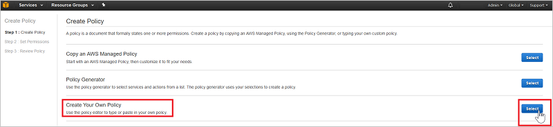
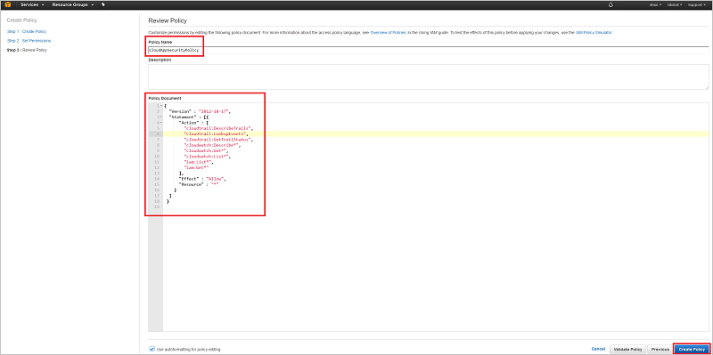

---
# required metadata

title: Connect AWS with Cloud App Security for visibility and control over use | Microsoft Docs
description: This topic provides information about how to connect your AWS app to Cloud App Security using the API connector.
keywords:
author: rkarlin
ms.author: rkarlin
manager: mbaldwin
ms.date: 3/1/2017
ms.topic: get-started-article
ms.prod:
ms.service: cloud-app-security
ms.technology:
ms.assetid: a6b4c745-cd5c-4458-819c-80cbe8b25f29

# optional metadata

#ROBOTS:
#audience:
#ms.devlang:
ms.reviewer: reutam
ms.suite: ems
#ms.tgt_pltfrm:
#ms.custom:

---

# Connect AWS to Microsoft Cloud App Security
This section provides instructions for connecting Cloud App Security to your existing Amazon Web Services account using the connector APIs.  
  
## How to connect Amazon Web Services to Cloud App Security  
  
1.  In your [Amazon Web Services console](https://console.aws.amazon.com/), under **Security, Identity & Compliance**, click on **IAM**.  
  
       
  
2.  Click on the **Users** tab and then click **Add user**.  
  
           
  
4.  In the **Details** step, provide a new user name for Cloud App Security and make sure that under **Access type** you select **Programmatic access** and click **Next Permissions**.  

     

5. In the **Permissions** step, select **Attach existing policies directly** and then click **Create policy**.

   

6.  Under **Create Policy** select **Create Your Own Policy**.
 
    
 
7.  Under **Review Policy**,  provide a **Policy Name**, for example CloudAppSecurityPolicy.

    

8. Then paste the following into the **Policy Document** field and click **Create policy**:
  
    ```     
    {  
      "Version" : "2012-10-17",  
      "Statement" : [{  
          "Action" : [  
            "cloudtrail:DescribeTrails",  
            "cloudtrail:LookupEvents",  
            "cloudtrail:GetTrailStatus",  
            "cloudwatch:Describe*",  
            "cloudwatch:Get*",  
            "cloudwatch:List*",  
            "iam:List*",  
            "iam:Get*"  
          ],  
          "Effect" : "Allow",  
          "Resource" : "*"  
        }  
      ]  
     }  
  
    ```  
  
9. Back in the **Add user** screen, refresh the list if necessary, and select the user you just created, and click **Next Review**.

   

10. If all the details are correct, click **Create user**.

    

11. When you get the success message, click **Download .csv** to save a copy of the new user's credentials, you will need these later.  

    
  
10. In the AWS console, click **Services** and then under **Management Tools** click **CloudTrail**.  
  
       
  
    If you have not used CloudTrail before, click **Get Started** and set it up by providing a name and selecting the appropriate S3 bucket and click **Turn On**. To make sure you have complete coverage, set **Apply to all regions** to **Yes**.
  
       
  
    You should see the new CloudTrail name in the **Trails** list.
    
      
  
11. In the Cloud App Security portal, click **Investigate** and then **Connected apps**.  
  
12. In the **App connectors** page, click the plus sign followed by **AWS**.  
  
       
  
13. In the popup, paste the **Access key** and **Secret key** from the csv file into the relevant fields, and click **Connect**.  
    
  
14. Make sure the connection succeeded by clicking **Test API**.  
  
     Testing may take a couple of minutes. When it is finished, you will get a Success or Failure notification. After receiving a success notice, click **Done**.  
  
After connecting AWS, you will receive events for 7 days prior to connection.
  
## See Also  
[Control cloud apps with policies](control-cloud-apps-with-policies.md)   
[For technical support, please visit the Cloud App Security assisted support page.](http://support.microsoft.com/oas/default.aspx?prid=16031)   
[Premier customers can also choose Cloud App Security directly from the Premier Portal.](https://premier.microsoft.com/)  
  
  