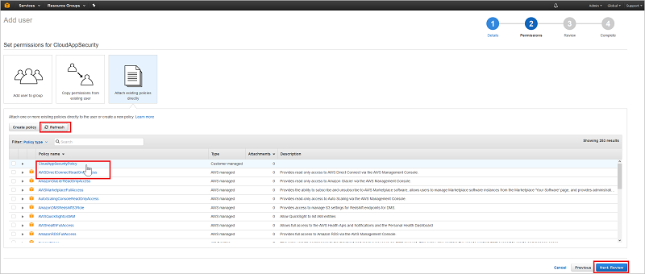
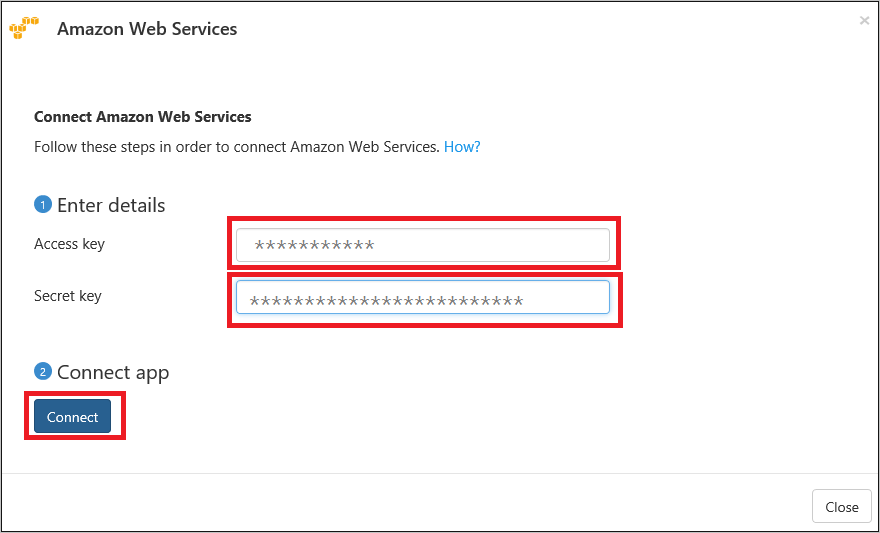

---
# required metadata

title: Connect AWS with Cloud App Security
description: This article provides information about how to connect your AWS app to Cloud App Security using the API connector for visibility and control over use.
keywords:
author: rkarlin
ms.author: rkarlin
manager: barbkess
ms.date: 12/10/2018
ms.topic: conceptual
ms.collection: M365-security-compliance
ms.prod:
ms.service: cloud-app-security
ms.technology:
ms.assetid: a6b4c745-cd5c-4458-819c-80cbe8b25f29

# optional metadata

#ROBOTS:
#audience:
#ms.devlang:
ms.reviewer: reutam
ms.suite: ems
#ms.tgt_pltfrm:
ms.custom: seodec18

---
# Connect AWS to Microsoft Cloud App Security

*Applies to: Microsoft Cloud App Security*

This article provides instructions for connecting Microsoft Cloud App Security to your existing Amazon Web Services account using the connector APIs. This connection gives you visibility into and control over AWS app use. 
  
## How to connect Amazon Web Services to Cloud App Security  
  
1.  In your [Amazon Web Services console](https://console.aws.amazon.com/), under **Security, Identity & Compliance**, click on **IAM**.  
  
       
  
2.  Click on the **Users** tab and then click **Add user**.  
  
           
  
4.  In the **Details** step, provide a new user name for Cloud App Security. Make sure that under **Access type** you select **Programmatic access** and click **Next Permissions**.  

     

5. Click on the JSON tab:

     

6. Paste the following script into the provided area:

    ```     
    {  
      "Version" : "2012-10-17",  
      "Statement" : [{  
          "Action" : [  
            "cloudtrail:DescribeTrails",  
            "cloudtrail:LookupEvents",  
            "cloudtrail:GetTrailStatus",  
            "cloudwatch:Describe*",  
            "cloudwatch:Get*",  
            "cloudwatch:List*",  
            "iam:List*",  
            "iam:Get*",
            "s3:ListAllMyBuckets",
            "s3:PutBucketAcl",
            "s3:GetBucketAcl",
            "s3:GetBucketLocation"
          ],  
          "Effect" : "Allow",  
          "Resource" : "*"  
        }  
      ]  
     }  
  
    ```  

     
    
6. Click **Review policy**.

7. Provide a **Name** and click **Create policy**.

     

9. Back in the **Add user** screen, refresh the list if necessary, and select the user you created, and click **Next Review**.

   

10. If all the details are correct, click **Create user**.

    

11. When you get the success message, click **Download .csv** to save a copy of the new user's credentials, you need these later.  

    
  
10. In the AWS console, click **Services** and then under **Management Tools** click **CloudTrail**.  
  
       
  
    If you haven't used CloudTrail before, click **Get Started** and set it up by providing a name and selecting the appropriate S3 bucket and click **Turn On**. To make sure you have complete coverage, set **Apply to all regions** to **Yes**.
  
       
  
    You should see the new CloudTrail name in the **Trails** list.
    
      
  
11. In the Cloud App Security portal, click **Investigate** and then **Connected apps**.  
  
12. In the **App connectors** page, click the plus sign followed by **Amazon Web Services**.  
  
       
  
13. In the pop-up, paste the **Access key** and **Secret key** from the csv file into the relevant fields, and click **Connect**.  
    
  
14. Make sure the connection succeeded by clicking **Test API**.  
  
     Testing may take a couple of minutes. When it's finished, you get a Success or Failure notification. After receiving a success notice, click **Done**.  
  
After connecting AWS, you'll receive events for seven days prior to connection. If you just enabled CloudTrail, in which case you receive events from the time you enabled CloudTrail.
  
## Next steps  
[Control cloud apps with policies](control-cloud-apps-with-policies.md)   

[Premier customers can also create a new support request directly in the Premier Portal.](https://premier.microsoft.com/)  
  
  
