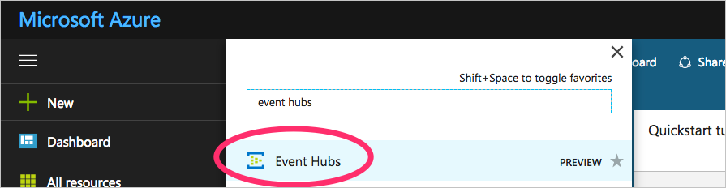
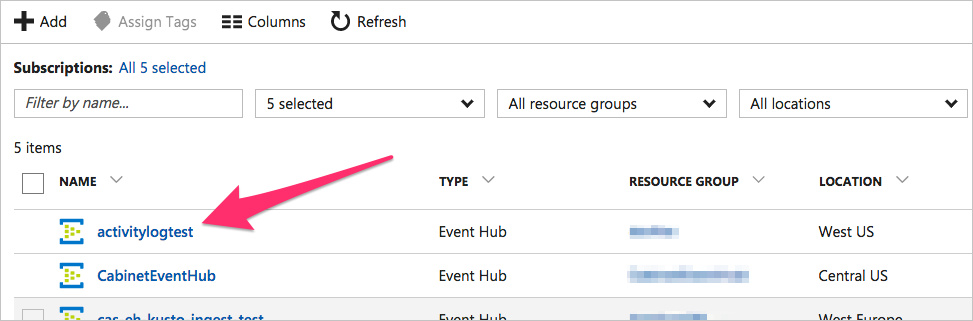
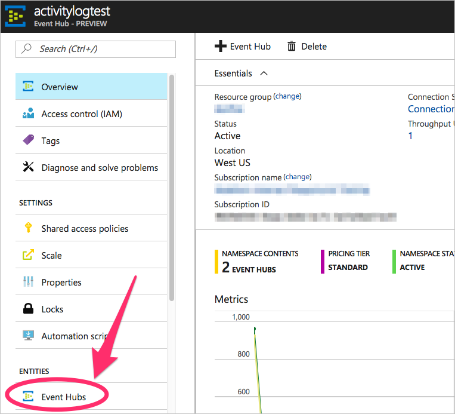
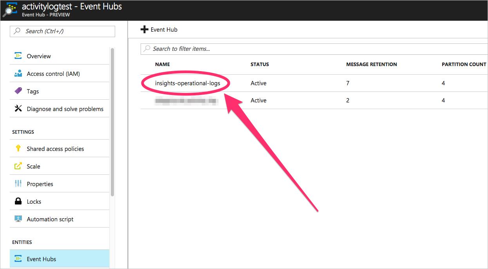
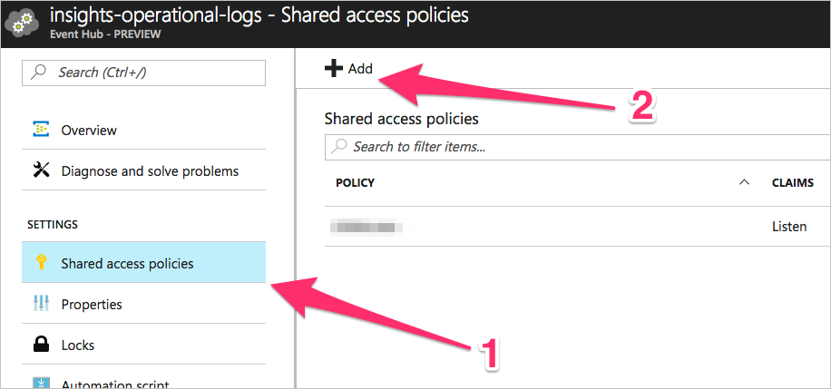
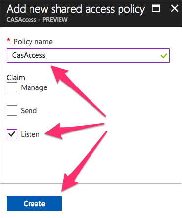
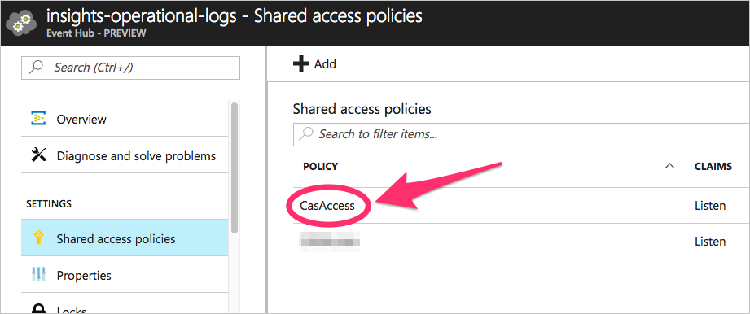
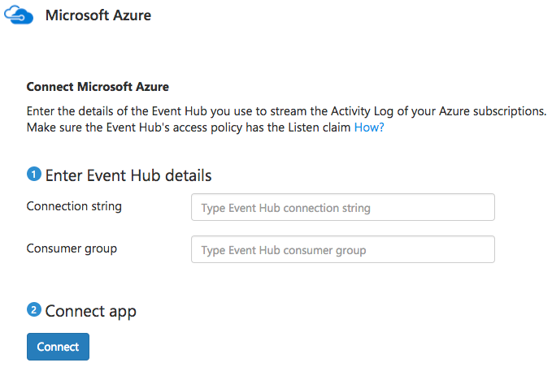

---
# required metadata

title: Connect Azure to Cloud App Security for visibility and control over use | Microsoft Docs
description: This topic provides information about how to connect Azure to Cloud App Security using the API connector.
keywords:
author: rkarlin
ms.author: rkarlin
manager: mbaldwin
ms.date: 8/15/2017
ms.topic: get-started-article
ms.prod:
ms.service: cloud-app-security
ms.technology:
ms.assetid: 3a677bc7-c8b7-4c6a-aada-82c8b3778352

# optional metadata

#ROBOTS:
#audience:
#ms.devlang:
ms.reviewer: reutam
ms.suite: ems
#ms.tgt_pltfrm:
#ms.custom:

---

# Connect Azure to Microsoft Cloud App Security

This section provides instructions for connecting Cloud App Security to your existing Azure account using the app connector API.  
  
## Setting up Azure for connection to Cloud App Security

Cloud App Security connects to Azure via Event Hubs. This section provides instruction for streaming all your Activity Logs to a single Event Hub in your subscription. 

### Step 1: Stream your Azure activity logs to Event Hubs

1.	Stream the Azure Activity Log of your Azure subscription to an Event Hub. Follow the official guide in the Azure documentation: https://docs.microsoft.com/en-us/azure/monitoring-and-diagnostics/monitoring-stream-activity-logs-event-hubs

 > [!NOTE]
 > If you have more than one Azure subscription, repeat this for each subscription but use a single Event Hub that will be shared across your subscriptions.

 After completing the instructions, a new Event Hub will be created in the Namespace you chose.
 
 > [!NOTE]
 > If you get an error after trying to export the Activity Logs, go to the **Resource providers** blade in Azure and make sure that ‘microsoft.insights’ is registered.

### Step 2: Get a connection string to your Event Hub

1.	Go to the **Event Hubs - Preview** blade.
  
   

2.	Select your Event Hub Namespace.
  
    

3.	In the menu, under **Entities**, click on **Event Hubs**. 
  
    

4.	Select the new Event Hub created by Azure Monitor. It is named **insights-operational-logs**.
  > [!NOTE]
  > It make take a few minutes until the Event Hub is created.

   
  
  
5. Create a new access policy that gives Cloud App Security permission to read from the Event Hub, by clicking on **Shared access policies** and then click **Add**.
  
    

6.	Enter a name for the new policy, and make sure to include at least the **Listen claim**. When done, click **Create**.
  
    

7.	Under **Settings** and then **Shared access policies**, click on the access policy you just created.   
  
    

8. In the Policy window, copy one of the connection strings by clicking on the button next to the **Connection string- Primary Key** or **Connection String- Secondary Key**.

### Step 3: Add Azure to Cloud App Security
 
1.	In the Cloud App Security portal, click **Investigate** and then **Connected apps**.  
  
3.  In the **App connectors** page, click the plus sign button and select **Microsoft Azure**.  
  
       
  
4.  In the **Connection string** field, paste the connection string you copied in the previous step.  
  
5.  In the **Consumer group** field, type:   `$Default`
    
   >[!NOTE] 
   > If you created a different consumer group to be used, use that **Consumer group** name.
  
6.  Click **Connect**.
     This will text the connection and may take a couple of minutes. After receiving a success notice, click **Close**.  
  
## See Also  
[Control cloud apps with policies](control-cloud-apps-with-policies.md)   
[For technical support, please visit the Cloud App Security assisted support page.](http://support.microsoft.com/oas/default.aspx?prid=16031)   
[Premier customers can also choose Cloud App Security directly from the Premier Portal.](https://premier.microsoft.com/)  
  
  