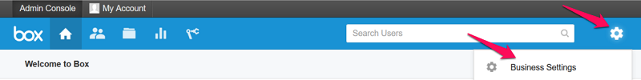
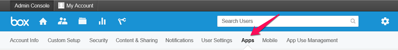
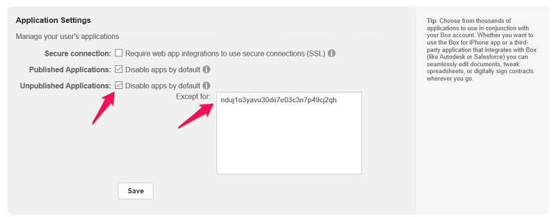
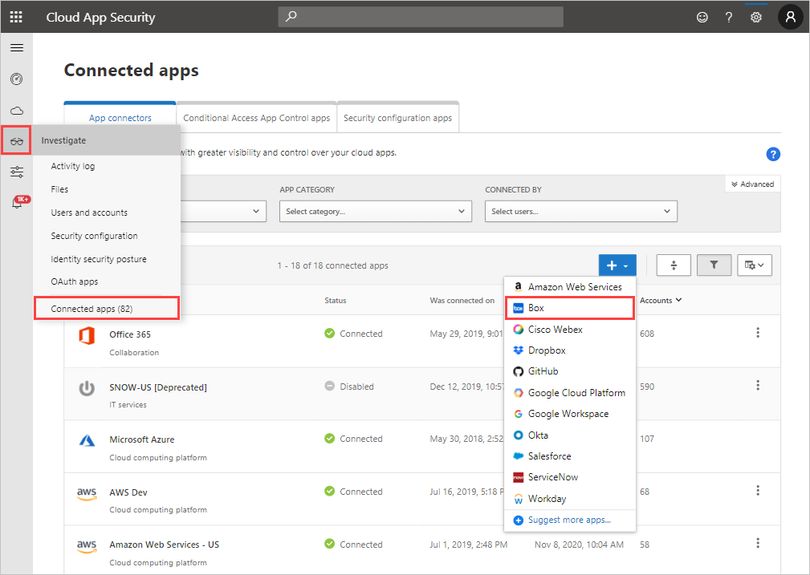

---
# required metadata

title: Connect Box to Cloud App Security
description: This article provides information about how to connect your Box app to Cloud App Security using the API connector for visibility and control over use.
keywords:
author: rkarlin
ms.author: rkarlin
manager: barbkess
ms.date: 12/10/2018
ms.topic: conceptual
ms.collection: M365-security-compliance
ms.prod:
ms.service: cloud-app-security
ms.technology:
ms.assetid: b3e4713e-986f-4a5e-9fcc-f8de94dd0df7

# optional metadata

#ROBOTS:
#audience:
#ms.devlang:
ms.reviewer: reutam
ms.suite: ems
#ms.tgt_pltfrm:
ms.custom: seodec18

---
# Connect Box to Microsoft Cloud App Security

*Applies to: Microsoft Cloud App Security*

This article provides instructions for connecting Microsoft Cloud App Security to your existing Box account using the App Connector APIs. This connection gives you visibility into and control over Box use.
  
## How to connect Box to Cloud App Security  
  
> [!NOTE]  
>  Deploying with an account that is not an Admin account leads to a failure in the API test and does not allow Cloud App Security to scan all of the files in Box. If this is a problem for you, you can deploy with a Co-Admin that has all of the privileges checked, but the API test will continue to fail and files owned by other admins in Box will not be scanned.  
  
1.  If you restrict application permission access, follow this step. Otherwise, skip to step 2.  
  
    -   In the Box Admin console, click the settings icon followed by **Business settings** or **Enterprise settings**.  
  
           
  
    -   Click on the **Apps** tab.  
  
           
  
    -   If **Unpublished Applications** is selected, in the **Except for** text box, add the Cloud App Security app serial number:
     
         |Data center|Microsoft Cloud App Security serial number|
         |----|----|    
         |US1| `nduj1o3yavu30dii7e03c3n7p49cj2qh`|
         |US2|`w0ouf1apiii9z8o0r6kpr4nu1pvyec75`|
         |US3|`dmcyvu1s9284i2u6gw9r2kb0hhve4a0r`|
         |EU1|`me9cm6n7kr4mfz135yt0ab9f5k4ze8qp`|
         |EU2|`uwdy5r40t7jprdlzo85v8suw1l4cdsbf`|

        Then click **Save**. For information on how to see which Cloud App Security data center you're connected to, see [API tokens](api-tokens.md). 
  
           
  
    > [!NOTE]  
    >  If you are an existing Adallom customer, and your console URL is for Adallom and not Cloud App Security, use this app serial number: bwahmilhdlpbqy2ongkl119o3lrkoshc.  
  
2.  In the Cloud App Security portal, click **Investigate** and then **Connected apps**.  
  
3.  In the **App connectors** page, click the plus sign button and select **Box**.  
  
       
  
4.  In the **Box settings** pop-up, click **Follow this link**.  
  
5.  The Box sign-in page opens. Enter your credentials to allow Cloud App Security access to your team's Box app.  
  
6.  Box asks you if you want to allow Cloud App Security access to your team information, activity log, and perform activities as a team member. To proceed, click **Allow**.  
  
7.  Back in the Cloud App Security portal, you should receive a message saying that Box was successfully connected.  
  
8.  Make sure the connection succeeded by clicking **Test API**.  
  
     Testing may take a couple of minutes. After receiving a success notice, click **Close**.  
  
Box is now connected to Cloud App Security.  
 
After connecting Box, you'll receive events for 60 days prior to connection.
  
After connecting Box, Cloud App Security performs a full scan. Depending on how many files and users you have, completing the full scan can take awhile. To enable near real-time scanning, files on which activities are detected are moved to the beginning of the scan queue. For example, a file that is edited, updated, or shared is scanned right away rather than waiting for the regular scan process. Near real-time scanning doesn't apply to files that aren't inherently modified. For example, files that are viewed, previewed, printed, or exported are scanned as part of the regularly scheduled scan.
  
## Next steps 
[Control cloud apps with policies](control-cloud-apps-with-policies.md)   

[Premier customers can also create a new support request directly in the Premier Portal.](https://premier.microsoft.com/)  
  
  
