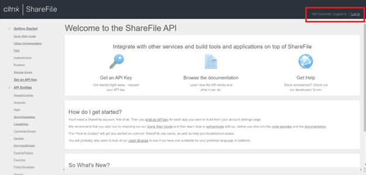
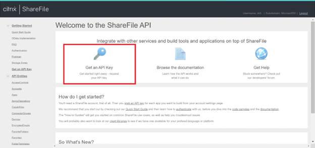
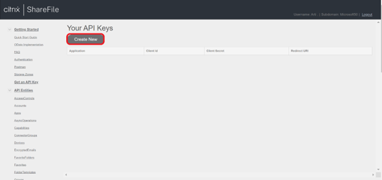
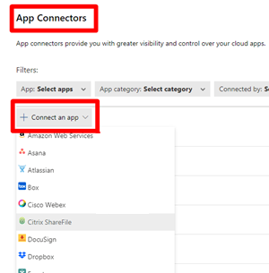
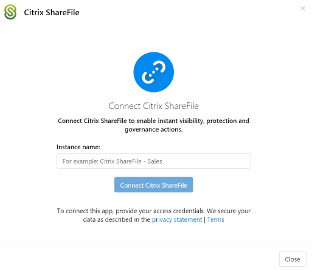

# Connect Citrix ShareFile to Microsoft Defender for Cloud Apps

[!INCLUDE [Banner for top of topics](includes/banner.md)]

This article provides instructions for connecting Microsoft Defender for Cloud Apps to your existing Citrix ShareFile account using the App Connector APIs. This connection gives you visibility into and control over Citrix ShareFile use.

[!INCLUDE [security-posture-management-connector](includes/security-posture-management-connector.md)]

## Prerequisites

The Citrix Share file user used for logging into Citrix Share file must have Access Company account permissions.

## Create API keys

1. Go to [ShareFile API Documentation](https://api.sharefile.com/), and sign in to your organization account.

    

1. Select **Get an API Key**.

    

1. To generate API keys (*Client ID* and *Client Secret*), go to **Create New**.

    

1. Fill out the following fields:

    - Application name: Microsoft Defender for Cloud Apps (you can also choose another name).
    - Redirect URL:  `https://portal.cloudappsecurity.com/api/oauth/saga` (change to your domain).

1. Select **Generate API Key**.

1. Copy the *Client ID* and *Client Secret*.

## Configure Defender for Cloud Apps

1. In the Microsoft 365 Defender portal, select **Settings**. Then choose **Cloud Apps**. Under **Connected apps**, select **App Connectors**.

1. In the **App connectors** page, select **+Connect an app**, followed by **Citrix ShareFile**.

    

1. In the pop-up, give the connector a descriptive name, and select **Connect Citrix ShareFile**.  

    

1. In the next screen, enter the following fields:

    - The **Client ID** and **Client Secret** that you created in the Citrix ShareFile API portal.
    - **Client Subdomain**: Enter your account's subdomain. For example, if your account's URL is "mycompany.sharefile.com", you would enter "mycompany".

1. Select **Connect** in Citrix ShareFile.

1. In the Microsoft 365 Defender portal, select **Settings**. Then choose **Cloud Apps**. Under **Connected apps**, select **App Connectors**. Make sure the status of the connected App Connector is **Connected**.

## Rate limits

The default rate limit is 420 requests per minute.  

## Next steps

> [!div class="nextstepaction"]
> [Control cloud apps with policies](control-cloud-apps-with-policies.md)

[!INCLUDE [Open support ticket](includes/support.md)]
