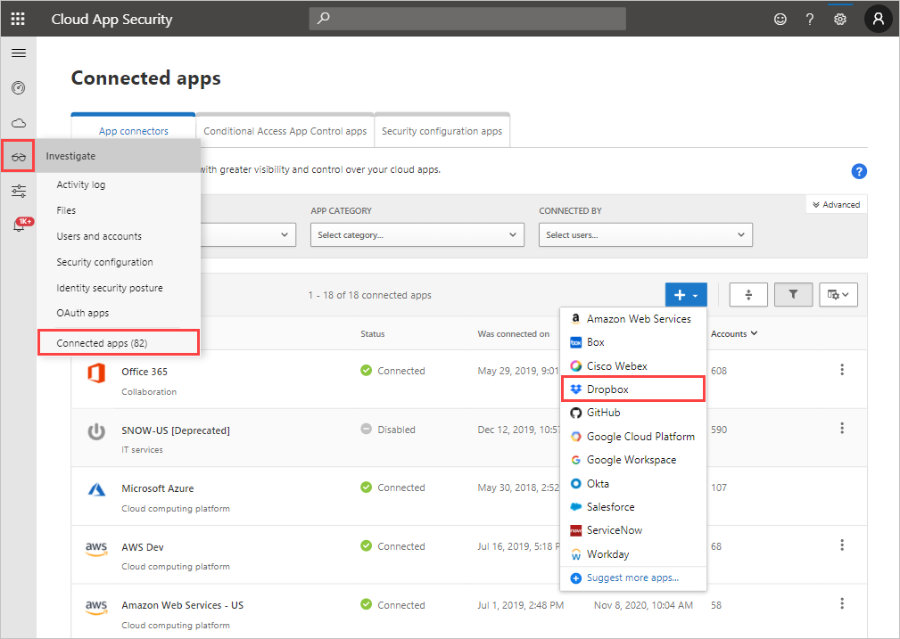

---
# required metadata

title: Connect Dropbox to Cloud App Security
description: This article provides information about how to connect your Dropbox app to Cloud App Security using the API connector  for visibility and control over use.
keywords:
author: rkarlin
ms.author: rkarlin
manager: barbkess
ms.date: 12/10/2018
ms.topic: conceptual
ms.collection: M365-security-compliance
ms.prod:
ms.service: cloud-app-security
ms.technology:
ms.assetid: 4acd93f4-b885-4e1f-a385-43b5db02a3ee

# optional metadata

#ROBOTS:
#audience:
#ms.devlang:
ms.reviewer: reutam
ms.suite: ems
#ms.tgt_pltfrm:
ms.custom: seodec18

---
# Connect Dropbox to Microsoft Cloud App Security

*Applies to: Microsoft Cloud App Security*

This article provides instructions for connecting Microsoft Cloud App Security to your existing Dropbox account using the connector APIs. This connection gives you visibility into and control over Dropbox use. 
 
 
Because Dropbox enables access to files from shared links without signing in, Cloud App Security registers these users as Unauthenticated users. If you see unauthenticated Dropbox users, it may indicate users who aren't from your organization, or they might be recognized users from within your organization who didn't sign in.

## How to connect Dropbox to Cloud App Security  
  
1.  In the Cloud App Security console, click **Investigate** and then **Connected apps**.  
  
2.  In the **App connectors** page, click the plus button followed by **Dropbox**.  
  
       
  
3.  In the pop-up, enter the admin account email address.  
  
4.  Click **Generate link**.  
  
5.  Click **Follow this link**.  
  
     The Dropbox sign in page opens. Enter your credentials to allow Cloud App Security access to your team's Dropbox instance.  
  
6.  Dropbox asks you if you want to allow Cloud App Security access to your team information, activity log, and perform activities as a team member. To proceed, click **Allow**.  
  
7.  Back in the Cloud App Security console, you should receive a message that Dropbox was successfully connected.  
  
8.  Make sure the connection succeeded by clicking **Test API**.  
  
     Testing may take a couple of minutes. After you receive a success notice, click **Close**.  
  
After connecting Dropbox, you'll receive events for 60 days prior to connection.

> [!NOTE] 
> Any Dropbox events for adding a file are displayed in Cloud App Security as Upload file to align to all other apps connected to Cloud App Security. 
 
## Next steps 
[Control cloud apps with policies](control-cloud-apps-with-policies.md)   

[Premier customers can also create a new support request directly in the Premier Portal.](https://premier.microsoft.com/)  
  
  
