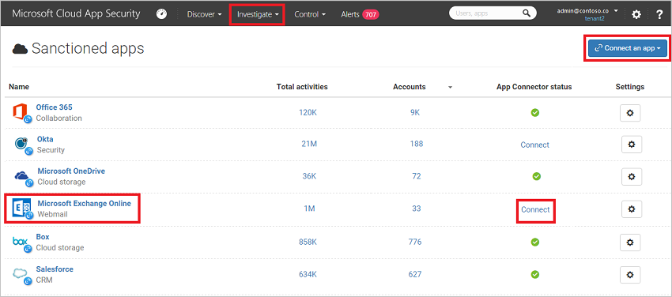
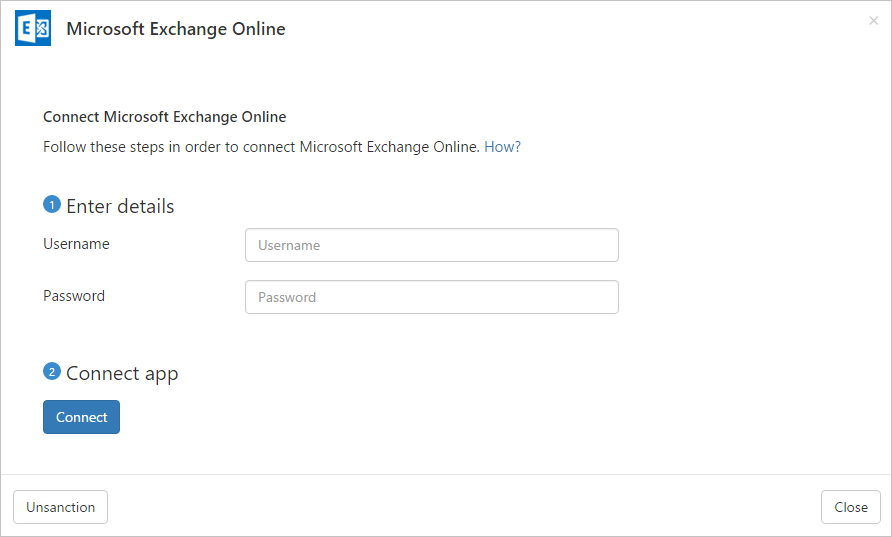

# Connect Exchange Online to Microsoft Cloud App Security
  This section provides instructions for connecting [!INCLUDE[Adallom](./includes/adallom_md.md)] to your existing Microsoft Exchange Online account using the app connector API.  
  
## How to connect Exchange Online to Cloud App Security  
  
1.  Make sure that you have a dedicated service account for [!INCLUDE[Adallom](./includes/adallom_md.md)] in Office 365.  
  
    -   You can do this by creating an onmicrosoft.com user in Azure AD, as described in [To add a user account](https://support.office.com/en-us/article/Create-or-edit-user-accounts-in-Office-365-operated-by-21Vianet-Admin-Help-39772f78-1df9-4b82-a3e5-f8ad41e66807).  
  
        > [!NOTE]  
        >  If you use ADSync, you can create and use a local user in Active Directory, instead of creating the  user in Office 365.  
  
         Make sure to set the following parameters:  
  
        -   Make sure the user account has global admin permissions.  
  
        -   Make sure to set your password with your organization's expiration policy. If you forget to update your Cloud App Security instance, you will be alerted within 24 hours.
  
            > [!NOTE]  
            >  Office has a token expiration policy for changing passwords. It is recommended to choose a very complex password and set the account to **Password never expires**. This will reduce the chances of visibility interruption to [!INCLUDE[Adallom](./includes/adallom_md.md)].  
  
2.  In the [!INCLUDE[Adallom](./includes/adallom_md.md)] console, click **Investigate** and then **Sanctioned apps**.  
  
3.  In the Exchange Online row, click **Connect** in the **App Connector status** column, or click the **Connect and App** button and select **Exchange Online**.  
  
       
  
4.  Enter the **User's email** and **Password** for the service account you created, and click **Connect**.  
  
       
  
5.  You should get a message that Microsoft Exchange Online was successfully connected.  

  After connecting Exchange, you will receive events for 7 days prior to connection.
  
## See Also  
 [Control cloud apps with policies](../migration/control-cloud-apps-with-policies.md)   
 [For technical support, please visit the Cloud App Security assisted support page.](http://support.microsoft.com/oas/default.aspx?prid=16031)   
 [Premier customers can also choose Cloud App Security directly from the Premier Portal.](https://premier.microsoft.com/)  
  
  