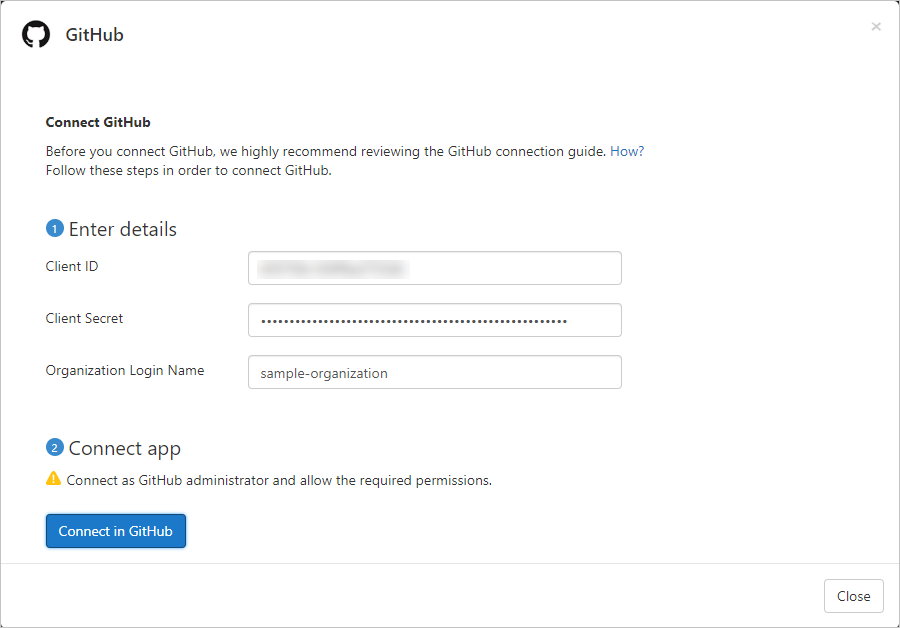

# Connect GitHub Enterprise Cloud to Microsoft Cloud App Security

[!INCLUDE [Banner for top of topics](includes/banner.md)]

This article provides instructions for connecting Microsoft Cloud App Security to your existing GitHub Enterprise Cloud organization using the App Connector APIs. This connection gives you visibility into and control over your organization's GitHub Enterprise Cloud use. For more information about how Cloud App Security protects GitHub Enterprise Cloud, see [Protect GitHub Enterprise](protect-github.md).

## Prerequisites

- Your organization must have a GitHub Enterprise Cloud license.
- The GitHub account used for connecting to Cloud App Security must have *Owner* permissions for your organization.
- To verify owners of your organization, browse to your organization's page, select **People**, and then filter by *Owner*.

## How to connect GitHub Enterprise Cloud to Cloud App Security

### Verify your GitHub domains

Verifying your domains is optional. However, we highly recommend that you do verify your domains so that Cloud App Security can match the domain emails of your GitHub organization's members to their corresponding Azure Active Directory user.

These steps can be completed independently of the [Configure GitHub Enterprise Cloud](#configure-github-enterprise-cloud) steps and can skipped if you have already verified your domains.

1. Upgrade your organization to the [Corporate Terms of Service](https://help.github.com/en/github/setting-up-and-managing-organizations-and-teams/upgrading-to-the-corporate-terms-of-service).
1. Verify [your organization's domains](https://help.github.com/en/github/setting-up-and-managing-organizations-and-teams/verifying-your-organizations-domain).

    > [!NOTE]
    > Make sure to verify each of the managed domains listed in your Cloud App Security portal. To view your managed domains, in Cloud App Security, browse to **Settings** > **Organization details** > **Managed domains**.

### Configure GitHub Enterprise Cloud

1. **Find your Organization's login name**  
In GitHub, browse to your organization's page, and from the URL, make a note of your organization login name, you'll need it later.

    > [!NOTE]
    > The page will have a URL like `https://github.com/<your-organization>`. For example, if your organization's page is `https://github.com/sample-organization`, the organization's login name is *sample-organization*.

    

1. **Create an OAuth App for Cloud App Security to connect your GitHub organization.**  
Repeat this step for each additional connected organization.

    1. Browse to **Settings** > **Developer settings**, select  **OAuth Apps**, and then click **Register an application**. Alternatively, if you have existing OAuth apps, click **New OAuth App**.

        

    1. Fill out the **Register a new OAuth app** details and then click **Register application**.
        - In the **Application name** box, enter a name for the app.
        - In the **Homepage URL** box, enter the URL for the app's homepage.
        - In the **Authorization callback URL** box, enter the following value: `https://portal.cloudappsecurity.com/api/oauth/connect`.

            > [!NOTE]
            > For US Government GCC High customers, enter the following value: `https://portal.cloudappsecurity.us/api/oauth/connect`

        

    > [!NOTE]
    >
    > - By default, OAuth app access is restricted for organizations. To enable access, browse to **Settings** > **Third-party access**, click **Remove restrictions**, and then click **Yes, remove application restrictions**.
    > - Apps owned by an organization have access to the organization's apps. For more information, see [About OAuth App access restrictions](https://help.github.com/en/github/setting-up-and-managing-organizations-and-teams/about-oauth-app-access-restrictions).

1. Browse to **Settings** > **OAuth Apps**, select the OAuth App you just created, and make note of its **Client ID** and **Client Secret**.

    

### Configure Cloud App Security

1. In the Cloud App Security portal, click **Investigate** and then **Connected apps**.

1. In the **App connectors** page, click the plus button followed by **GitHub**.

1. In the pop-up, fill out the **Client ID**, **Client Secret**, and **Organization Login Name** that you made a note of earlier, and then click **Connect in GitHub**.

    

    The GitHub sign-in page opens. If necessary, enter your GitHub administrator credentials to allow Cloud App Security access to your team's GitHub Enterprise Cloud instance.

1. Authorize the app to give Cloud App Security to access your GitHub organization.

    > [!NOTE]
    > Cloud App Security requires the following OAuth scopes:
    >
    > - **admin:org** - required for synchronizing your organization's audit log
    > - **read:user** and **user:email** - required for synchronizing your organization's members
    > - **repo:status** - required for synchronizing repository-related events in the audit log
    > For more information about OAuth scopes, see [Understanding scopes for OAuth Apps](https://developer.github.com/apps/building-oauth-apps/understanding-scopes-for-oauth-apps/).

    

1. Back in the Cloud App Security console, you should receive a message that GitHub was successfully connected.

1. Make sure the connection succeeded by clicking **Test API**.

    Testing may take a couple of minutes. After you receive a success notice, click **Close**.

After connecting GitHub Enterprise Cloud, you'll receive events for 7 days prior to connection.

If you have any problems connecting the app, see [Troubleshooting App Connectors](troubleshooting-api-connectors-using-error-messages.md).

## Next steps

> [!div class="nextstepaction"]
> [Control cloud apps with policies](control-cloud-apps-with-policies.md)

[!INCLUDE [Open support ticket](includes/support.md)]
