# Connect Google Apps to Microsoft Cloud App Security
  This section provides instructions for connecting Cloud App Security to your existing Google Apps account using the connector APIs.  
  
## Configure Google Apps  
  
1.  As a Google Apps Super Admin, log into [https://cloud.google.com/console/project](https://cloud.google.com/console/project).  
  
2.  Click **Create an empty project** to start a new project.  
  
       
  
3.  In the **New project** screen:  
  
    1.  Name your project **Cloud App Security for Google**.  
  
    2.  Select whether or not you want to subscribe to updates.  
  
    3.  Review and approve the terms of service.  
  
    4.  Click **Create**.  
  
           
  
4.  After the project is created, click **Enable and manage APIs**.  
  
     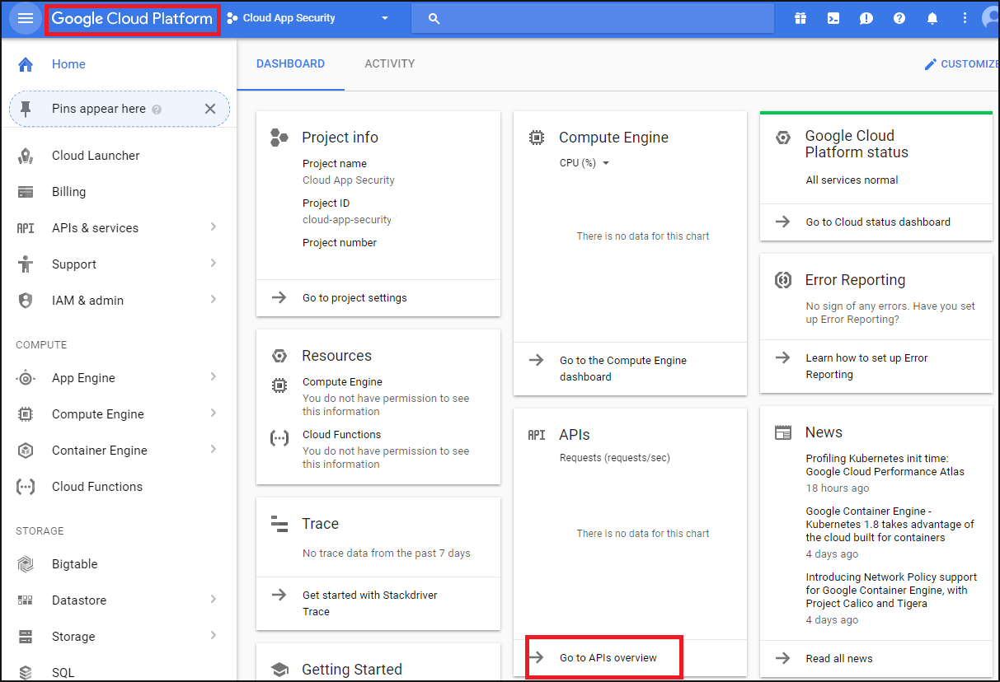  
  
5.  Click on the **Enabled APIs** tab, and disable all the listed APIs.  
  
       
  
6.  Click on the **Google APIs** tab and enable the following APIs (use the search line if the API is not listed in the **Popular APIs** list):  
  
     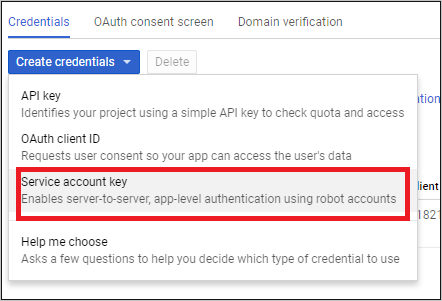  
  
    > [!NOTE]  
    >  Ignore the **Credentials** warning for now.  
  
    -   Admin SDK  
  
    -   Audit API  
  
    -   Drive API  
  
    -   Google Apps Marketplace SDK  
  
    -   Gmail API  
  
         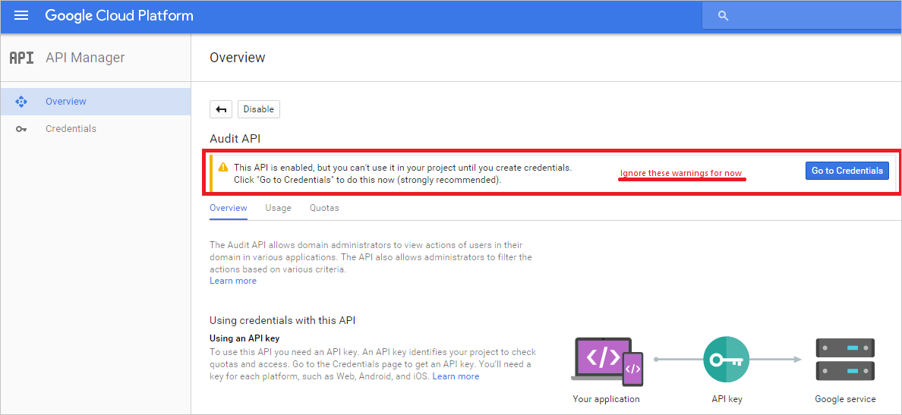  
  
7.  You should have 5 **Enabled APIs**:  
  
       
  
8.  Click **Credentials** followed by **OAuth consent**  
  
    -   In **Product name shown to users**, type **Cloud App Security for Google**.  
  
    -   All other fields are optional.  
  
    -   Click **Save**.  
  
     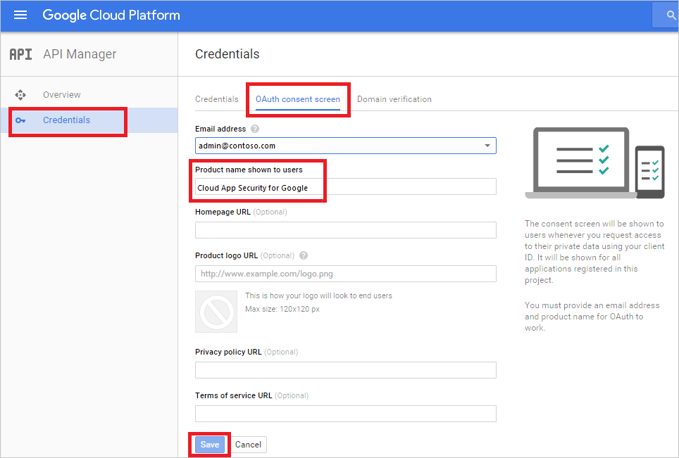  
  
9. In the **Credentials** tab, click the arrow next to **Create credentials** and select **Service account key**.  
  
     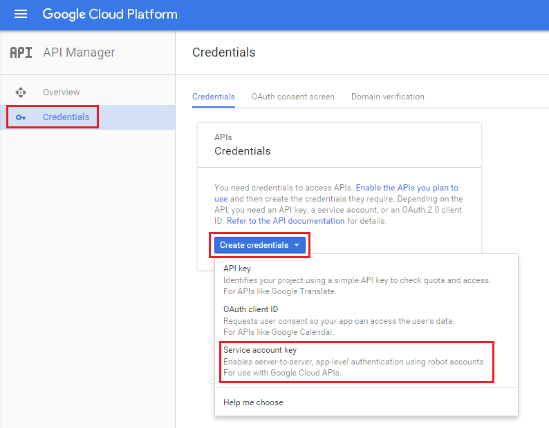  
  
10. In **Service account**, choose **New service account** and type any name, for example **Service account 1**.  
  
     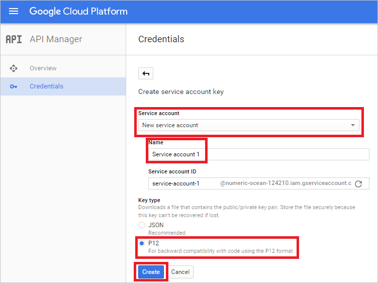  
  
     Under **Key type** choose **P12** and click **Create**.  
  
     A P12 certificate file will be downloaded. Save the certificate for use later.  
  
     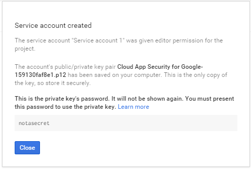  
  
11. In the **Credentials** tab, click **Manage service accounts** in the far right.  
  
     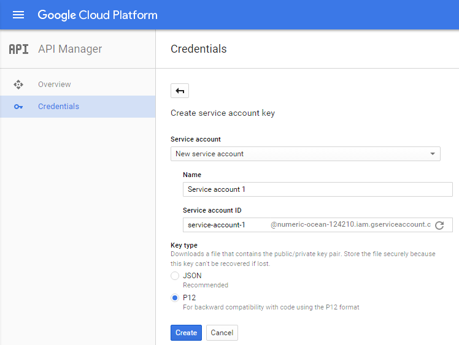  
  
12. Click the 3 dots to the right of the service account you created and select **Edit**.  
  
     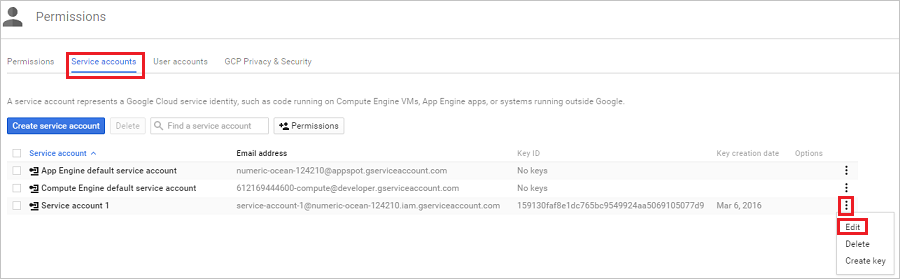  
  
13. Select the **Enable Google Apps Domain-wide Delegation** checkbox and click **Save**.  
  
     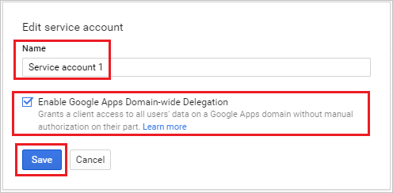  
  
14. Copy the **Email address** assigned to your service - you will need it later.  
  
     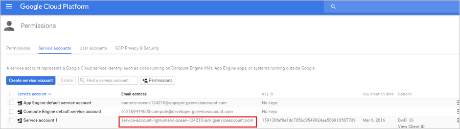  
  
15. Open the Google menu by clicking the three horizontal lines next to Google Cloud Platform, and select **API manager**.  
  
       
  
     Select **Enabled APIs**.  
  
     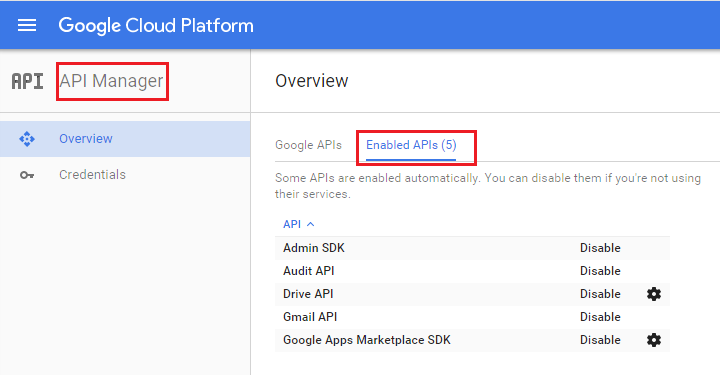  
  
16. Click on the settings cog next to **Drive API** and under **Drive UI Integration**, fill in the following:  
  
    -   **Application Name**: Cloud App Security for Google.  
  
    -   **Short Description & Long Description**: Microsoft Cloud App Security enables you visibility into cloud applications, helping you control, investigate and govern cloud application use; secure corporate data; and detect suspicious activities for any cloud application.  
  
    -   Under **Application icon** upload the 128x128 and 32x32 images.  
  
         The images can be found at:  [https://portal.cloudappsecurity.com/cas/static/files/MSLogos.zip](https://portal.cloudappsecurity.com/cas/static/files/MSLogos.zip)  
  
    -   Type the following under **Open URL:**  
  
         https://portal.cloudappsecurity.com/#/services/11770?tab=files  
  
    -   Click **Save Changes**.  
  
           
  
17. In the **Enabled APIs** list, click the setting cog setting next to **Google Apps Marketplace SDK** and select the **Configuration** tab.  
  
    -   Copy the **Project number (App ID)** that appears at the top to use later.  
  
    -   **Application Name**: Cloud App Security for Google.  
  
         Fill in the **Application description** field with "Microsoft Cloud App Security provides visibility into cloud apps, helping you control, investigate and govern cloud app use; secure corporate data; and detect suspicious activities for any cloud app."  
  
    -   Uncheck the **Enable individual install** checkbox.  
  
    -   Configure the 4 required images under **Application icons**.  
  
         The images can be found at:  [https://portal.cloudappsecurity.com/cas/static/files/MSLogos.zip](https://portal.cloudappsecurity.com/cas/static/files/MSLogos.zip)  
  
           
  
    -   Fill in the following **Support URLs**:  
  
        -   **Terms of service URL**: http://go.microsoft.com/fwlink/?LinkID=733268  
  
        -   **Privacy policy URL**: http://go.microsoft.com/fwlink/?LinkId=512132  
  
    -   Under **OAuth 2.0 scopes** type the following (1 per line. Press Enter to confirm):  
  
        -   https://www.googleapis.com/auth/admin.reports.audit.readonly  
  
        -   https://www.googleapis.com/auth/admin.reports.usage.readonly  
  
        -   https://www.googleapis.com/auth/drive  
  
        -   https://www.googleapis.com/auth/drive.appdata  
  
        -   https://www.googleapis.com/auth/drive.apps.readonly  
  
        -   https://www.googleapis.com/auth/drive.file  
  
        -   https://www.googleapis.com/auth/drive.metadata.readonly  
  
        -   https://www.googleapis.com/auth/drive.readonly  
  
        -   https://www.googleapis.com/auth/drive.scripts  
  
        -   https://www.googleapis.com/auth/admin.directory.user.readonly  
  
        -   https://www.googleapis.com/auth/admin.directory.user.security  
  
        -   https://www.googleapis.com/auth/admin.directory.user.alias  
  
        -   https://www.googleapis.com/auth/admin.directory.orgunit  
  
        -   https://www.googleapis.com/auth/admin.directory.notifications  
  
        -   https://www.googleapis.com/auth/admin.directory.group.member  
  
        -   https://www.googleapis.com/auth/admin.directory.group  
  
        -   https://www.googleapis.com/auth/admin.directory.device.mobile.action  
  
        -   https://www.googleapis.com/auth/admin.directory.device.mobile  
  
        -   https://www.googleapis.com/auth/admin.directory.user  
  
    -   Click on **Save Changes**.  
  
18. Select **Security** from the list of controls. If you don't see this option listed, select More controls from the gray bar at the bottom of the page, and then select **Security**.  
  
     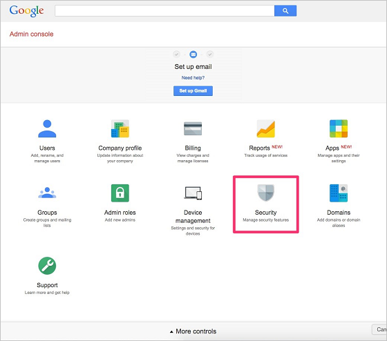  
  
19. Choose **API reference**.  
  
     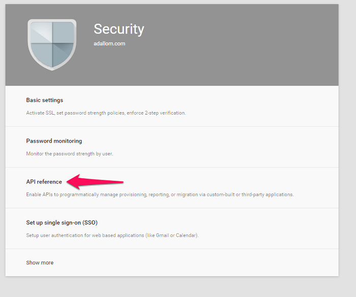  
  
20. Select **Enable API Access** and click **Save changes**.  
  
     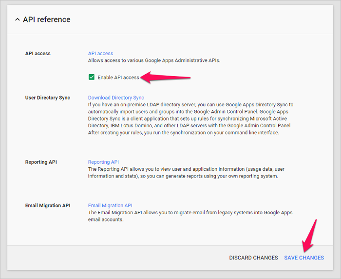  
  
## Configure Cloud App Security  
  
1.  In the Cloud App Security portal, click **Investigate** and then **Sanctioned apps**.  
  
2.  In the Google Apps row, click **Connect** in the **App Connector status** column, or click **Connect an app** and select **Google Apps**.  
  
     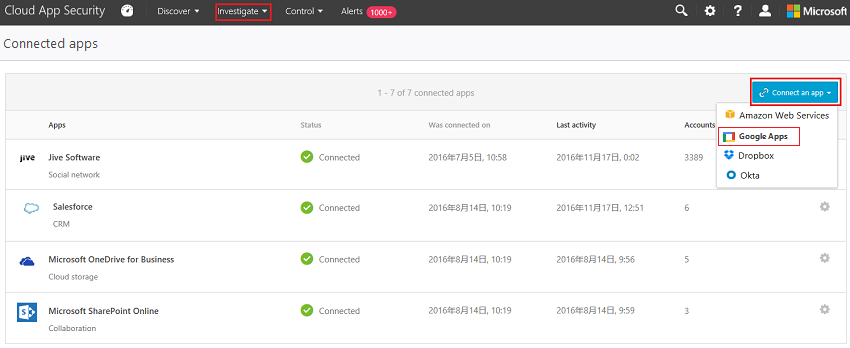  
  
3.  In the Google Apps settings page, fill in the following:  
  
     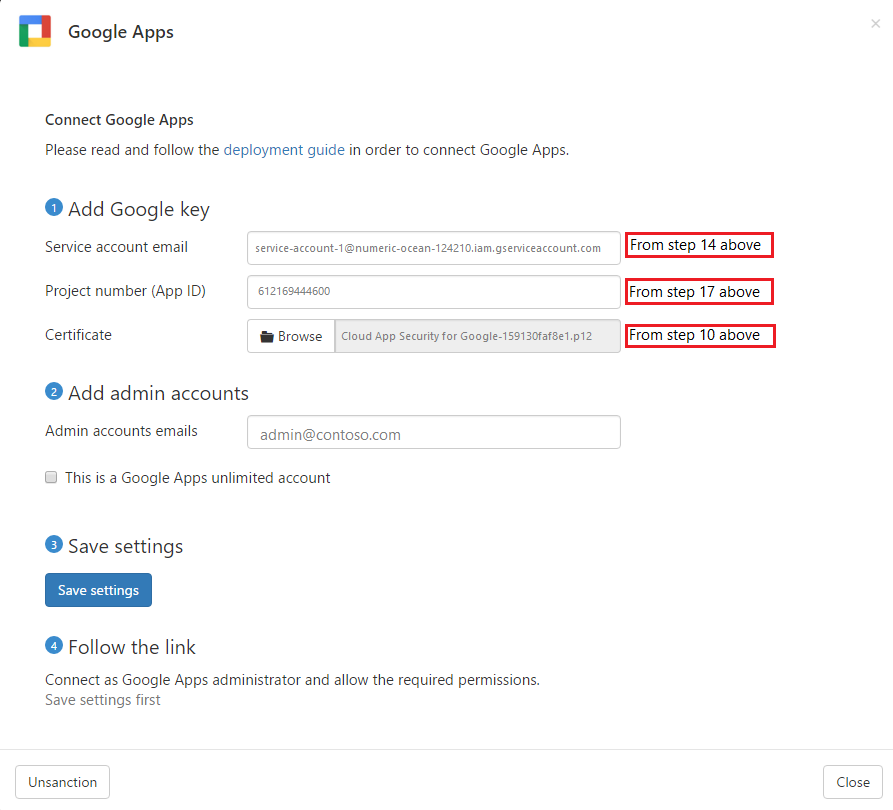  
  
    1.  **Google Service Account email address** that you copied in step 14.  
  
    2.  **Google Project number (App ID)** that you copied in step 17.  
  
    3.  Upload the **Google Certificate** P12 that you saved in step 10.  
  
    4.  Enter one **admin email** of your Google Apps admin.  
  
    5.  If you have a Google Apps unlimited account, check this checkbox. For information about which features are available in Cloud App Security for Google Apps unlimited, see [Enable instant visibility, protection and governance actions for your apps](enable-instant-visibility--protection-and-governance-actions-for-your-apps.md).  
  
    6.  Click **Save settings**.  
  
    7.  **Follow the link** to connect to Google Apps. This will open Google Apps and you will be asked to authorize access for Cloud App Security.  
  
         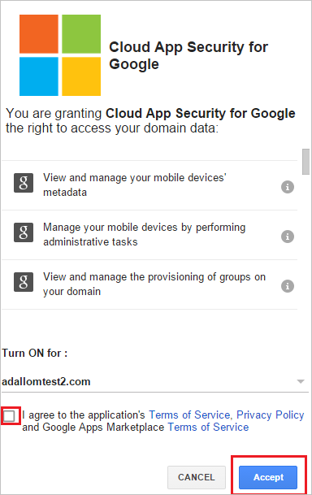  
  
    8.  Make sure the connection succeeded by clicking **Test API**.  
  
         Testing may take a couple of minutes.  
  
         After receiving a success notice, click **Done** and close the Google Apps page.  
  
  
  After connecting Google Apps, you will receive events for 60 days prior to connection.
  
  After connecting Google Apps, Cloud App Security performs a full scan. Depending on how many files and users you have, completing the full scan can take awhile. To enable near real time scanning, files on which activity is detected are moved to the beginning of the scan queue, for example a file that is edited, updated, or shared is scanned right away and doesn't wait until it is reached by regular scan process. This does not apply to files that are not inherently modified, for example files that are viewed, previewed, printed or exported.
  
  
## See Also  
 [Control cloud apps with policies](control-cloud-apps-with-policies.md)   
 [For technical support, please visit the Cloud App Security assisted support page.](http://support.microsoft.com/oas/default.aspx?prid=16031)   
 [Premier customers can also choose Cloud App Security directly from the Premier Portal.](https://premier.microsoft.com/)  
  
  