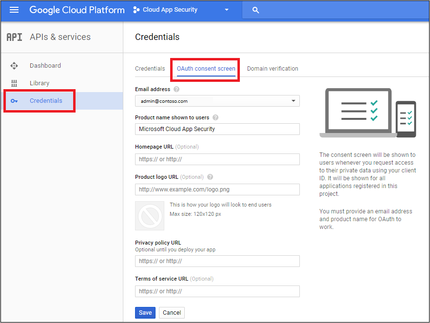
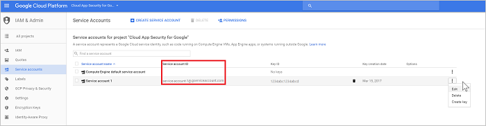
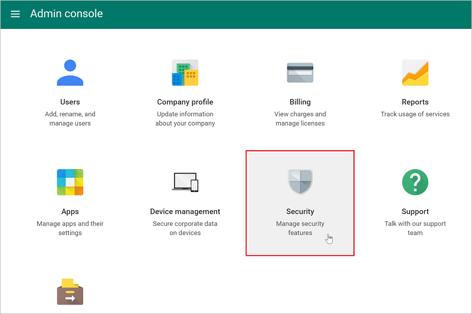
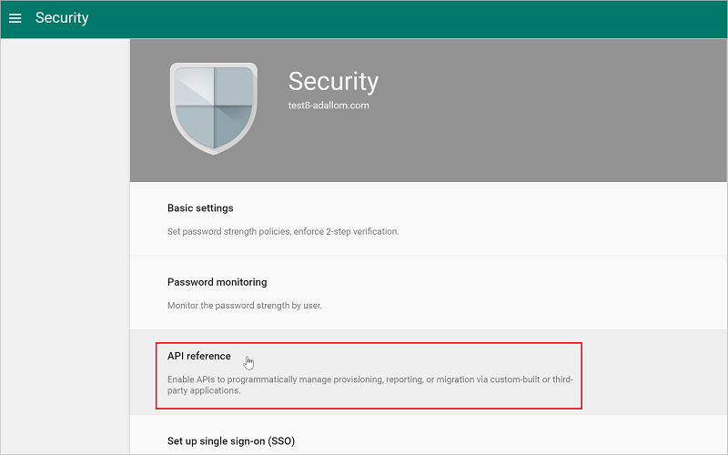

---
# required metadata

title: Connect G Suite to Cloud App Security for visibility and control over use | Microsoft Docs
description: This topic provides information about how to connect your G Suite to Cloud App Security using the API connector.
keywords:
author: rkarlin
ms.author: rkarlin
manager: mbaldwin
ms.date: 3/15/2017
ms.topic: get-started-article
ms.prod:
ms.service: cloud-app-security
ms.technology:
ms.assetid: b938e1e0-356d-4cc6-ba4a-862c0c59d709

# optional metadata

#ROBOTS:
#audience:
#ms.devlang:
ms.reviewer: reutam
ms.suite: ems
#ms.tgt_pltfrm:
#ms.custom:

---

# Connect G Suite to Microsoft Cloud App Security
This section provides instructions for connecting Cloud App Security to your existing G Suite account using the connector APIs.

  
  
## Configure G Suite  
  
1.  As a G Suite Super Admin, log into [https://cloud.google.com/console/project](https://cloud.google.com/console/project).  
  
2.  Click **Create project** to start a new project.  
  
       
  
3.  In the **New project** screen name your project as follows: 
    **Cloud App Security for Google** and click **Create**.  
             
  
4.  After the project is created, in the toolbar, next to Google Cloud Platform, select the project and then under **API** click **Go to APIs overview**.  
  
       
  
5.  Under **API**, disable all the listed APIs.  
      
6.  Click on **Library** and enable the following APIs (use the search line if the API is not listed in the **Popular APIs** list):  
  
       
  
    > [!NOTE]  
    >  Ignore the **Credentials** warning for now.  
  
    -   Admin SDK  
  
    -   Audit API  
  
    -   Google Drive API  
  
    -   Google Apps Marketplace SDK  
  
    -   Gmail API  
            
7.  You should have 5 **Enabled APIs**:  
  
       
  
8.  Click **Credentials** followed by **OAuth consent screen**  
  
    -   In **Product name shown to users**, type **Cloud App Security for Google**.  
  
    -   All other fields are optional.  
  
    -   Click **Save**.  
  
       
  
9. In the **API Credentials** screen, click the arrow next to **Create credentials**.  
  
       

10. Select **Service account key**.

       
  
11. Under **Create service account key**, choose **New service account** and type any name, for example **Service account 1**, under **Role** choose **Project** and then **editor** and under **Key type** choose **P12** and click **Create**.  
  
       
  
12.  A P12 certificate file will be saved to your computer. A pop-up will show you  the **password for the private key** MAKE SURE YOU SAVE IT for use later.  
        
12. In the **Credentials** screen, click **Manage service accounts** in the far right.  
         
  
13. Click the 3 dots to the right of the service account you created and select **Edit**.  
  
       
  
14. Select the **Enable G Suite Domain-wide Delegation** checkbox and click **Save**.  
  
       
  
15. Copy the **Service account ID** assigned to your service - you will need it later.  
  
       
  
16. Open the Google menu by clicking the three horizontal lines next to Google Cloud Platform in the titlebar, and select **API manager** followed by **Dashboard**.  
    
17. Scroll down to the list of enabled APIs and click on the settings cog next to **Google Drive API**.   
         

18. Fill in the following:

    -   **Application Name**: Cloud App Security for Google.  
  
    -   **Short Description & Long Description** (optional): Microsoft Cloud App Security provides you with visibility into cloud applications, helping you control, investigate and govern cloud application use; secure corporate data; and detect suspicious activities for any cloud application.  
  
    -   Google requires you to upload at least one application Icon. Go to [https://portal.cloudappsecurity.com/cas/static/files/MSLogos.zip](https://portal.cloudappsecurity.com/cas/static/files/MSLogos.zip) to download a zip file containing Cloud App Security icons. Then, under **Application icon** drag and drop the 128x128 and 32x32 images.  
  
    -   Under **Drive Integration** type the following under **Open URL:**  
  
         https://portal.cloudappsecurity.com/#/services/11770?tab=files  
  
    -   Click **Save Changes**.  
  
           
  
19. In the **Enabled APIs** list, click the setting cog setting next to **Google Apps Marketplace SDK**. 
           
20. Select the **Configuration** tab.  
  
    -   Copy the **Project number (App ID)** that appears at the top to use later.  
  
    -   The **Application Name** should say **Cloud App Security for Google**.
  
         Fill in the **Application description** field with "Microsoft Cloud App Security provides visibility into cloud apps, helping you control, investigate and govern cloud app use; secure corporate data; and detect suspicious activities for any cloud app."  
  
    -   Uncheck the **Enable individual install** checkbox.  
  
    -   Configure the 4 required images under **Application icons**.  
  
         The images can be found at:  [https://portal.cloudappsecurity.com/cas/static/files/MSLogos.zip](https://portal.cloudappsecurity.com/cas/static/files/MSLogos.zip)  
  
           
  
    -   Fill in the following **Support URLs**:  
  
        -   **Terms of service URL**: http://go.microsoft.com/fwlink/?LinkID=733268  
  
        -   **Privacy policy URL**: http://go.microsoft.com/fwlink/?LinkId=512132  
  
    -   Under **OAuth 2.0 scopes** copy and paste following. You have to copy them one at a time and press Enter after each one:  
  
           https://www.googleapis.com/auth/admin.reports.audit.readonly  
  
           https://www.googleapis.com/auth/admin.reports.usage.readonly  
  
           https://www.googleapis.com/auth/drive  
  
           https://www.googleapis.com/auth/drive.appdata  
  
           https://www.googleapis.com/auth/drive.apps.readonly  
  
           https://www.googleapis.com/auth/drive.file  
  
           https://www.googleapis.com/auth/drive.metadata.readonly  
  
           https://www.googleapis.com/auth/drive.readonly  
  
           https://www.googleapis.com/auth/drive.scripts  
  
           https://www.googleapis.com/auth/admin.directory.user.readonly  
  
           https://www.googleapis.com/auth/admin.directory.user.security  
  
           https://www.googleapis.com/auth/admin.directory.user.alias  
  
           https://www.googleapis.com/auth/admin.directory.orgunit  
  
           https://www.googleapis.com/auth/admin.directory.notifications  
  
           https://www.googleapis.com/auth/admin.directory.group.member  
  
           https://www.googleapis.com/auth/admin.directory.group  
  
           https://www.googleapis.com/auth/admin.directory.device.mobile.action  
  
           https://www.googleapis.com/auth/admin.directory.device.mobile  
  
           https://www.googleapis.com/auth/admin.directory.user  
  
    -   Click on **Save Changes**.  
  
18. Go to [www.admin.google.com](https://www.admin.google.com/) and then choose **Security**. 
         
 
19. Choose **API reference**.  
         
      
20. Select **Enable API Access** and click **Save changes**.  
  
              

  
## Configure Cloud App Security  
  
1.  In the Cloud App Security portal, click **Investigate** and then **Connected apps**.  
  
2.  In the **Connected apps** page, click the plus sign and select **G Suite**.  
       
  
3.  In the pop-up, fill in the following:  
  
       
  
    1.  **Service Account email address** that you copied in step 16.  
  
    2.  **Project number (App ID)** that you copied in step 21.  
  
    3.  Upload the **Certificate** P12 that you saved in step 12. You will need the password you saved to do this.  
  
    4.  Enter one **admin account email** of your G Suite admin.  
  
    5.  If you have a G Suite unlimited account, check this checkbox. For information about which features are available in Cloud App Security for G Suite unlimited, see [Enable instant visibility, protection and governance actions for your apps](enable-instant-visibility-protection-and-governance-actions-for-your-apps.md).  
  
    6.  Click **Save settings**.  
  
    7.  **Follow the link** to connect to G Suite. This will open G Suite and you will be asked to authorize access for Cloud App Security.  
         
    8.  Make sure the connection succeeded by clicking **Test now**.  
  
         Testing may take a couple of minutes.  
  
         After receiving a success notice, click **Done** and close the G Suite page.  
  
  
After connecting G Suite, you will receive events for 60 days prior to connection.
  
After connecting G Suite, Cloud App Security performs a full scan. Depending on how many files and users you have, completing the full scan can take awhile. To enable near real time scanning, files on which activity is detected are moved to the beginning of the scan queue, for example a file that is edited, updated, or shared is scanned right away and doesn't wait until it is reached by regular scan process. This does not apply to files that are not inherently modified, for example files that are viewed, previewed, printed or exported.
  
  
## See Also  
[Control cloud apps with policies](control-cloud-apps-with-policies.md)   
[For technical support, please visit the Cloud App Security assisted support page.](http://support.microsoft.com/oas/default.aspx?prid=16031)   
[Premier customers can also choose Cloud App Security directly from the Premier Portal.](https://premier.microsoft.com/)  
  
  