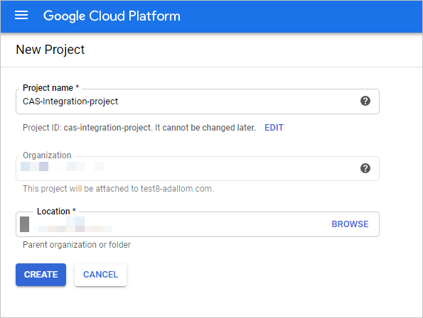
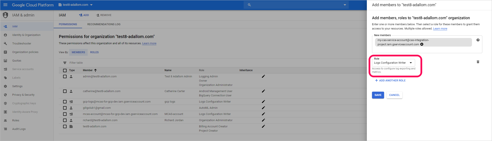
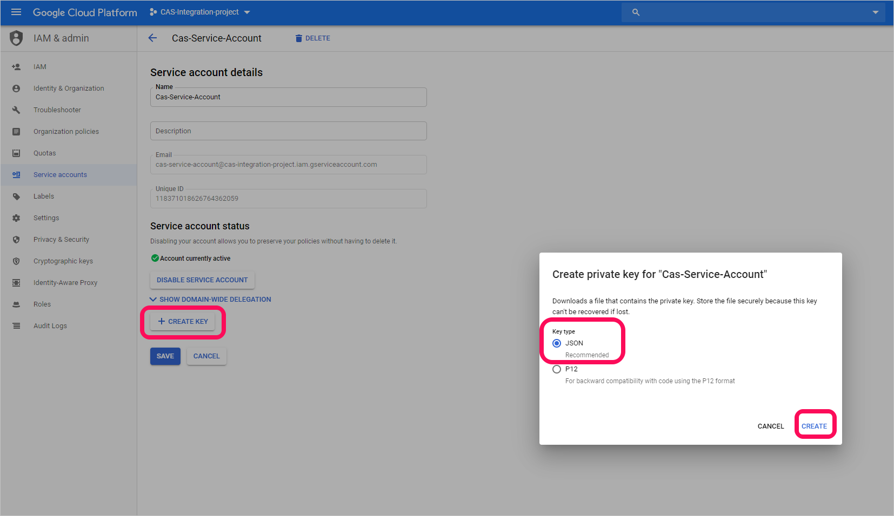
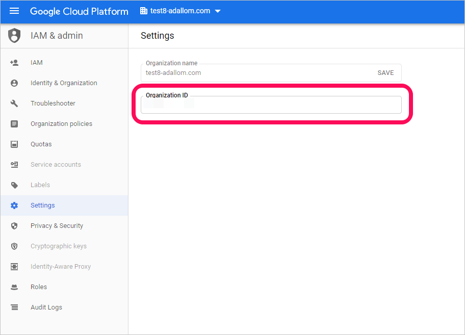
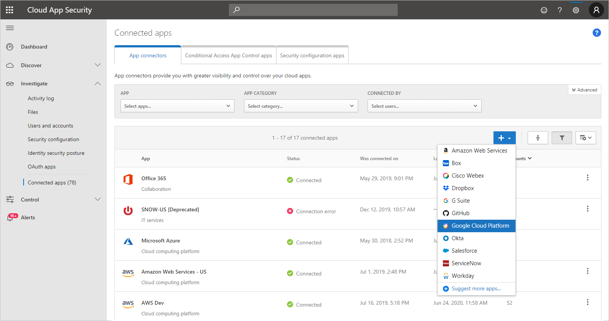

---
# required metadata

title: Connect Google Cloud Platform to Cloud App Security
description: This article provides information about how to connect your Google Cloud Platform to Cloud App Security using the API connector for visibility and control over use.
keywords:
author: shsagir
ms.author: shsagir
manager: shsagir
ms.date: 10/16/2019
ms.topic: conceptual
ms.service: cloud-app-security

# optional metadata
#ROBOTS: NOINDEX # Used to prevent showing on search pages
#services: na
#ms.subservice: na
ms.collection: M365-security-compliance
---
# Connect Google Cloud Platform to Microsoft Cloud App Security (Preview)

*Applies to: Microsoft Cloud App Security*

This article provides instructions for connecting Microsoft Cloud App Security to your existing Google Cloud Platform (GCP) account using the connector APIs. This connection gives you visibility into and control over GCP use.

> [!NOTE]
> The instructions for connecting your GCP environment follow [Google’s recommendations](https://cloud.google.com/blog/products/gcp/best-practices-for-working-with-google-cloud-audit-logging) for consuming aggregated logs. The integration leverages Google StackDriver and will consume additional resources that might impact your billing. The consumed resources are:
>
> * [Aggregated export sink – Organization level](https://cloud.google.com/logging/docs/export/aggregated_exports#concept)
> * [Pub/Sub topic – GCP project level](https://cloud.google.com/logging/docs/export/using_exported_logs#pubsub-overview)
> * [Pub/Sub subscription – GCP project level](https://cloud.google.com/logging/docs/export/using_exported_logs#pubsub-overview)
>
> Currently, Cloud App Security only imports Admin Activity audit logs; Data Access and System Event audit logs are not imported. For more information about GCP logs, see [Cloud Audit Logs](https://go.microsoft.com/fwlink/?linkid=2109230).

We recommend that you use a dedicated project for the integration and restrict access to the project to maintain stable integration and prevent deletions/modifications of the setup process. Also, if your GCP instance is part of an G Suite instance already connected to Cloud App Security, we recommend following the **For a GCP instance that is part of a connected G Suite organization** steps when you add the GCP connection details.

## Prerequisites

The integrating GCP user must have the following permissions:

* **IAM and Admin edit** – Organization level
* **Project creation and edit**

## Configure Google Cloud Platform

* Sign in to your GCP portal using your integrating GCP user account.

### Create a dedicated project

Create a dedicated project in GCP under your organization to enable integration isolation and stability

1. Click **Create Project** to start a new.
1. In the **New project** screen, name your project and click **Create**.

    

### Enable the Pub/Sub API

1. Switch to the dedicated project.
1. Go to the Pub/Sub tab. A service activation message should appear.

### Create a dedicated service account for the integration

1. Under **IAM & admin**, click **Service accounts**.
1. Click **CREATE SERVICE ACCOUNT** to create a dedicated service account.
1. Enter an account name, and then click **Create**.
1. Specify the **Role** as **Pub/Sub Admin** and then click **Save**.

    

1. Copy the **Email** value, you'll need this later.

    

1. Under **IAM & admin**, click **IAM**.

    1. Switch to organization level.
    1. Click **ADD**.
    1. In the **New members** box, paste the **Email** value you copied earlier.
    1. Specify the **Role** as **Logs Configuration Writer** and then click **Save**.

        

### Create a private key for the dedicated service account

1. Switch to project level.
1. Under **IAM & admin**, click **Service accounts**.
1. Open the dedicated service account and click **Edit**.
1. Click **CREATE KEY**.
1. In the **Create private key** screen, select **JSON**, and then click **CREATE**.

    

    > [!NOTE]
    > You'll need the JSON file that is downloaded to your machine later.

### Retrieve your Organization ID

Make a note of your **Organization ID**, you'll need this later. For more information, see [Getting your organization ID](https://cloud.google.com/resource-manager/docs/creating-managing-organization#retrieving_your_organization_id).
    

## Configure Cloud App Security

* In the Cloud App Security portal, click **Investigate** and then **Connected apps**.

### Add the GCP connection details

To provide the GCP connection details, under **App connectors**, do one of the following:

**For a GCP instance that is not part of a connected G Suite organization**

1. Click the plus sign followed by **Google Cloud Platform**.

    

1. In the pop-up, provide a name for the connector, and then click **Connect Google Cloud Platform**.

1. On the Google Cloud Platform page, do the following:
    1. In the **Organization ID** box, enter the organization you made a note of earlier.
    1. In the **Private key file** box, browse to the JSON file you downloaded earlier.
    1. Click **Connect Google Cloud Platform**.

    > [!NOTE]
    > We recommended that you connect your G Suite instance to get unified user management and governance. This is the recommended even if you do not use any G Suite products and the GCP users are managed via the G Suite user management system.

**For a GCP instance that is part of a connected G Suite organization**

1. In the list of connected instances, at the end of row in which the G Suite connector appears, click the three dots and then click **Add Google Cloud Platform**.

1. On the Google Cloud Platform page, do the following:
    1. In the **Organization ID** box, enter the organization you made a note of earlier.
    1. In the **Private key file** box, browse to the JSON file you downloaded earlier.
    1. Click **Connect Google Cloud Platform**.

    > [!NOTE]
    > This enables unified user management and governance via the G Suite user identity realm.

### Test the connection

Make sure the connection succeeded by clicking **Test API**.

Testing may take a couple of minutes. When it's finished, you get a Success or Failure notification. After receiving a success notice, click **Done**.

## Aggregated export sink

Disabling aggregated export sink is currently only possible via Google Cloud Shell.

### To disable aggregated export sink

| Step | Script | For more information |
|-|-|-|
| 1. Start a Google Cloud Shell session. | | [Using Cloud Shell](https://cloud.google.com/shell/docs/using-cloud-shell) |
| 2. Set the current project. | `gcloud config set project {PROJECT_ID}` | [gcloud config set](https://cloud.google.com/sdk/gcloud/reference/config/set) |
| 3. List the organization-level sinks. | `gcloud logging sinks list --organization={ORGANIZATION_ID}` | [gcloud logging sinks list](https://cloud.google.com/sdk/gcloud/reference/logging/sinks/list) |
| 4. Delete the relevant sink. | `gcloud logging sinks delete {SINK_NAME} --organization={ORGANIZATION_ID}` | [gcloud logging sinks delete](https://cloud.google.com/sdk/gcloud/reference/logging/sinks/delete) |

## Next steps

> [!div class="nextstepaction"]
> [Control cloud apps with policies](control-cloud-apps-with-policies.md)

[!INCLUDE [Open support ticket](includes/support.md)]
