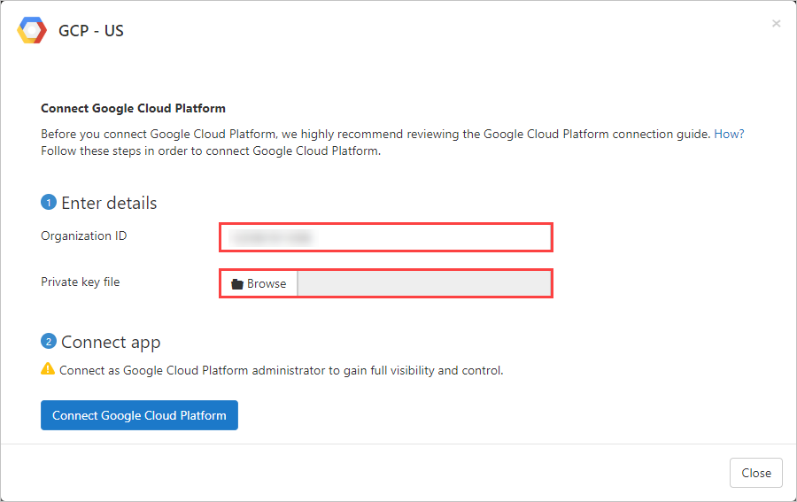
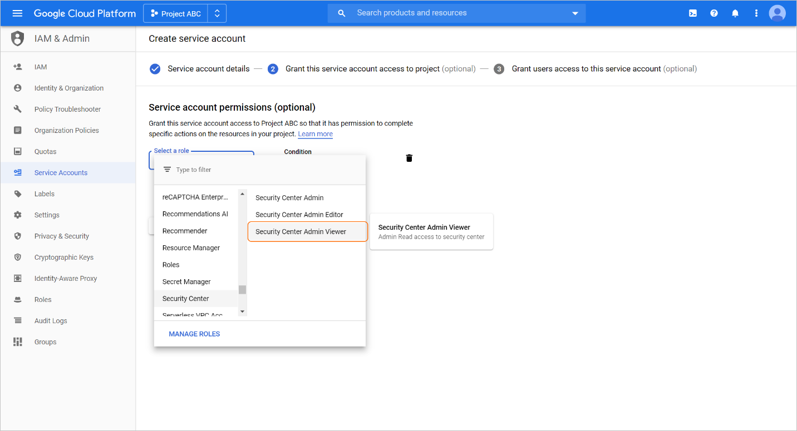
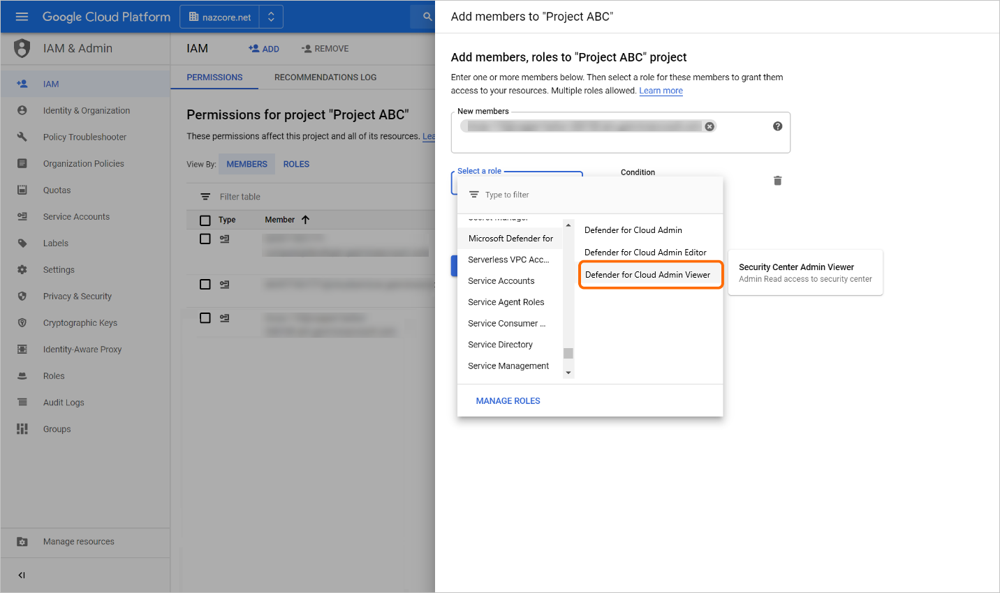
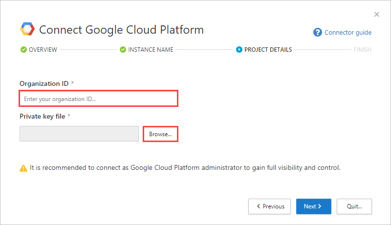

# Connect Google Cloud Platform to Microsoft Defender for Cloud Apps

[!INCLUDE [Banner for top of topics](includes/banner.md)]

This article provides instructions for connecting Microsoft Defender for Cloud Apps to your existing Google Cloud Platform (GCP) account using the connector APIs. This connection gives you visibility into and control over GCP use. For information about how Defender for Cloud Apps protects GCP, see [Protect GCP](protect-gcp.md).

We recommend that you use a dedicated project for the integration and restrict access to the project to maintain stable integration and prevent deletions/modifications of the setup process.

## Prerequisites

The integrating GCP user must have the following permissions:

- **IAM and Admin edit** – Organization level
- **Project creation and edit**

You can connect one or both of the following GCP to Defender for Cloud Apps connections:

- **Security auditing**: This connection gives you visibility into and control over GCP app use.
- **Security configuration**: This connection gives you fundamental security recommendations based on the Center for Internet Security (CIS) benchmark for GCP.

Since you can add either or both of the connections, the steps in this article are written as independent instructions. If you have already added one of the connections, where relevant edit the existing configurations.

## How to connect GCP security auditing to Defender for Cloud Apps

Connecting GCP security auditing gives you visibility into and control over GCP app use.

Follow these steps to connect GCP Security auditing to Defender for Cloud Apps.

> [!div class="checklist"]
>
> - [Configure Google Cloud Platform](#configure-google-cloud-platform)
> - [Connect Google Cloud Platform auditing to Defender for Cloud Apps](#connect-google-cloud-platform-auditing-to-defender-for-cloud-apps)

### Configure Google Cloud Platform

> [!NOTE]
> The instructions for connecting your GCP environment for auditing follow [Google's recommendations](https://cloud.google.com/blog/products/it-ops/best-practices-for-working-with-google-cloud-audit-logging) for consuming aggregated logs. The integration leverages Google StackDriver and will consume additional resources that might impact your billing. The consumed resources are:
>
> - [Aggregated export sink – Organization level](https://cloud.google.com/logging/docs/export/aggregated_sinks#concept)
> - [Pub/Sub topic – GCP project level](https://cloud.google.com/logging/docs/export/using_exported_logs#pubsub-overview)
> - [Pub/Sub subscription – GCP project level](https://cloud.google.com/logging/docs/export/using_exported_logs#pubsub-overview)
>
> The Defender for Cloud Apps auditing connection only imports Admin Activity audit logs; Data Access and System Event audit logs are not imported. For more information about GCP logs, see [Cloud Audit Logs](https://go.microsoft.com/fwlink/?linkid=2109230).

#### Create a dedicated project

Create a dedicated project in GCP under your organization to enable integration isolation and stability

1. Sign in to your GCP portal using your integrating GCP user account.
1. Click **Create Project** to start a new.
1. In the **New project** screen, name your project and click **Create**.

    

#### Enable required APIs

1. Switch to the dedicated project.
1. Go to the **Library** tab.
1. Search for and select **Cloud Logging API**, and then on the API page, click **ENABLE**.
1. Search for and select **Cloud Pub/Sub API**, and then on the API page, click **ENABLE**.

    > [!NOTE]
    > Make sure that you do not select **Pub/Sub Lite API**.

#### Create a dedicated service account for the security auditing integration

1. Under **IAM & admin**, click **Service accounts**.
1. Click **CREATE SERVICE ACCOUNT** to create a dedicated service account.
1. Enter an account name, and then click **Create**.
1. Specify the **Role** as **Pub/Sub Admin** and then click **Save**.

    

1. Copy the **Email** value, you'll need this later.

    

1. Under **IAM & admin**, click **IAM**.

    1. Switch to organization level.
    1. Click **ADD**.
    1. In the **New members** box, paste the **Email** value you copied earlier.
    1. Specify the **Role** as **Logs Configuration Writer** and then click **Save**.

        

#### Create a private key for the dedicated service account

1. Switch to project level.
1. Under **IAM & admin**, click **Service accounts**.
1. Open the dedicated service account and click **Edit**.
1. Click **CREATE KEY**.
1. In the **Create private key** screen, select **JSON**, and then click **CREATE**.

    

    > [!NOTE]
    > You'll need the JSON file that is downloaded to your device later.

#### Retrieve your Organization ID

Make a note of your **Organization ID**, you'll need this later. For more information, see [Getting your organization ID](https://cloud.google.com/resource-manager/docs/creating-managing-organization#retrieving_your_organization_id).

### Connect Google Cloud Platform auditing to Defender for Cloud Apps

#### Add the GCP connection details

1. In the [Defender for Cloud Apps portal](https://portal.cloudappsecurity.com/), click **Investigate** and then **Connected apps**.

1. In the **App connectors** page, to provide the GCP connector credentials, do one of the following:

    > [!NOTE]
    > We recommended that you connect your Google Workspace instance to get unified user management and governance. This is the recommended even if you do not use any Google Workspace products and the GCP users are managed via the Google Workspace user management system.

    **For a new connector**

    1. Click the plus sign (**+**) followed by **Google Cloud Platform**.

        

    1. In the pop-up, provide a name for the connector, and then click **Connect Google Cloud Platform**.

        

    1. In the **Project details** page, do the following, and then click **Connect Google Cloud Platform**.
        1. In the **Organization ID** box, enter the organization you made a note of earlier.
        1. In the **Private key file** box, browse to the JSON file you downloaded earlier.

        

    **For an existing connector**

    1. In the list of connectors, on the row in which the GCP connector appears, click **Connect security auditing**.

        

    1. In the **Project details** page, do the following, and then click **Connect Google Cloud Platform**.
        1. In the **Organization ID** box, enter the organization you made a note of earlier.
        1. In the **Private key file** box, browse to the JSON file you downloaded earlier.

        

1. Click **Test API** to make sure the connection succeeded.

    Testing may take a couple of minutes. When it's finished, you get a success or failure notification. After receiving a success notice, click **Done**.
    
    > [!NOTE]
    > Defender for Cloud Apps will create an aggregated export sink (organization level), a Pub/Sub topic and Pub/Sub subscription using the integration service        account in the integration project. 
    > 
    > Aggregated export sink is used to aggregate logs across the GCP organization and the Pub/Sub topic created is used as the destination. Defender for Cloud Apps subscribes to this topic through the Pub/Sub subscription created to retrieve the admin activity logs across the GCP organization. 

If you have any problems connecting the app, see [Troubleshooting App Connectors](troubleshooting-api-connectors-using-error-messages.md).

## How to connect GCP security configuration to Defender for Cloud Apps

Connecting GCP security configuration gives you insights into fundamental security recommendations based on the Center for Internet Security (CIS) benchmark for GCP.

Follow these steps to connect GCP security configuration to Defender for Cloud Apps.

> [!div class="checklist"]
>
> - [Set up GCP Security Command Center with Security Health Analytics](#set-up-gcp-security-command-center-with-security-health-analytics)
> - [Enable Security Command Center API](#enable-security-command-center-api)
> - [Create a dedicated service account for the security configuration integration](#create-a-dedicated-service-account-for-the-security-configuration-integration)
> - [Connect Google Cloud Platform security configuration to Defender for Cloud Apps](#connect-google-cloud-platform-security-configuration-to-defender-for-cloud-apps)

### Set up GCP Security Command Center with Security Health Analytics

1. Set up [Security Command Center](https://cloud.google.com/security-command-center/docs/quickstart-security-command-center).
1. [Enable GCP Security Health Analytics](https://cloud.google.com/security-command-center/docs/how-to-use-security-health-analytics).
1. Verify that there is data flowing to the Security Command Center.

    > [!NOTE]
    >
    > - The instructions for connecting your GCP environment for security configuration follow [Google's recommendations](https://cloud.google.com/security-command-center/docs/how-to-notifications#enable-scc-api) for consuming security configuration recommendations. The integration leverages Google Security Command Center and will consume **additional resources** that might impact your billing.
    > - When you first enable Security Health Analytics, it may take several hours for data to be available.

### Enable Security Command Center API

1. In Cloud Console API Library, select the project you want to connect to Defender for Cloud Apps.
1. In the API Library, search for and select the "Security Command Center API".
1. In the API page, click **ENABLE**.

### Create a dedicated service account for the security configuration integration

1. In GCP Security Command Center, select the project you want to connect to Defender for Cloud Apps.
1. Under **IAM & admin**, click **Service accounts**.
1. Click **CREATE SERVICE ACCOUNT** to create a dedicated service account.
1. Enter an account name, and then click **Create**.
1. Specify the **Role** as **Security Center Admin Viewer** and then click **Save**.

    

1. Copy the **Email** value, you'll need this later.

    

1. Under **IAM & admin**, click **IAM**.

    1. Switch to organization level.
    1. Click **ADD**.
    1. In the **New members** box, paste the **Email** value you copied earlier.
    1. Specify the **Role** as **Security Center Admin Viewer** and then click **Save**.

        

#### Create a private key for the dedicated service account

1. Switch to project level.
1. Under **IAM & admin**, click **Service accounts**.
1. Open the dedicated service account and click **Edit**.
1. Click **CREATE KEY**.
1. In the **Create private key** screen, select **JSON**, and then click **CREATE**.

    

    > [!NOTE]
    > You'll need the JSON file that is downloaded to your device later.

#### Retrieve your Organization ID

Make a note of your **Organization ID**, you'll need this later. For more information, see [Getting your organization ID](https://cloud.google.com/resource-manager/docs/creating-managing-organization#retrieving_your_organization_id).
    

### Connect Google Cloud Platform security configuration to Defender for Cloud Apps

1. In Defender for Cloud Apps, click **Investigate**, and then select **Connected apps**.

1. In the **Security configuration apps** tab, click the plus button, and then select **Google Cloud Platform**.

    

1. In the **Instance name** page, choose the instance type, and then click **Next**.

    - For an existing connector, choose the relevant instance.

        

    - For a new connector, provide a name for the instance.

        

1. In the **Project details** page, do the following, and then click **Next**.
    1. In the **Organization ID** box, enter the organization you made a note of earlier.
    1. In the **Private key file** box, browse to the JSON file you downloaded earlier.

    

1. In the **Finished** page, make sure the connection succeeded, and then click **Finished**.

If you have any problems connecting the app, see [Troubleshooting App Connectors](troubleshooting-api-connectors-using-error-messages.md).

## Next steps

> [!div class="nextstepaction"]
> [Control cloud apps with policies](control-cloud-apps-with-policies.md)

[!INCLUDE [Open support ticket](includes/support.md)]
