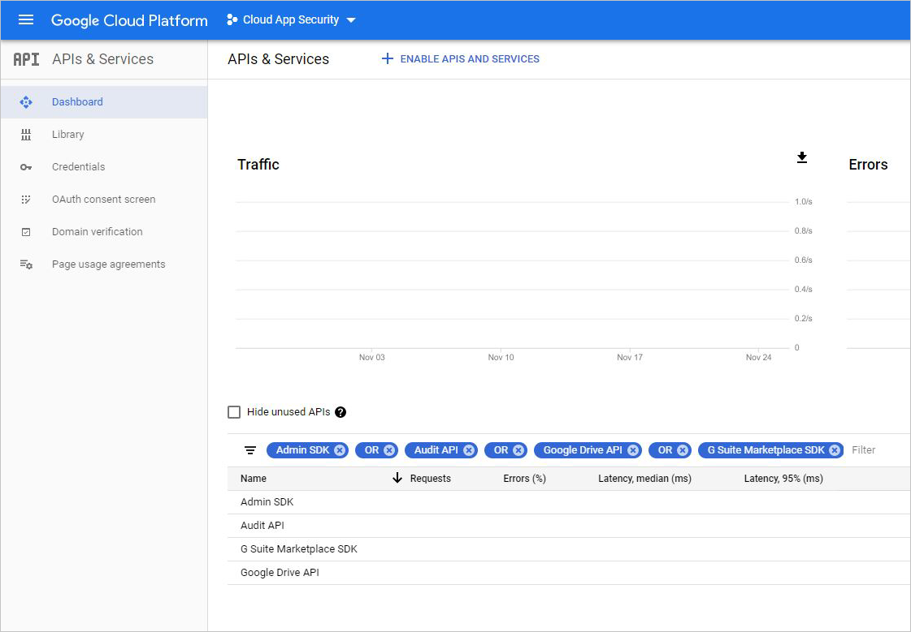
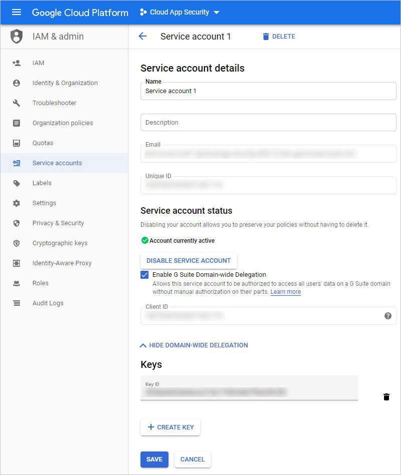

# Connect Google Workspace to Microsoft Cloud App Security

[!INCLUDE [Banner for top of topics](includes/banner.md)]

This article provides instructions for connecting Microsoft Cloud App Security to your existing Google Workspace account using the connector APIs. This connection gives you visibility into and control over Google Workspace use. For information about how Cloud App Security protects Google Workspace, see [Protect Google Workspace](protect-google-workspace.md).

## Configure Google Workspace

1. As a Google Workspace Super Admin, sign in to <a href="https://cloud.google.com/console/project" target="_blank">https://cloud.google.com/console/project</a>.

1. Click **Create project** to start a new project.

    

1. In the **New project** screen, name your project as follows: **Cloud App Security** and click **Create**.

    

1. After the project is created, in the tool bar, click on **Google Cloud Platform**. Make sure that the right project is selected in the drop-down at the top.

    

1. Select menu, go to **APIs & Services** > **Library** and enable the following APIs (use the search line if the API isn't listed):

    * Admin SDK

    * Audit API
    * Google Drive API
    * Google Marketplace SDK

    > [!NOTE]
    > For each API, click **Enable** to active it.
    >
    > 
    >
    > Ignore the **Credentials** warning for now.

1. Select menu, go to **APIs & Services** > **Dashboard**, and make sure you have the following APIs enabled:

    * Admin SDK

    * Audit API
    * Google Drive API
    * Google Marketplace SDK

    

1. Go to the **OAuth consent screen** tab.
    1. Under **User Type**, choose **External**, and then click **Create**.

        

    1. Fill out the following information, and then click **Save**.

        | Field name | Value |
        | --- | --- |
        | Application type | Public |
        | Application name | Microsoft Cloud App Security |
        | Support email | `<your_email_address>` |

        \* All other fields are optional

        

1. In the **Credentials** screen, click **Create credentials**, and select **Service Account**.
    - Under **Service account details**, provide a name and description, and then click **Create**.
    - Under **Grant this service account access to project**, for **Role** select Project, select **Editor** and then click **Done** but do not click **Continue**.

    

1. For **Service account**, choose **New service account**, and provide a name for the account, for example **Service account 1**. Under **Role**, choose **Project** and then **Editor**. Under **Key type**, choose **P12** and click **Create**. A P12 certificate file is saved to your computer.

    

1. In the **Credentials** screen, click **Manage service accounts** in the far right. Copy the **Email** assigned to your service account - you'll need it later.

    

1. Click the three dots to the right of the service account you created and select **Edit**.

    

1. Click **SHOW DOMAIN-WIDE DELEGATION**, select **Enable Google Workspace Domain-wide Delegation**.

    

    1. Copy the **Client ID** - you need it later.
    

    1. Click **SAVE**

    1. Go to [admin.google.com](https://admin.google.com/) and then choose **Security**.

    1. Expand **Advanced settings**, and then under **Authentication**, select **Manage API client access**.

    1. In the **Client Name** box, enter the **Client ID** that you copied earlier.  

    1. In the **One or More API Scopes** box, enter the following list of required scopes (copy the text and paste it in the box):  
`https://www.googleapis.com/auth/admin.reports.audit.readonly,https://www.googleapis.com/auth/admin.reports.usage.readonly,https://www.googleapis.com/auth/drive,https://www.googleapis.com/auth/drive.appdata,https://www.googleapis.com/auth/drive.apps.readonly,https://www.googleapis.com/auth/drive.file,https://www.googleapis.com/auth/drive.metadata.readonly,https://www.googleapis.com/auth/drive.readonly,https://www.googleapis.com/auth/drive.scripts,https://www.googleapis.com/auth/admin.directory.user.readonly,https://www.googleapis.com/auth/admin.directory.user.security,https://www.googleapis.com/auth/admin.directory.user.alias,https://www.googleapis.com/auth/admin.directory.orgunit,https://www.googleapis.com/auth/admin.directory.notifications,https://www.googleapis.com/auth/admin.directory.group.member,https://www.googleapis.com/auth/admin.directory.group,https://www.googleapis.com/auth/admin.directory.device.mobile.action,https://www.googleapis.com/auth/admin.directory.device.mobile,https://www.googleapis.com/auth/admin.directory.user`

    1. Click **Authorize**.

1. In the [Google Cloud Platform](https://console.cloud.google.com/), select menu and go to **APIs and services** > **Dashboard**.

1. In the dashboard, scroll down to the list of enabled APIs and click on **Google Drive API**.
    

1. Click on the **Drive UI Integration** tab and fill in the following information:

    * **Application Name**: Microsoft Cloud App Security.

    * **Short Description & Long Description** (optional): Microsoft Cloud App Security provides you with visibility into cloud applications, helping you control, investigate, and govern cloud application use; secure corporate data; and detect suspicious activities for any cloud application.

    * Google requires you to upload at least one application Icon. Go to [https://go.microsoft.com/fwlink/?linkid=862826](https://go.microsoft.com/fwlink/?linkid=862826) to download a zip file containing Cloud App Security icons. Then, under **Application icon**, click **Select** next to the 128x128 image and drag it to the pop-up screen. Click **Select** next to the 32x32 image and drag it to the pop-up screen.

    * Scroll down and in the **Drive Integration** section, type the following URL under **Open URL:**
    `https://portal.cloudappsecurity.com/#/services/11770?tab=files`

    

1. Click **Submit**.

1. Go back to the **Enabled APIs** list. Click **Google Workspace Marketplace SDK**.

1. Select the **Configuration** tab.

    1. Copy the **Project number (App ID)** that appears at the top to use later.

    1. Under **Application Name** type **Microsoft Cloud App Security**.  
In **Application description** type "Microsoft Cloud App Security provides visibility into cloud apps, helping you control, investigate, and govern cloud app use; secure corporate data; and detect suspicious activities for any cloud app."

    1. Make sure to click **Done** in the **New item** window.

    

    * Clear the **Enable individual install** check box.

    * Configure the four required images under **Application icons**.

    The images can be found at:  [https://go.microsoft.com/fwlink/?linkid=862826](https://go.microsoft.com/fwlink/?linkid=862826)

    * Fill in the following **Support URLs**:

    * **Terms of service URL**: https://go.microsoft.com/fwlink/?LinkID=733268

    * **Privacy policy URL**: https://go.microsoft.com/fwlink/?LinkId=512132

    * Under **OAuth 2.0 scopes**, copy and paste the following URLs (copy them one at a time and press Enter after each one):  
`https://www.googleapis.com/auth/admin.reports.audit.readonly`  
`https://www.googleapis.com/auth/admin.reports.usage.readonly`  
`https://www.googleapis.com/auth/drive`  
`https://www.googleapis.com/auth/drive.appdata`  
`https://www.googleapis.com/auth/drive.apps.readonly`  
`https://www.googleapis.com/auth/drive.file`  
`https://www.googleapis.com/auth/drive.metadata.readonly`  
`https://www.googleapis.com/auth/drive.readonly`  
`https://www.googleapis.com/auth/drive.scripts`  
`https://www.googleapis.com/auth/admin.directory.user.readonly`  
`https://www.googleapis.com/auth/admin.directory.user.security`  
`https://www.googleapis.com/auth/admin.directory.user.alias`  
`https://www.googleapis.com/auth/admin.directory.orgunit`  
`https://www.googleapis.com/auth/admin.directory.notifications`  
`https://www.googleapis.com/auth/admin.directory.group.member`  
`https://www.googleapis.com/auth/admin.directory.group`  
`https://www.googleapis.com/auth/admin.directory.device.mobile.action`  
`https://www.googleapis.com/auth/admin.directory.device.mobile`  
`https://www.googleapis.com/auth/admin.directory.user`

    * Under **Visibility**, select **My domain** (not public).
    * Click on **Save Changes**.
        
1. In the Google Admin console, go to [Manage App Access Control](https://admin.google.com/). Locate the **Google Workspace Admin** row and verify that it has **Unrestricted** access.

    

## Configure Cloud App Security

1. In the Cloud App Security portal, click **Investigate** and then **Connected apps**.

1. To provide the Google Workspace connection details, under **App connectors**, do one of the following:

    **For a Google Workspace organization that already has a connected GCP instance**

    * In the list of connectors, at the end of row in which the GCP instance appears, click the three dots and then click **Add Google Workspace**.

    **For a Google Workspace organization that does not already have a connected GCP instance**

    * In the **Connected apps** page, click the plus sign and select **Google Workspace**.

1. In the pop-up, fill in the following information:

    

    1. Enter the **Service account ID**, the **Email** that you copied earlier.

    1. Enter the **Project number (App ID)** that you copied earlier.

    1. Upload the P12 **Certificate** file that you saved earlier.

    1. Enter one **admin account email** of your Google Workspace admin.

    1. If you have a Google Workspace Business or Enterprise account, check this check box. For information about which features are available in Cloud App Security for Google Workspace Business or Enterprise, see [Enable instant visibility, protection, and governance actions for your apps](enable-instant-visibility-protection-and-governance-actions-for-your-apps.md).

    1. Click **Save settings**.

    1. **Follow the link** to connect to Google Workspace. This opens Google Workspace and you're asked to authorize access for Cloud App Security.

    1. Make sure the connection succeeded by clicking **Test now**.  
    Testing may take a couple of minutes.  
    After receiving a success notice, click **Done** and close the Google Workspace page.

After connecting Google Workspace, you'll receive events for 60 days prior to connection.

After connecting Google Workspace, Cloud App Security performs a full scan. Depending on how many files and users you have, completing the full scan can take awhile. To enable near real-time scanning, files on which activity is detected are moved to the beginning of the scan queue. For example, a file that is edited, updated, or shared is scanned right away. This doesn't apply to files that aren't inherently modified. For example, files that are viewed, previewed, printed, or exported are scanned during the regular scan.

If you have any problems connecting the app, see [Troubleshooting App Connectors](troubleshooting-api-connectors-using-error-messages.md).

## Next steps

> [!div class="nextstepaction"]
> [Control cloud apps with policies](control-cloud-apps-with-policies.md)

[!INCLUDE [Open support ticket](includes/support.md)]
