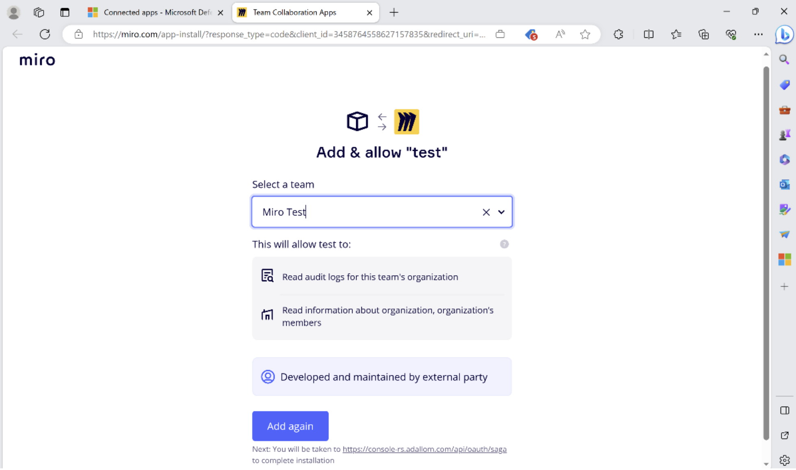

---
# Required metadata
		# For more information, see https://review.learn.microsoft.com/en-us/help/platform/learn-editor-add-metadata?branch=main
		# For valid values of ms.service, ms.prod, and ms.topic, see https://review.learn.microsoft.com/en-us/help/platform/metadata-taxonomies?branch=main

		title:       # Add a title for the browser tab
description: # Add a meaningful description for search results
author:      NagarajVenkatesh # GitHub alias
ms.author:   naven # Microsoft alias
ms.service:  # Add the ms.service or ms.prod value
# ms.prod:   # To use ms.prod, uncomment it and delete ms.service
ms.topic:    # Add the ms.topic value
ms.date:     07/17/2023
---

# Connect Miro to Microsoft Defender for Cloud Apps (Preview)

[!INCLUDE [Banner for top of topics](includes/banner.md)]

This article provides instructions for connecting Microsoft Defender for Cloud Apps to your existing Miro account using the App Connector APIs. This connection gives you visibility into and control over Miro usage. 

## Prerequisites

- A Miro account with an enterprise plan is a pre-requisite for this connection. You must sign-in as a company admin to Miro. 

## How to connect Miro to Defender for Cloud Apps

1. Sign into [Miro](https://miro.com/app/dashboard/) portal with a company admin account.
2. Create a developer team from the portal. To create a developer team, navigate to **Company Settings > User & Team management > Teams > Create new team**.

3. Give a descriptive name to the team and set the permissions to ‘Default’. Select ‘Create as a Developer Team’ and create the team.

4. Create a new application in the newly created developer team. To create a new application, navigate to **Profile settings > Your apps** and click on **‘Create new app’**

5. Give a name to the app, select the newly created developer team, and click on **Create app**.
6. Copy the Client ID and Client secret for future reference. 
7. Provide 'https://portal.cloudappsecurity.com/api/oauth/saga' as the 'Redirect URI for OAuth2.0'.
8. Provide ‘auditlogs:read’ and ‘organization:read; permissions and click on **Install app and get OAuth token**.

9. In the [Defender for Cloud Apps](https://portal.cloudAppSecurity.com) portal, navigate to Investigate >Connected apps.
10. In the App connectors page, click on Connect an app and choose Miro. 
11. Enter a name for Miro connection in the connection wizard and click on Connect Miro.
12. Enter the Client ID, Client secret and click on Connect in Miro.
13. Select the Miro team that you want to connect with Defender for Cloud Apps and click on Add again.

14. Click on Test now to make sure the connection succeeded. Audit events will start flowing into Defender for Cloud apps from the time the connection is successfully established.

If you have any problems connecting the app, see [Troubleshooting App Connectors](/defender-cloud-apps/troubleshooting-api-connectors-using-error-messages).

Next steps

> [!div class="nextstepaction"]
> [Control cloud apps with policies](control-cloud-apps-with-policies.md)

[!INCLUDE [Open support ticket](includes/support.md)]

