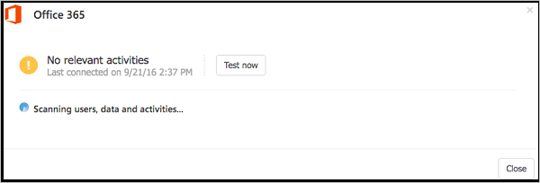
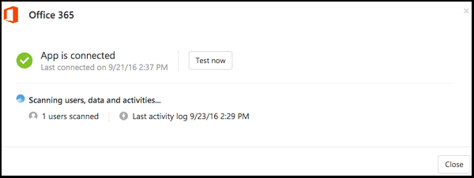

---
# required metadata

title: Connect Office 365 to Cloud App Security for visibility and control over use | Microsoft Docs
description: This topic provides information about how to connect your Office 365 to Cloud App Security using the API connector.
keywords:
author: rkarlin
ms.author: rkarlin
manager: mbaldwin
ms.date: 1/23/2017
ms.topic: get-started-article
ms.prod:
ms.service: cloud-app-security
ms.technology:
ms.assetid: a79bf393-0d2c-44b6-8dab-86c740fd7333

# optional metadata

#ROBOTS:
#audience:
#ms.devlang:
ms.reviewer: reutam
ms.suite: ems
#ms.tgt_pltfrm:
#ms.custom:

---

# Connect Office 365 to Microsoft Cloud App Security
This section provides instructions for connecting Cloud App Security to your existing Microsoft Office 365 account using the app connector API.  
  
Cloud App Security supports the legacy Office 365 Dedicated Platform as well as the latest offerings of Office 365 services (commonly referred as the vNext release family of Office 365).  Cloud App Security does not support  the Legacy Microsoft Business Productivity Online Standard Suite. 

> [!NOTE]
> In some cases, a vNext service release differs slightly at the administrative and management levels from the standard Office 365 offering.

 

## How to connect Office 365 to Cloud App Security  
  
> [!NOTE]
>- You must have at least one assigned Office 365 license to connect Office 365 to Cloud App Security.
>-  Exchange administrator audit logging, which is enabled by default in Office 365, logs an event in the Office 365 audit log when an administrator (or a user who has been assigned administrative privileges) makes a change in your Exchange Online organization. Changes made using the Exchange admin center or by running a cmdlet in Windows PowerShell are logged in the Exchange admin audit log. For more detailed information about admin audit logging in Exchange, see [Administrator audit logging](http://go.microsoft.com/fwlink/p/?LinkID=619225).
>- Exchange Mailbox audit logging must be turned on for each user mailbox before user activity in Exchange Online will be logged, see [Exchange Mailbox activities](https://support.office.com/article/Search-the-audit-log-in-the-Office-365-Security-Compliance-Center-0d4d0f35-390b-4518-800e-0c7ec95e946c).
>- If Office apps are enabled, groups that are part of Office 365 are also created in the specific Office apps, for example if SharePoint is enabled, Office 365 groups will be created in SharePoint.
 
1.  In **Connected apps** page, click the plus button and select **Office 365**.  

2.  In the Office 365 pop-up, click Connect Office 365.

       
 
3.  Click Test now to test the connection to Office 365. Testing may take a couple of minutes.
  
     
 
4.   After Office 365 is displayed as successfully connected, click **Close**.
  
      

> [!NOTE] 
> After connecting Office 365, you will see data from a week back including any third-party applications connected to Office 365 that are pulling APIs. For third-party apps that weren't pulling APIs prior to connection, you will see events from the moment you connect Office 365, because Cloud App Security turns on any APIs that had been off by default.

## See Also  
[Control cloud apps with policies](control-cloud-apps-with-policies.md)   
[For technical support, please visit the Cloud App Security assisted support page.](http://support.microsoft.com/oas/default.aspx?prid=16031)   
[Premier customers can also choose Cloud App Security directly from the Premier Portal.](https://premier.microsoft.com/)  
  
  