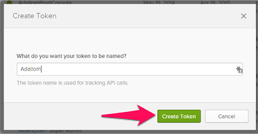

---
# required metadata

title: Connect Okta to Cloud App Security
description: This article provides information about how to connect your Okta to Cloud App Security using the API connector for visibility and control over use.
keywords:
author: shsagir
ms.author: shsagir
manager: shsagir
ms.date: 9/1/2019
ms.topic: conceptual
ms.collection: M365-security-compliance
ms.prod:
ms.service: cloud-app-security
ms.technology:

# optional metadata

#ROBOTS:
#audience:
#ms.devlang:
ms.reviewer: reutam
ms.suite: ems
#ms.tgt_pltfrm:
ms.custom: seodec18
---
# Connect Okta to Microsoft Cloud App Security

*Applies to: Microsoft Cloud App Security*

This article provides instructions for connecting Microsoft Cloud App Security to your existing Okta account using the connector APIs. This connection gives you visibility into and control over Okta use.

## How to connect Okta to Cloud App Security

1. It's recommended that you create an admin Service Account in Okta for Cloud App Security.

    Make sure you use an account with Super Admin permissions.

    Make sure your Okta account is verified.

1. In the Okta console, click **Admin**.

    - Click on **Security** and then **API**.

         

    - Click **Create Token**.

         

    - In the **Create Token** pop-up, name your Cloud App Security token, and click **Create Token**.

         

    - In the **Token created successfully** pop-up, copy the **Token value**.

         

1. In the Cloud App Security console, click **Investigate** and then **Connected apps**.

1. In the **App connectors page**, click the plus button and then **Okta**.

    

1. In the pop-up that opens, in the **Domain** field, enter your Okta domain and paste your Token into the **Token** field.

1. Click **Connect** to create the token for Okta in Cloud App Security.

1. Make sure the connection succeeded by clicking **Test API**.

    Testing may take a couple of minutes. After receiving a success notice, click **Close**.

After connecting Okta, you'll receive events for 60 days prior to connection.

## Next steps

[Control cloud apps with policies](control-cloud-apps-with-policies.md)

[!INCLUDE [Open support ticket](includes/support.md)]
