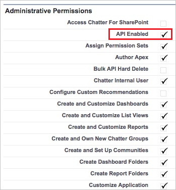

---
# required metadata

title: Connect Salesforce | Microsoft Docs
description: This topic provides information about how to connect your Salesforce to Cloud App Security using the API connector.
keywords:
author: rkarlin
ms.author: rkarlin
manager: mbaldwin
ms.date: 10/26/2016
ms.topic: get-started-article
ms.prod:
ms.service: cloud-app-security
ms.technology:
ms.assetid: 776d7589-acdb-4cb6-99a0-3be2f7b6aab2

# optional metadata

#ROBOTS:
#audience:
#ms.devlang:
ms.reviewer: reutam
ms.suite: ems
#ms.tgt_pltfrm:
#ms.custom:

---

# Connect Salesforce to Microsoft Cloud App Security
This section provides instructions for connecting Cloud App Security to your existing Salesforce account using the app connector API.  
  
## How to connect Salesforce to Cloud App Security  
  
1.  It is recommended to have a dedicated service admin account for Cloud App Security.  
  
2.  Validate that REST API is enabled in Salesforce.  
  
     Your Salesforce account must be one of the following editions that include REST API support:  
  
     **Performance**, **Enterprise**, **Unlimited** or **Developer**.  
  
     The **Professional** edition does not have REST API by default, but it can be added on demand.  
  
     Check to see that your edition has REST API available and enabled as follows:  
  
    -   Log in to your Salesforce account and go to the **Setup** page.  
  
    -   Under **Manage Users**, go to the **Profiles** page.  
  
           
  
    -   Choose the profile you are using to deploy Cloud App Security and click **Edit**. This is the profile to be used for the Cloud App Security service account to set up the App connector.  
  
           
  
    -   Make sure you have the **API Enabled** checkbox selected. If it is not selected, you may need to contact Salesforce to add it to your account.  
  
           
  
3.  If your organization has **Salesforce CRM Content** enabled, make sure that the current administrative account has it enabled as well.  
  
    1.  Go to your Salesforce setup page.  
  
           
  
    2.  From the side-menu, select **Manage Users** and then click **Users**.  
  
           
  
    3.  Select the current administrative user to your dedicated Cloud App Security user.  
  
    4.  Make sure that the **Salesforce CRM Content User** checkbox is selected.  
  
         If it is not selected, click **Edit** and then check the checkbox.  
  
           
  
    5.  Click **Save**.  
  
4.  In the Cloud App Security console, click **Investigate** and then **Connected apps**.  
  
5.  In the **App connectors** page, click the plus button followed by **Salesforce**.  
  
       
  
6.  In the Salesforce settings page, on the API tab, click **Follow this link**, depending on which instance you want to install.  
  
7.  This opens the Salesforce logon page. Enter your credentials to allow Cloud App Security access to your team's Salesforce app.  
  
       
  
8.  Salesforce will ask you if you want to allow Cloud App Security access to your team information and activity log and perform any activity as any team member. To proceed, click **Allow**.  
  
9. At this point, you will receive a success or failure notice regarding the deployment. Cloud App Security is now authorized in Salesforce.com.  
  
10. Back in the Cloud App Security console, you should see the Salesforce was successfully connected message.  
  
11. Make sure the connection succeeded by clicking **Test API**.  
  
     Testing may take a couple of minutes. After receiving a success notice, click **Done**.  
  
  
After connecting SalesForce, you will receive Events as follows: Triggers from the moment of connection, Login events and Setup Audit Trail for 60 days prior to connection, EventMonitoring 30 days or 1 day back - depending on your SalesForce EventMonitoring license.
  
## See Also  
[Control cloud apps with policies](control-cloud-apps-with-policies.md)   
[For technical support, please visit the Cloud App Security assisted support page.](http://support.microsoft.com/oas/default.aspx?prid=16031)   
[Premier customers can also choose Cloud App Security directly from the Premier Portal.](https://premier.microsoft.com/)  
  
  