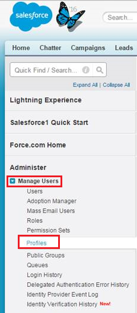
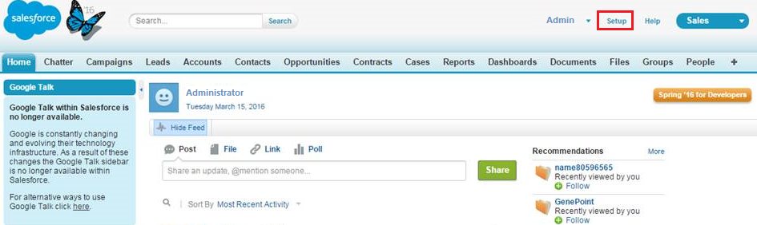

---
# required metadata

title: Connect Salesforce to Cloud App Security
description: This article provides information about how to connect your Salesforce to Cloud App Security using the API connector for visibility and control over use.
keywords:
author: shsagir
ms.author: shsagir
manager: shsagir
ms.date: 10/06/2019
ms.topic: conceptual
ms.collection: M365-security-compliance
ms.prod:
ms.service: cloud-app-security
ms.technology:

# optional metadata

#ROBOTS:
#audience:
#ms.devlang:
ms.reviewer: reutam
ms.suite: ems
#ms.tgt_pltfrm:
ms.custom: seodec18

---
# Connect Salesforce to Microsoft Cloud App Security

*Applies to: Microsoft Cloud App Security*

This article provides instructions for connecting Microsoft  Cloud App Security to your existing Salesforce account using the app connector API. This connection gives you visibility into and control over Salesforce use.

## How to connect Salesforce to Cloud App Security

1. It's recommended to have a dedicated service admin account for Cloud App Security.

1. Validate that REST API is enabled in Salesforce.

    Your Salesforce account must be one of the following editions that include REST API support:

    **Performance**, **Enterprise**, **Unlimited**, or **Developer**.

    The **Professional** edition doesn't have REST API by default, but it can be added on demand.

    Check to see that your edition has REST API available and enabled as follows:

    * Sign in to your Salesforce account and go to the **Setup** page.

    * Under **Manage Users**, go to the **User Profiles** page.

        

    * Create a new profile by clicking **New**.
    * Choose the profile you just created to deploy Cloud App Security and click **Edit**. This profile will be used for the Cloud App Security service account to set up the App connector.

         

    * Make sure you have the following checkboxes enabled:
      * **API Enabled**
      * **View All Data**
      * **Manage Salesforce CRM Content**
      * **Manage Users**
      * **[Query All Files](https://go.microsoft.com/fwlink/?linkid=2106480)**

      If these checkboxes aren't selected, you may need to contact Salesforce to add them to your account.

1. If your organization has **Salesforce CRM Content** enabled, make sure that the current administrative account has it enabled as well.

    1. Go to your Salesforce setup page.

        

    1. From the side-menu, select **Manage Users** and then click **Users**.

        

    1. Select the current administrative user to your dedicated Cloud App Security user.

    1. Make sure that the **Salesforce CRM Content User** check box is selected.

        If it isn't selected, click **Edit** and then check the check box.

        

    1. Click **Save**.

1. In the Cloud App Security console, click **Investigate** and then **Connected apps**.

1. In the **App connectors** page, click the plus button followed by **Salesforce**.

    

1. In the Salesforce settings page, on the API tab, click **Follow this link**, depending on which instance you want to install.

1. This opens the Salesforce sign in page. Enter your credentials to allow Cloud App Security access to your team's Salesforce app.

    

1. Salesforce will ask you if you want to allow Cloud App Security access to your team information and activity log and perform any activity as any team member. To proceed, click **Allow**.

1. At this point, you'll receive a success or failure notice for the deployment. Cloud App Security is now authorized in Salesforce.com.

1. Back in the Cloud App Security console, you should see the Salesforce was successfully connected message.

1. Make sure the connection succeeded by clicking **Test API**.

    Testing may take a couple of minutes. After receiving a success notice, click **Done**.

After connecting Salesforce, you'll receive Events as follows: Triggers from the moment of connection, Log in events, and Setup Audit Trail for 60 days prior to connection, EventMonitoring 30 days, or 1 day back - depending on your Salesforce EventMonitoring license. The Cloud App Security API communicates directly with the APIs available from Salesforce. Because Salesforce limits the number of API calls it can receive, Cloud App Security takes this into account and respects the limitation. Salesforce APIs send each response with a field for the API counters, including total available and remaining. Cloud App Security calculates this into a percentage and makes sure to always leave 10% of available API calls remaining.

> [!NOTE]
> Cloud App Security throttling is calculated solely on its own API calls with Salesforce, not with those of any other applications making API calls with Salesforce.
> Limiting API calls due to the limitation may slow down the rate at which data is ingested in Cloud App Security, but usually catches up over night.

Salesforce events are processed by Cloud App security as follows:

* Sign in events every 15 minutes
* Setup audit trails every 15 minutes
* Salesforce logs track usage activity for a 24-hour period, from 12:00 a.m. to 11:59 p.m. UTC time. Events in Salesforce generate log data in real time. However, log files are generated by Salesforce the day after an event takes place, during nonpeak hours. Therefore, log file data is unavailable for at least one day after an event. For more information about Salesforce events, see [Using event monitoring](https://developer.salesforce.com/docs/atlas.en-us.api_rest.meta/api_rest/using_resources_event_log_files.htm).

## Next steps

> [!div class="nextstepaction"]
> [Control cloud apps with policies](control-cloud-apps-with-policies.md)

[!INCLUDE [Open support ticket](includes/support.md)]
