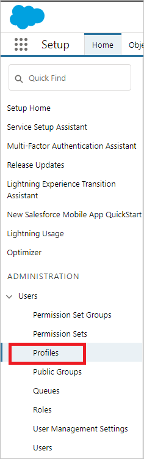
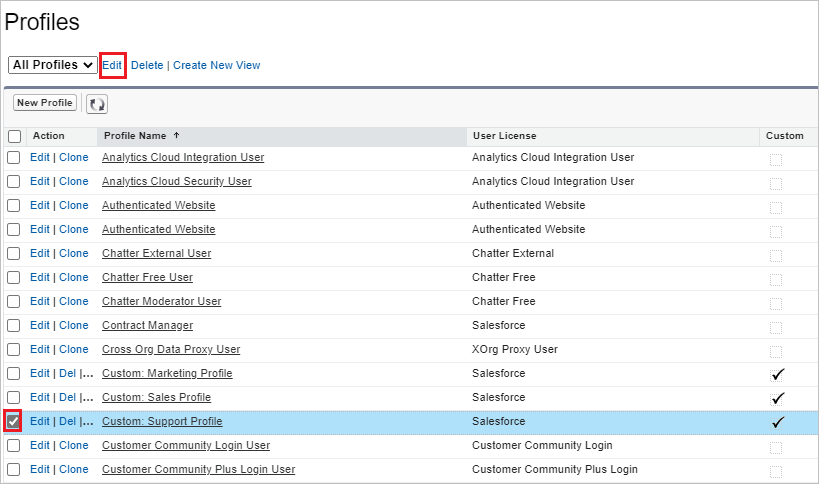
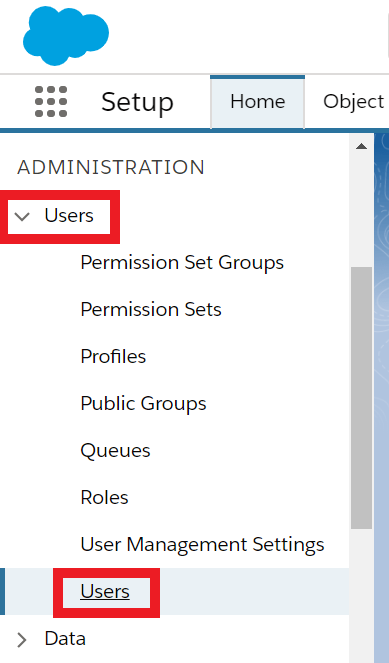
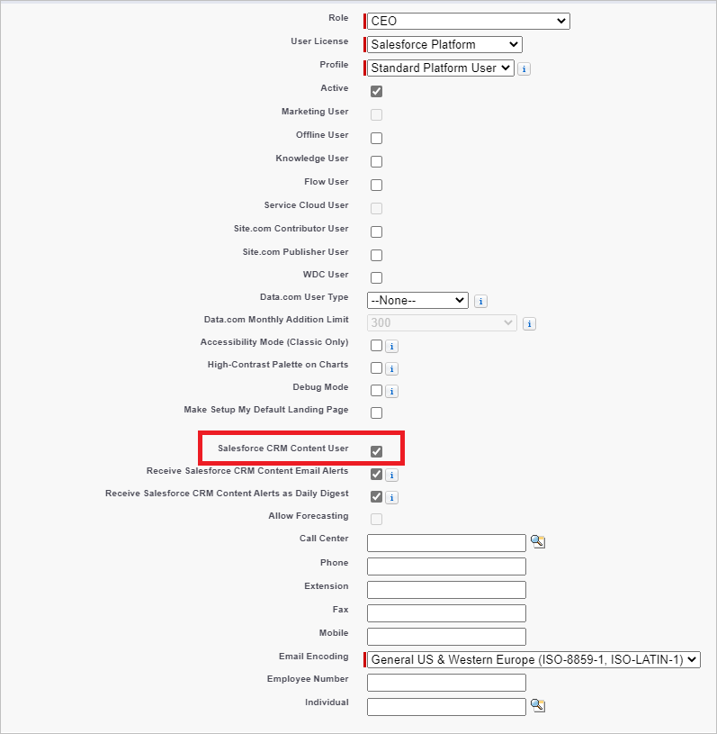
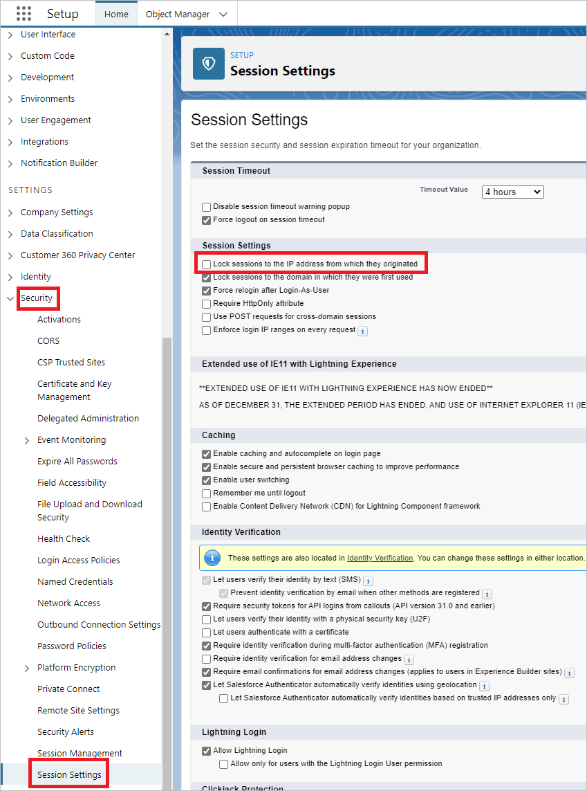
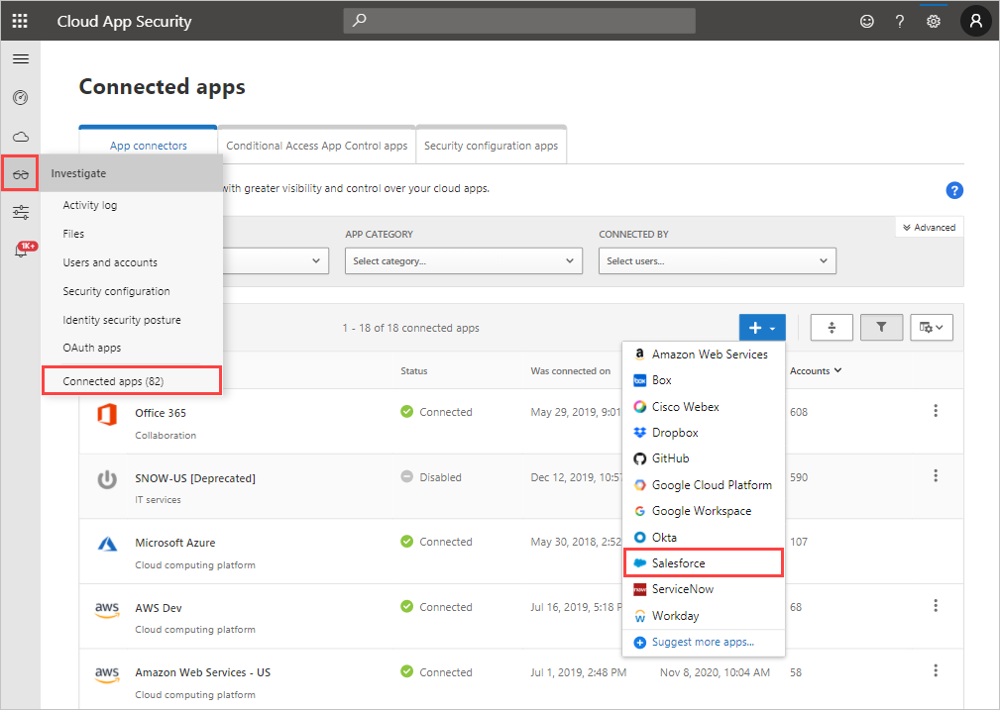
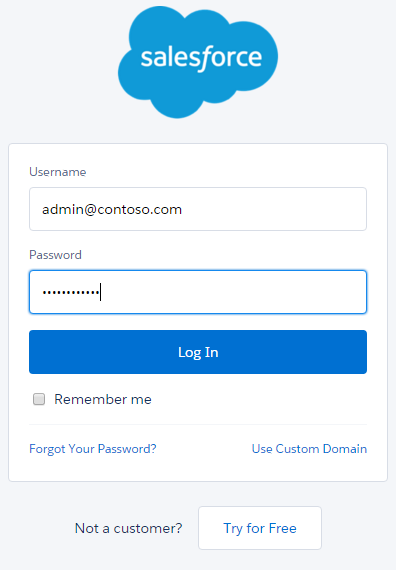

# Connect Salesforce to Microsoft Defender for Cloud Apps

[!INCLUDE [Banner for top of topics](includes/banner.md)]

This article provides instructions for connecting Microsoft  Defender for Cloud Apps to your existing Salesforce account using the app connector API. This connection gives you visibility into and control over Salesforce use. For information about how Defender for Cloud Apps protects Salesforce, see [Protect Salesforce](protect-salesforce.md).

[!INCLUDE [security-posture-management-connector](includes/security-posture-management-connector.md)]

## How to connect Salesforce to Defender for Cloud Apps

> [!NOTE]
> Salesforce Shield should be available for your Salesforce instance as a prerequisite for this integration.

1. It's recommended to have a dedicated service admin account for Defender for Cloud Apps.

1. Validate that REST API is enabled in Salesforce.

    Your Salesforce account must be one of the following editions that include REST API support:

    **Performance**, **Enterprise**, **Unlimited**, or **Developer**.

    The **Professional** edition doesn't have REST API by default, but it can be added on demand.

    Check to see that your edition has REST API available and enabled as follows:

    * Sign in to your Salesforce account and go to the **Setup Home** page.

    * Under **Administration** -> **Users**, go to the **Profiles** page.

        

    * Create a new profile by selecting **New Profile**.
    * Choose the profile you just created to deploy Defender for Cloud Apps and select **Edit**. This profile will be used for the Defender for Cloud Apps service account to set up the App connector.

         

    * Make sure you have the following checkboxes enabled:
      * **API Enabled**
      * **View All Data**
      * **Manage Salesforce CRM Content**
      * **Manage Users**
      * **[Query All Files](https://go.microsoft.com/fwlink/?linkid=2106480)**
      * **Modify Metadata Through Metadata API Functions**

      If these checkboxes aren't selected, you may need to contact Salesforce to add them to your account.

1. If your organization has **Salesforce CRM Content** enabled, make sure that the current administrative account has it enabled as well.

    1. Go to the Salesforce **Setup Home** page.

    1. Under **Administration** -> **Users**, go to the **Users** page.

        

    1. Select the current administrative user to your dedicated Defender for Cloud Apps user.

    1. Make sure that the **Salesforce CRM Content User** check box is selected.

        

    1. Go to **Setup Home** -> **Security** -> **Session Settings**. Under **Session Settings**, make sure that  **Lock sessions to the IP address from which they originated** check box is **not** selected.

        

    1. Select **Save**.

    1. Go to **Build** -> **Customize** -> **Salesforce Files** -> **Settings** -> **Content Deliveries and Public Links**.

    1. Select **Edit** and then select **Checked Content Deliveries feature can be enabled for users**

    1. Select **Save**.

> [!NOTE]
> The Content Deliveries feature needs to be enabled for Defender for Cloud Apps to query file sharing data. For more information, see [ContentDistribution](https://developer.salesforce.com/docs/atlas.en-us.object_reference.meta/object_reference/sforce_api_objects_contentdistribution.htm).

## How to connect Defender for Cloud Apps to Salesforce

1. In the Defender for Cloud Apps console, select **Investigate** and then **Connected apps**.

1. In the **App connectors** page, select **+Connect an app** followed by **Salesforce**.

    

1. In the next window, give the connection a name and select **Next**.

1. In the **Follow the link** page, select **Connect Salesforce**.

1. This opens the Salesforce sign in page. Enter your credentials to allow Defender for Cloud Apps access to your team's Salesforce app.

    

1. Salesforce will ask you if you want to allow Defender for Cloud Apps access to your team information and activity log and perform any activity as any team member. To continue, select **Allow**.

1. At this point, you'll receive a success or failure notice for the deployment. Defender for Cloud Apps is now authorized in Salesforce.com.

1. Back in the Defender for Cloud Apps console, you should see the Salesforce was successfully connected message.

1. In the Microsoft 365 Defender portal, select **Settings**. Then choose **Cloud Apps**. Under **Connected apps**, select **App Connectors**. Make sure the status of the connected App Connector is **Connected**.

After connecting Salesforce, you'll receive Events as follows: Log in events and Setup Audit Trail for 60 days prior to connection, EventMonitoring 30 days, or 1 day back - depending on your Salesforce EventMonitoring license. The Defender for Cloud Apps API communicates directly with the APIs available from Salesforce. Because Salesforce limits the number of API calls it can receive, Defender for Cloud Apps takes this into account and respects the limitation. Salesforce APIs send each response with a field for the API counters, including total available and remaining. Defender for Cloud Apps calculates this into a percentage and makes sure to always leave 10% of available API calls remaining.

> [!NOTE]
> Defender for Cloud Apps throttling is calculated solely on its own API calls with Salesforce, not with those of any other applications making API calls with Salesforce.
> Limiting API calls due to the limitation may slow down the rate at which data is ingested in Defender for Cloud Apps, but usually catches up over night.

> [!NOTE]
> If your Salesforce instance is not in English, make sure to select the appropriate **language** attribute value for the integration service admin account.
>
> To change the language attribute, navigate to **Administration** -> **Users** -> **User** and open the integration system admin account. Now navigate to **Locale Settings** -> **Language** and select the desired language.

Salesforce events are processed by Defender for Cloud Apps as follows:

* Sign-in events every 15 minutes
* Setup audit trails every 15 minutes
* Event logs every 1 hour. For more information about Salesforce events, see [Using event monitoring](https://developer.salesforce.com/docs/atlas.en-us.api_rest.meta/api_rest/using_resources_event_log_files.htm).

If you have any problems connecting the app, see [Troubleshooting App Connectors](troubleshooting-api-connectors-using-error-messages.md).

## Next steps

> [!div class="nextstepaction"]
> [Control cloud apps with policies](control-cloud-apps-with-policies.md)

[!INCLUDE [Open support ticket](includes/support.md)]
