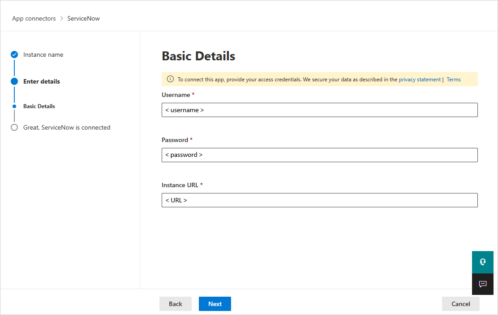

# Connect ServiceNow to Microsoft Cloud App Security
  This section provides instructions for connecting [!INCLUDE[Adallom](./includes/adallom_md.md)] to your existing ServiceNow account using the app connector API.  
  
## How to connect ServiceNow to Cloud App Security  
  
> [!NOTE]  
>  [!INCLUDE[Adallom](./includes/adallom_md.md)] supports ServiceNow versions of Eureka and Fiji. In order to connect ServiceNow with [!INCLUDE[Adallom](./includes/adallom_md.md)], you must have admin-level permissions and make sure the ServiceNow instance supports API access.  
  
1.  Log on with an Admin account to your ServiceNow account.  
  
2.  Create a new service account for [!INCLUDE[Adallom](./includes/adallom_md.md)] and attach the Admin role to the newly created account.  
  
3.  Make sure the REST API plug-in is turned on.  
  
       
  
4.  In the [!INCLUDE[Adallom](./includes/adallom_md.md)] portal, click **Investigate** and then **Sanctioned apps**.  
  
5.  In the ServiceNow row, click **Connect** in the **App Connector status** column, or click the **Connect an app** button and then **ServiceNow**.  
  
       
  
6.  In the ServiceNow settings page, on the API tab, add your ServiceNow username, password and instance URL in the appropriate boxes.  
  
7.  Click **Connect**.  
  
       
  
8.  Make sure the connection succeeded by clicking **Test API**.  
  
     Testing may take a couple of minutes. After receiving a success notice, click **Close**.  
  
  After connecting ServiceNow, you will receive events for 60 days prior to connection.
  
## See Also  
 [Control cloud apps with policies](../migration/control-cloud-apps-with-policies.md)   
 [For technical support, please visit the Cloud App Security assisted support page.](http://support.microsoft.com/oas/default.aspx?prid=16031)   
 [Premier customers can also choose Cloud App Security directly from the Premier Portal.](https://premier.microsoft.com/)  
  
  