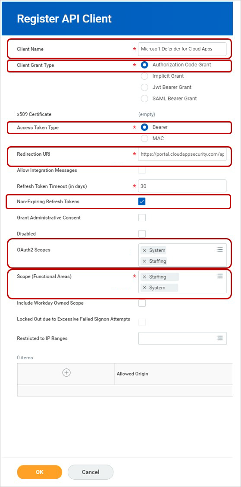
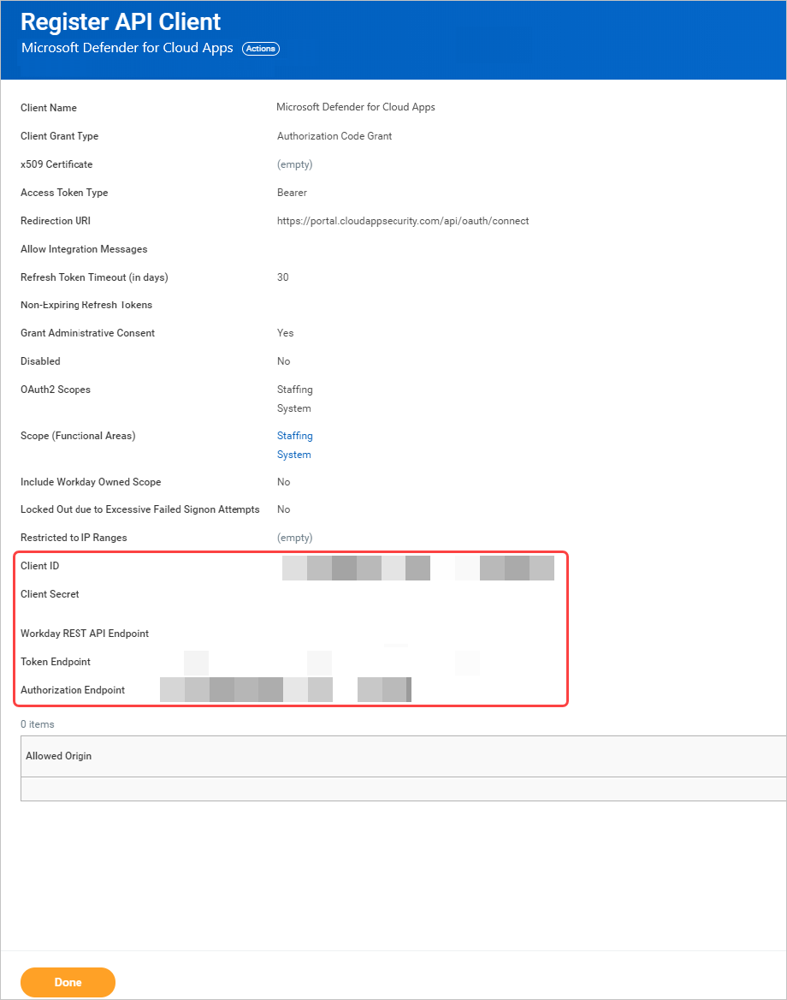
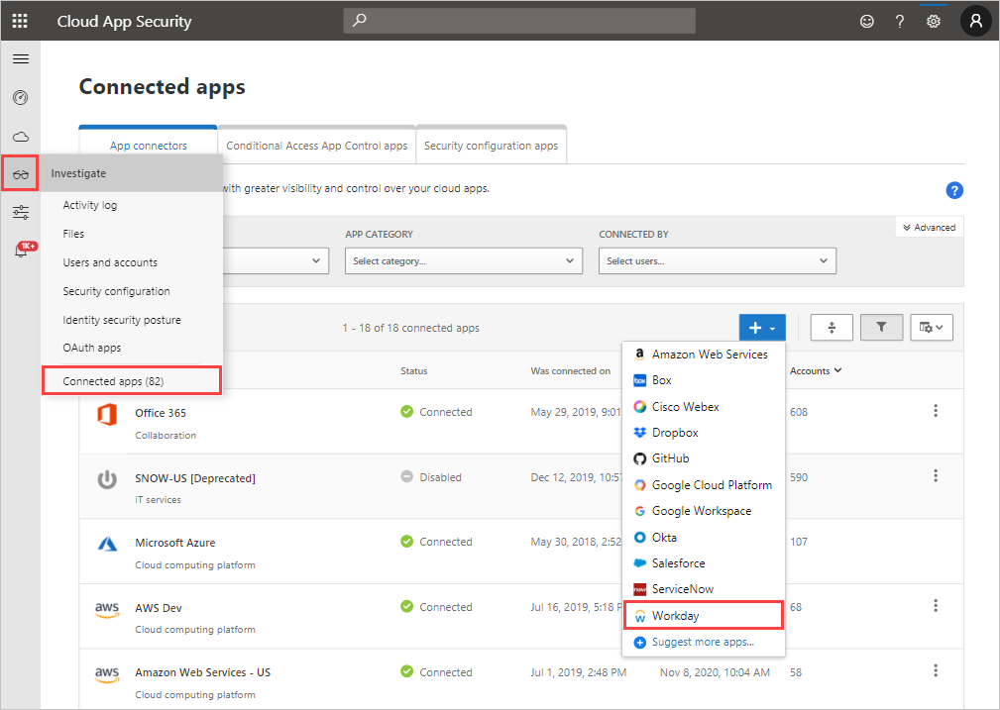
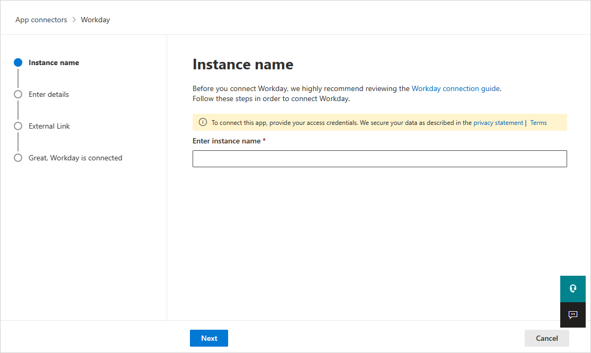
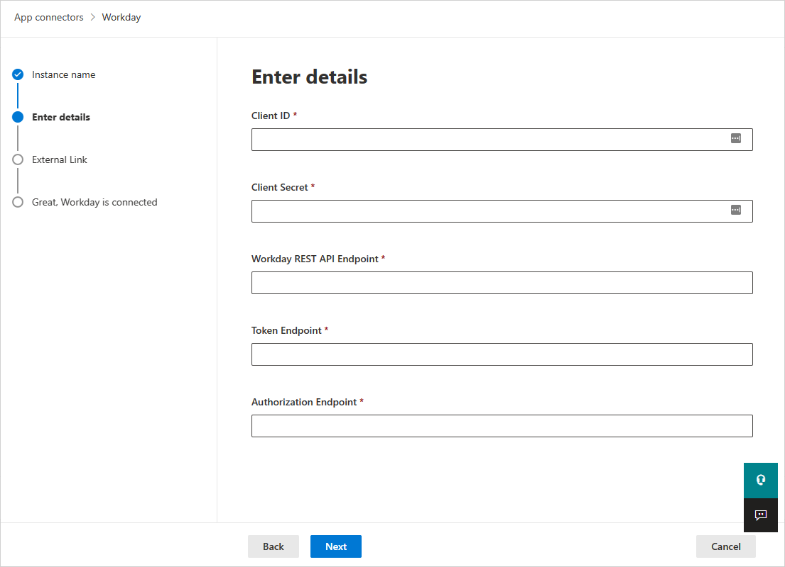
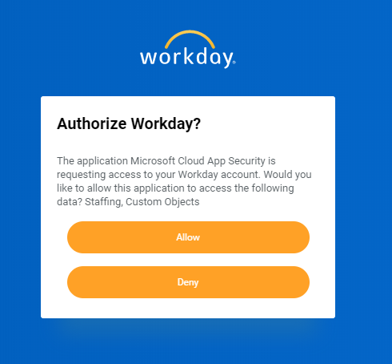

---
# required metadata

title: Connect Workday to Cloud App Security
description: This article provides information about how to connect your Workday app to Cloud App Security using the API connector for visibility and control over use.
keywords:
author: ShlomoSagir-MS
ms.author: shsagir
manager: ShlomoSagir-MS
ms.date: 9/5/2019
ms.topic: conceptual
ms.collection: M365-security-compliance
ms.prod:
ms.service: cloud-app-security
ms.technology:

# optional metadata

#ROBOTS:
#audience:
#ms.devlang:
ms.reviewer: reutam
ms.suite: ems
#ms.tgt_pltfrm:
ms.custom: seodec18

---
# Connect Workday to Microsoft Cloud App Security

*Applies to: Microsoft Cloud App Security*

This article provides instructions for connecting Microsoft Cloud App Security to your existing Workday account using the app connector API. This connection gives you visibility into and control over Workday use.

## Prerequisites

- The Workday account used for connecting to Cloud App Security must be a member of a security group that has the following domains enabled for them:

  - System - Security Administration
  - System - System auditing
  - Staffing - Worker Data: Public Worker Reports

  We recommended using a Workday Integration System User.

- If your Workday deployment manages IP address ranges, you must whitelist all Cloud App Security IP addresses. For the list of IP addresses, see [Network requirements - App connector](network-requirements.md#app-connector).

## How to connect Workday to Cloud App Security using OAuth

1. Sign in with an Admin account to your Workday account.

1. Search for "Edit tenant setup – system", and under **User Activity Logging**, select **Enable User Activity Logging**.

    

1. Search for "Edit tenant setup – security", and under **OAuth 2.0 Settings**, select **OAuth 2.0 Clients Enabled**.

1. Search for "Register API Client" and select **Register API Client – Task**.

1. On the **Register API Client** page, fill out the following information, and then click **OK**.

    | Field name | Value |
    | ---- | ---- |
    | Client Name | Microsoft Cloud App Security |
    | Client Grant Type | Authorization Code Grant |
    | Access Token Type | Bearer |
    | Redirection URI | `https://portal.cloudappsecurity.com/api/oauth/connect` |
    | OAuth2 Scopes | **Staffing** and **System** |
    | Scope (Functional Areas) | **Staffing** and **System** |

    

1. Once registered, make a note for the following parameters, and then click **Done**.

    - Client ID
    - Client Secret
    - Workday REST API Endpoint
    - Token Endpoint
    - Authorization Endpoint

    

1. In the Cloud App Security portal, click **Investigate** and then click **Connected Apps**.

1. In the **App connectors** page, click the plus button and then **Workday**.

    

1. In the popup, add your instance name and then click **Connect Workday**.

    

1. On the next page, fill out the details with the information you noted earlier, and then click **Connect in Workday**.

    

1. In Workday, a popup will ask you if you want to allow Cloud App Security access to your Workday account. To proceed, click **Allow**.

    

1. Back in the Cloud App Security portal, you should see a message that Workday was successfully connected. Make sure the connection succeeded by clicking **Test API**.

    Testing may take a couple of minutes. After receiving a success notice, click **Close**.

> [!NOTE]
> After connecting Workday, you'll receive events for seven days prior to connection.

## Next steps

[Control cloud apps with policies](control-cloud-apps-with-policies.md)

[Premier customers can also create a new support request directly in the Premier Portal.](https://premier.microsoft.com/)
