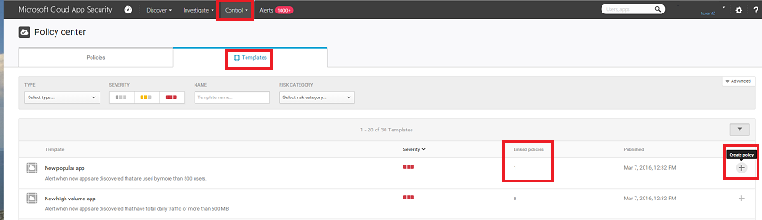
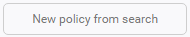
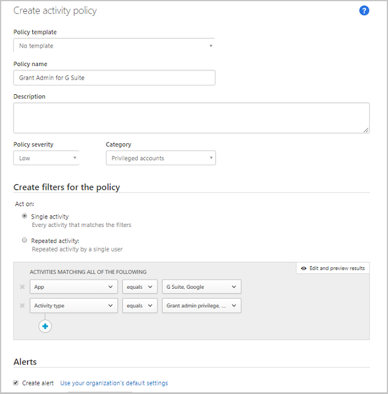

---
# required metadata

title: Control cloud apps with policies | Microsoft Docs
description: This topic provides information on how policies are used and set up to control cloud app use.
keywords:
author: rkarlin
ms.author: rkarlin
manager: mbaldwin
ms.date: 10/15/2016
ms.topic: article
ms.prod:
ms.service: cloud-app-security
ms.technology:
ms.assetid: 14d10238-0f61-43e9-ab96-71534a27d3d4

# optional metadata

#ROBOTS:
#audience:
#ms.devlang:
ms.reviewer: reutam
ms.suite: ems
#ms.tgt_pltfrm:
#ms.custom:

---
# Control cloud apps with policies

Policies allow you to define the way you want your users to behave in the cloud. They enable you to detect risky behavior, violations or suspicious data points and activities in your cloud environment, and if required, to integrate remediation work flows to achieve complete risk mitigation. There are multiple types of policies that correlate to the different types of information you want to gather about your cloud environment and the types of remediation actions you may want to take.  
  
For example, if there is a data violation threat that you want to quarantine, you will need a different type of policy in place than if you want to block a risky cloud app from being used by your organization.  
  
## Policy types  
The following types of policies can be created:  
  
|Policy type|Use|  
|-----------------|---------|  
|Activity policy|Activity policies allow you to enforce a wide range of automated processes leveraging the app provider’s APIs. These policies enable you to monitor specific activities carried out by various users, or follow unexpectedly high rates of a certain type of activity.|  
|Anomaly detection policy|Anomaly detection policies enable you to look for unusual activities on your cloud based on the risk factors you set here to alert you when something happens that is different from either the baseline of your organization or from the user's regular activity.|  
|Cloud Discovery anomaly detection policy|Cloud Discovery anomaly detection policies look at the logs you use for discovering cloud apps and search for unusual occurrences. For example, when a user who never used Dropbox before suddenly uploads 600 GB to Dropbox, or when there are a lot more transactions than usual on a particular app.|  
|App discovery policy|App discovery policies enable you to set alerts that notify you when new apps are detected within your organization.|  
|File policy|File policies enable you to scan your cloud apps for specified files or file types (shared, shared with external domains), data (proprietary information, PII, credit card information, etc.) and apply governance actions to the files (governance actions are cloud-app specific).|  
  
## Identifying risk  
Cloud App Security helps you mitigate different risks in the cloud. You can configure any policy and alert to be associated with one of the following risks:  
  
-   **Access control:** Who accesses what from where?  
  
     Continuously monitor behavior and detect anomalous activities, including high-risk insider and external attacks, and apply a policy to alert, block, or require identity verification for any app or specific action within an app. Enables on-premises and mobile access control policies based on user, device, and geography with coarse blocking and granular view, edit, and block. Detect suspicious login events, including multi-factor authentication failures, disabled account login failures, and impersonation events.  
  
-   **Compliance:** Are your compliance requirements breached?  
  
     Catalog and identify sensitive or regulated data, including sharing permissions for each file, stored in file-sync services to ensure compliance with regulations such as PCI, SOX, and HIPAA  
  
-   **Configuration control:** Are unauthorized changes being made to your configuration?  
  
     Monitor configuration changes including remote configuration manipulation.  
  
-   **Cloud Discovery:** Are new, unsanctioned, apps being used in your organization? Do you have a problem of Shadow IT apps being used that you don't know about?  
  
     Rate overall risk for each cloud app based on regulatory and industry certifications and  
    best practices, enables you to monitor the number of users, activities, traffic volume and typical usage hours for  
    each cloud application.  
  
-   **DLP:** Are proprietary files being shared publicly? Do you need to quarantine files?  
  
     On-premises DLP integration provides integration and closed-loop remediation with existing on-premises DLP solutions.  
  
-   **Privileged accounts:** Do you need to monitor admin accounts?  
  
     Real-time activity monitoring and reporting of privileged users and admins.  
  
-   **Sharing control:** How is data being shared in your cloud environment?  
  
     Inspect the content of files and content in the cloud, and enforce internal and external sharing policies. Monitor collaboration and enforce sharing policies, such as blocking files from being shared outside your organization.  
  
-   **Threat detection:** Are there suspicious activities threatening your cloud environment?  
  
     Receive real-time notifications for any policy violation or activity threshold via text message or email. By applying machine learning algorithms Cloud App Security enables you to detect behavior that could indicate that a user is misusing data.  
  
## How to control risk  
Follow this process to control risk with policies:  
  
1.  Create a policy from a template or a query.  
  
2.  Fine-tune the policy to achieve expected results.  
  
3.  Add automated actions to respond and remediate risks automatically.  
  
### Create a policy  
You can either use Cloud App Security’s policy templates as a basis for all your policies, or create policies from a query.  
  
Policy templates will help you set the correct filters and configurations necessary to detect specific events of interest within your environment. The templates include policies of all types, and can apply to various services.  
  
To create a policy from a **policy templates**, perform the following:  
  
1.  In the console, click on **Control** followed by **Templates**.  
  
       
  
2.  Click the **+** at the far right of the row of the template you want to use. A create policy page opens, containing the pre-defined configuration of the template.  
  
3.  Modify the template as needed for your custom policy. Every property and field of this new template-based policy can be modified according to your needs.  
> [!NOTE] 
>When using the policy filters, **Contains**  will search only for full words – separated by comas, dots, spaces or underscores. For example if you search for **malware** or **virus**, it will find virus_malware_file.exe but it will not find malwarevirusfile.exe. If you search for **malware.exe** then you will find ALL files with either malware or exe in their filename, whereas if you search for **“malware.exe”** (with the quotation marks) you will find only files that contain exactly “malware.exe”. 
     **Equals** will search only for the complete string, for example if you search for **malware.exe** it will find malware.exe but not malware.exe.txt.  
4.  After you create the new template-based policy, a link to the new policy appears in the **Linked policies** column in the policy template table next to the template from which the policy was created.  
     You can create as many policies as you want from each template and they will all be linked to the original template, allowing you to track all policies built using the same template.  
  
Alternatively, you can **create a policy during investigation**. If you are investigating the **Activity log**, **Files** or **Accounts**, and you drill down to search for something specific, at any time you can create a new policy based on the results of your investigation.  
  
For example, if you are looking at the **Activity log**, and see that one of your admin accounts is being logged into from an unexpected geographic location, you can filter the results of the **Activity log** to display all log on activities by that admin, and then create a report that notifies you the next time activity is detected for that user.  
  
To create a policy based on investigation results, perform the following:  
  
1.  In the console, click on **Investigate** followed by **Activity log**, **Files** or **Accounts**.  
  
2.  Use the filters at the top of the page to limit the search results to the suspicious area, for example, in the Activity log page, click **User** and select the Admin whose account is registering unusual activity. Then, under **Activity**, select **Copy folder** and **Copy file**.  
  
       
  
3.  In the upper right corner of the console, click **New policy from search**  
  
4.  A create policy page opens, containing the filters you used in your investigation.  
  
5.  Modify the template as needed for your custom policy. Every property and field of this new investigation-based policy can be modified according to your needs.  
   
> [!NOTE] 
> When using the policy filters, **Contains**  will search only for full words – separated by comas, dots, spaces or underscores. For example if you search for **malware** or **virus**, it will find virus_malware_file.exe but it will not find malwarevirusfile.exe.  
     **Equals** will search only for the complete string, for example if you search for **malware.exe** it will find malware.exe but not malware.exe.txt.  
  
 
 

 
 
  
> [!NOTE]  
>  For more information on setting the policy fields, refer to the corresponding policy documentation:  
>   
>  [User activity policies](user-activity-policies.md)  
>   
>  [Data protection policies](data-protection-policies.md)  
>   
>  [Cloud Discovery policies](cloud-discovery-policies.md)  
  
### Policy conflicts
After creating multiple policies, a situation may arise in which the policies overlap. In this case, Cloud App Security will process the policies as follows:
* If two policies contain actions that are contained on in the other (for example, **Remove external shares** is included in **Make private**), Cloud App Security will resolve the conflict and the stronger action will be enforced.
* If the actions are completely unrelated (for example, **Notify owner** and **Make private**). Both actions will take place.
* If the actions conflict, (for example **Change owner to user A** and **Change owner to user B**), different results may result from every match. It is important to change your policies to prevent conflicts because they may result in unwanted changes in the drive that will be hard to detect. 

## See Also  
[Daily activities to protect your cloud environment](daily-activities-to-protect-your-cloud-environment.md)   
[For technical support, please visit the Cloud App Security assisted support page.](http://support.microsoft.com/oas/default.aspx?prid=16031)   
[Premier customers can also choose Cloud App Security directly from the Premier Portal.](https://premier.microsoft.com/)  
  