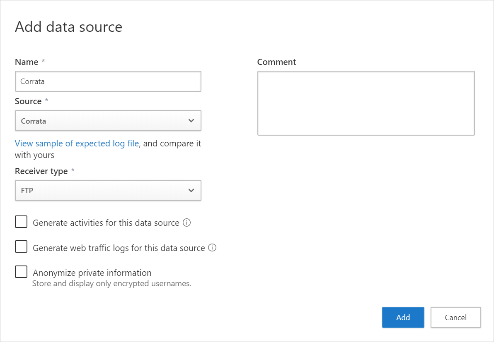

---
# required metadata

title: Integrate Cloud App Security with Coratta
description: This article describes how to integrate Microsoft Cloud App Security with Coratta for seamless Cloud Discovery and automated block of unsanctioned apps.
keywords:
author: shsagir
ms.author: shsagir
manager: shsagir
ms.date: 05/17/2020
ms.topic: conceptual
ms.collection: M365-security-compliance
ms.prod:
ms.service: cloud-app-security
ms.technology:

# optional metadata

#ROBOTS:
#audience:
#ms.devlang:
ms.reviewer: borisk
ms.suite: ems
#ms.tgt_pltfrm:
ms.custom: seodec18

---
# Integrate Cloud App Security with Coratta

*Applies to: Microsoft Cloud App Security*

If you work with both Cloud App Security and Coratta, you can integrate the two products to enhance your security Cloud Discovery experience for mobile app use. Coratta, as a local Mobile gateway, monitors your organization's traffic from mobile devices enabling you to set policies for blocking transactions. Together, Cloud App Security and Coratta provide the following capabilities:

- Seamless deployment of Cloud Discovery - Use Coratta to collect your mobile device traffic and send it to Cloud App Security. This eliminates the need for installation of log collectors on your network endpoints to enable Cloud Discovery.
- Coratta's block capabilities are automatically applied on apps you set as unsanctioned in Cloud App Security.
- Enhance your Coratta portal with Cloud App Security's risk assessment for leading cloud apps, which can be viewed directly in the Coratta portal.

## Prerequisites

- A valid license for Microsoft Cloud App Security
- A valid license for Coratta Cloud

## Deployment

1. In the Coratta portal, do the steps to complete the [Coratta partner integration with Microsoft Cloud App Security](https://corrata.com/microsoft-mcas-onboarding).
2. In the Cloud App Security portal, do the following integration steps:
    1. Click on the settings cog and select **Cloud Discovery Settings**.
    2. Click on the **Automatic log upload** tab and then click **Add data source**.
    3. In the **Add data source** page, enter the following settings:

        - Name = Corrata
        - Source = Coratta
        - Receiver type = FTP

        

    4. Click **View sample of expected log file**. Then click **Download sample log** to view a sample discovery log, and make sure it matches your logs.

3. Investigate cloud apps discovered on your network. For more information and investigation steps, see [Working with Cloud Discovery](working-with-cloud-discovery-data.md).

4. Any app that you set as unsanctioned in Cloud App Security will be pinged by Coratta, and then automatically blocked by Coratta. For more information about unsanctioning apps, see [Sanctioning/unsanctioning an app](governance-discovery.md#BKMK_SanctionApp).

## Next steps

> [!div class="nextstepaction"]
> [Control cloud apps with policies](control-cloud-apps-with-policies.md)

[!INCLUDE [Open support ticket](includes/support.md)]
