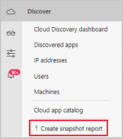
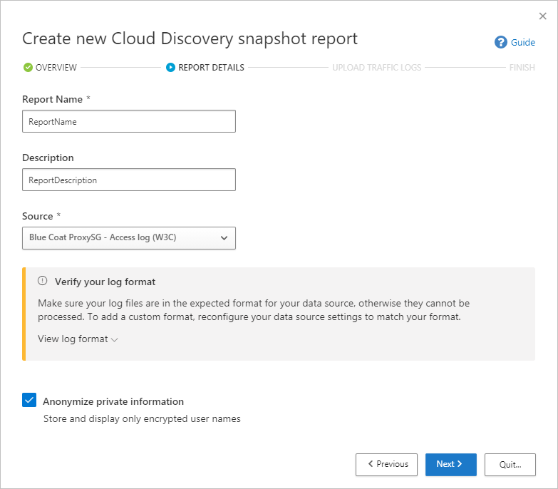
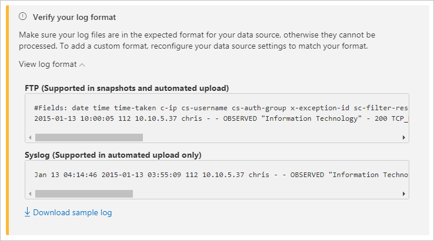
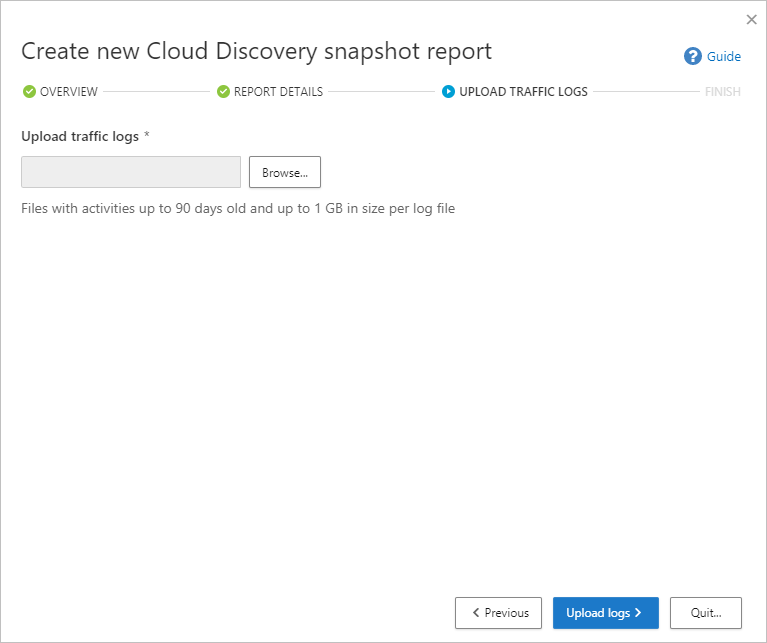
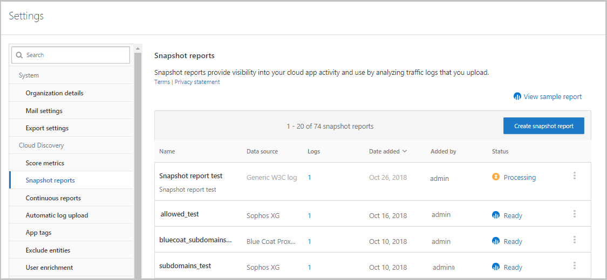

# Create snapshot cloud discovery reports

It's important to upload a log manually and let Microsoft Defender for Cloud Apps parse it before trying to use the automatic log collector. For information on how the log collector works and the expected log format, see [Using traffic logs for cloud discovery](#log-format).

If you don't have a log yet and you want to see an example of what your log should look like, download a sample log file. Follow the procedure below to see what your log should look like.

To create a snapshot report:

1. Collect log files from your firewall and proxy, through which users in your organization access the Internet. Make sure to gather logs during times of peak traffic that are representative of all user activity in your organization.

1. In the Microsoft Defender Portal, under **Cloud Apps**, select **Cloud discovery**.
1. In the top-right corner, pull down **Actions**, and select **Create Cloud Discovery snapshot report.**

    

1. Select **Next**.

1. Enter a **Report name** and a **Description**

    

1. Select the **Source** from which you want to upload the log files. If your source isn't supported (see [Supported firewalls and proxies](set-up-cloud-discovery.md#supported-firewalls-and-proxies-) for the full list), you can create a custom parser. For more information, see [Use a custom log parser](custom-log-parser.md).

1. Verify your log format to make sure that it's formatted properly according to the sample log you can download. Under **Verify your log format**, select **View log format** then select **Download sample log**. Compare your log with the sample provided to make sure it's compatible.

    

    > [!NOTE]
    > The FTP sample format is supported in snapshots and automated upload while syslog is supported in automated upload only. Downloading a sample log will download a sample FTP log.

1. **Upload traffic logs** that you want to upload. You can upload up to 20 files at once. Compressed and zipped files are also supported.

    

1. Select **Upload logs**.

1. After upload completes, the status message will appear at the top-right corner of your screen letting you know that your log was successfully uploaded.

1. After you upload your log files, it will take some time for them to be parsed and analyzed.
    After processing of your log files completes, you'll receive an email to notify you that it's done.

1. A notification banner will appear in the status bar at the top of the **Cloud Discovery** dashboard. The banner updates you with the processing status of your log files.
    

1. After the logs are uploaded successfully, you should see a notification letting you know that the log file processing completed successfully. At this point, you can view the report by selecting the link in the status bar. Or, in the Microsoft Defender Portal, select **Settings**.

1. Then under **Cloud Discovery**, select **Snapshot reports**, and select your snapshot report.

    

## Using traffic logs for cloud discovery 

Cloud discovery uses the data in your traffic logs. The more detailed your log, the better visibility you get. Cloud discovery requires web-traffic data with the following attributes:

- Date of the transaction
- Source IP
- Source user - highly recommended
- Destination IP address
- Destination URL **recommended** (URLs provide higher accuracy for cloud app detection than IP addresses)
- Total amount of data (data information is highly valuable)
- Amount of uploaded or downloaded data (provides insights about the usage patterns of the cloud apps)
- Action taken (allowed/blocked)

Cloud discovery can't show or analyze attributes that aren't included in your logs.
For example, **Cisco ASA Firewall** standard log format doesn't have the **number of uploaded bytes per transaction**, **Username**, and  **Target URL** (only target IP).
Therefore, these attributes won't be shown in cloud discovery data for these logs, and the visibility into the cloud apps will be limited. For Cisco ASA firewalls, it's necessary to set the information level to 6.

To successfully generate a cloud discovery report, your traffic logs must meet the following conditions:

1. [Data source is supported](set-up-cloud-discovery.md#supported-firewalls-and-proxies).
2. Log format matches the expected standard format (format checked upon upload by the Log tool).
3. Events aren't more than 90 days old.
4. The log file is valid and includes outbound traffic information.

## Next steps

> [!div class="nextstepaction"]
> [Control cloud apps with policies](control-cloud-apps-with-policies.md)

[!INCLUDE [Open support ticket](includes/support.md)]
