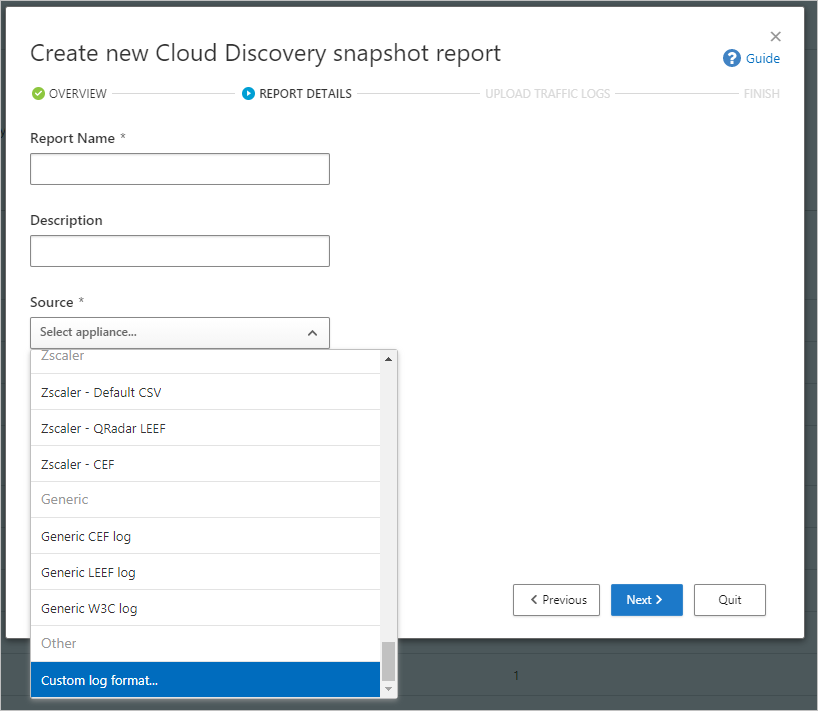
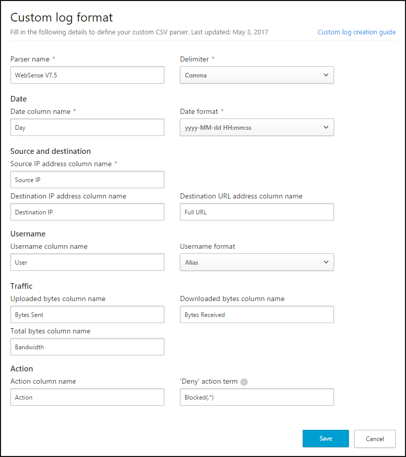

# Use a custom log parser

Defender for Cloud Apps enables you to configure a custom parser to match and process the format of your logs so that they can be used for cloud discovery. Typically you would use a custom parser if the firewall or device is not explicitly supported by Defender for Cloud Apps. This can be a CSV parser or a custom key value parser.

The custom parser enables you to use logs from unsupported firewalls by following this process.

**To configure a custom parser**:

1. In the Microsoft Defender Portal, under **Cloud Apps**, select **Cloud Discovery** >  **Actions** > **Create Cloud Discovery snapshot report**. For example:

    

1. Enter a **Report name** and a **Description**

1. Under **Source**, scroll all the way down and select **Custom log format...**. For example:

    

1. Collect logs from your firewall and proxy, through which users in your organization access the Internet. Make sure to gather logs during times of peak traffic that are representative of all user activity in your organization.

1. Open the logs you want to process in a text editor. Review their format, making sure that the column names in the log correspond to the fields in the **Custom log format** dialog.

    Required fields are marked in the **Custom log format** dialog with an asterisk (*), and must be present in the logs in the same sequence as presented in the **Custom log format** dialog. Logs are processed only if the required fields are found in the log. Extra fields, which aren't used by Defender for Cloud Apps, are discarded.

1. In the **Custom log format** dialog, fill in the fields based on your data to delineate which columns in the data correlate to specific fields in Defender for Cloud Apps. You may have to modify column names in your log file to correlate properly.

    > [!NOTE]
    > The fields are case-sensitive. Make sure you spell and type the names of the columns identically in Defender for Cloud Apps and in the log file. Also, make sure that the date format you choose is identical. 

    For example, the following images show a sample log file opened in a text editor, and the corresponding **Custom log format** dialog, populated.

    :::image type="content" source="media/log-data.png" alt-text="Screenshot of a log file opened in a text editor.":::

    

1. Select **Save**. The custom log format your configured will be saved as the default custom parser. You can edit it at any time by selecting **Edit**.

1. Under **Upload traffic logs**, select the log file you modified and select **Upload logs** to upload it. You can upload up to 20 files at once. Compressed and zipped files are also supported.

After the upload completes, a status message shows at the top right-corner of your screen, letting you know that your log was successfully uploaded. 

It'll take some time for your logs to be parsed and analyzed. A notification banner shows in the status bar at the top of the **Cloud Discovery > Dashboard** tab, showing you the processing status of your log files. For example:

When the processing of your log files is complete, you'll receive an email to notify you that it's done.

View the report either by selecting the link in the status bar, or select **Settings** > **Cloud Apps** > **Cloud Discovery** > **Snapshot reports**. Select your snapshot report to open it. For example:

## Next steps

> [!div class="nextstepaction"]
> [Create snapshot cloud discovery reports](create-snapshot-cloud-discovery-reports.md)

> [!div class="nextstepaction"]
> [Configure automatic log upload for continuous reports](discovery-docker.md)

> [!div class="nextstepaction"]
> [Working with cloud discovery data](working-with-cloud-discovery-data.md)

[!INCLUDE [Open support ticket](includes/support.md)]
