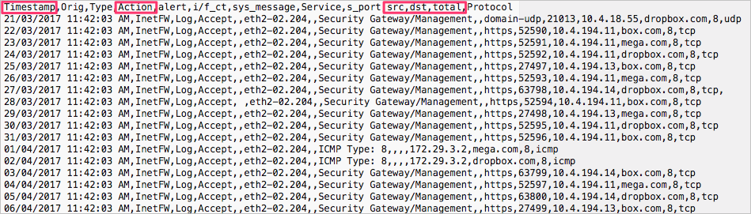
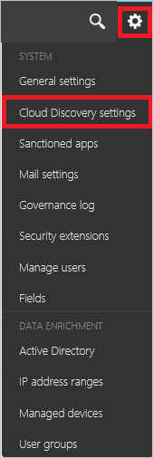
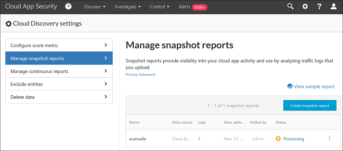

---
# required metadata

title: Cloud App Security custom log parser for logs that are't supported
description: This article provides information about how to use the custom log parser to upload logs for devices that aren't supported to Cloud App Security.
keywords:
author: rkarlin
ms.author: rkarlin
manager: barbkess
ms.date: 12/10/2018
ms.topic: conceptual
ms.collection: M365-security-compliance
ms.prod:
ms.service: cloud-app-security
ms.technology:
ms.assetid: a612d87e-5471-4add-b4b1-dbbb530f2b61

# optional metadata

#ROBOTS:
#audience:
#ms.devlang:
ms.reviewer: reutam
ms.suite: ems
#ms.tgt_pltfrm:
ms.custom: seodec18

---
# Use a custom log parser

*Applies to: Microsoft Cloud App Security*

Cloud App Security enables you to configure a custom parser to match and process the format of your logs so that they can be used for Cloud Discovery. Typically you would use a custom parser if the firewall or device is not explicitly supported by Cloud App Security. This can be a CSV parser or a custom key value parser.

The custom parser enables you to use logs from unsupported firewalls by following this process. 

 
To configure a custom parser:
1. In the Cloud App Security portal, click on **Discover** and then **Create new snapshot report**.  
  
   
     
2. Enter a **Report name** and a **Description**
  
3. Under **Data source**, select **Custom log format...**.  

       

4. Collect logs from your firewall and proxy, through which users in your organization access the Internet. Make sure to gather logs during times of peak traffic that are representative of all user activity in your organization. 

5. Open the logs you want to process in a text editor. Review their format, making sure that the column names in the log correspond to the fields in the **Custom log format** screen.

    

6. Then, fill in the fields based on your data to delineate which columns in the data correlate to specific fields in Cloud App Security. You may have to modify column names in your log file to correlate properly.
  
   > [!NOTE]
    > The fields are case-sensitive. Make sure you spell and type the names of the columns identically in Cloud App Security and in the log file. Also, make sure that the date format you choose is identical.

    

7. Click **Save**. The custom log format your configured will be saved as the default custom parser. You can edit it at any time by clicking on **Edit**.

8. Under **Choose the traffic logs**, select the log file you modified and upload it. You can upload up to 20 files at once. Compressed and zipped files are also supported.  
  

9. Click **Create**.  

10. After upload completes, the status message will appear at the top right corner of your screen letting you know that your log was successfully uploaded.  
  
11. After you upload your log files, it will take some time for them to be parsed and analyzed.  
    After processing of your log files completes, you'll receive an email to notify you that it's done. 
  
12. A notification banner will appear in the status bar at the top of the **Cloud Discovery dashboard**. The banner updates you with the processing status of your log files.  
     
   
13. After the logs are uploaded successfully, you should see a notification letting you know that the log file processing completed successfully. At this point, you can view the report either by clicking the link in the status bar, or by going to the Settings cog and selecting **Cloud Discovery settings**.   
  
     
14. Then selecting **Manage snapshot reports** and select your snapshot report.
 
    

  
      

## Next steps
 
[Create snapshot Cloud Discovery reports](create-snapshot-cloud-discovery-reports.md)

[Configure automatic log upload for continuous reports](configure-automatic-log-upload-for-continuous-reports.md)

[Working with Cloud Discovery data](working-with-cloud-discovery-data.md)

[Premier customers can also create a new support request directly in the Premier Portal.](https://premier.microsoft.com/)  
