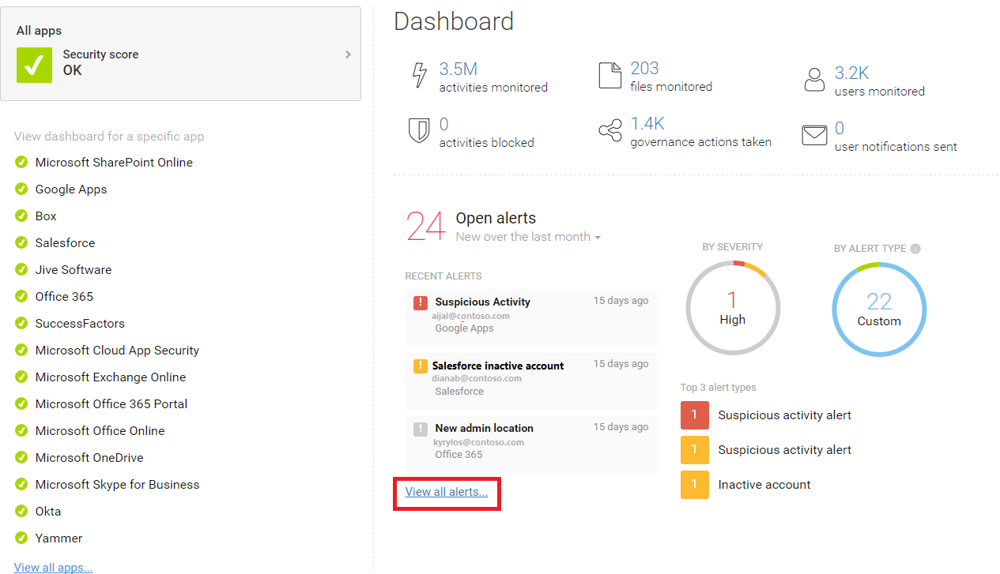

---
# required metadata

title: Working with the Cloud App Security dashboard
description: This article provides a foundation for how to use the Cloud App Security dashboard.
keywords:
author: shsagir
ms.author: shsagir
manager: shsagir
ms.date: 12/10/2018
ms.topic: conceptual
ms.collection: M365-security-compliance
ms.prod:
ms.service: cloud-app-security
ms.technology:
ms.assetid: a835fa24-15c5-4bbb-a25a-688444040f1f

# optional metadata

#ROBOTS:
#audience:
#ms.devlang:
ms.reviewer: reutam
ms.suite: ems
#ms.tgt_pltfrm:
ms.custom: seodec18

---
# Working with the dashboard

*Applies to: Microsoft Cloud App Security*

This article describes what you should do with Cloud App Security daily.  After you get Microsoft Cloud App Security up and running, you'll need to:

- Configure data streams
- Sanction apps you want to allow people to use 
- Set up policies to monitor your cloud environment. 

You can then use Cloud App Security to control and protect your cloud and manage risk.  

## Check the dashboard  
The Cloud App Security dashboard provides you with an overview of activities and features, including:

- Open alerts
- Activity violations
- Content violations
- An activity map that plots where user activity originates
- Connected app usage trends in your cloud environment
- Top users by threat detection

We recommend you check the dashboard daily to see what new alerts have been triggered. It's a good place to keep an eye on the health of your cloud environment. The dashboard helps you get a sense of what's happening.  

  

## Next steps  
For more information about investigating alerts, see [Investigate](investigate.md).  

[!INCLUDE [Open support ticket](includes/support.md)]  
