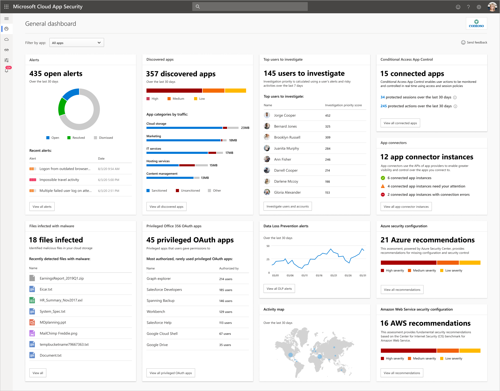

---
# required metadata

title: Working with the Cloud App Security dashboard
description: This article provides a foundation for how to use the Cloud App Security dashboard.
keywords:
author: shsagir
ms.author: shsagir
manager: shsagir
ms.date: 05/06/2020
ms.topic: conceptual
ms.collection: M365-security-compliance
ms.prod:
ms.service: cloud-app-security
ms.technology:

# optional metadata

#ROBOTS:
#audience:
#ms.devlang:
ms.reviewer: reutam
ms.suite: ems
#ms.tgt_pltfrm:
ms.custom: seodec18

---
# Working with the dashboard

*Applies to: Microsoft Cloud App Security*

This article describes what you should do with Cloud App Security daily.  After you get Microsoft Cloud App Security up and running, you'll need to:

- Configure data streams
- Sanction apps you want to allow people to use
- Set up policies to monitor your cloud environment.

You can then use Cloud App Security to control and protect your cloud and manage risk.

## Check the dashboard

The Cloud App Security dashboard provides you with an overview of activities and features, including:

- Open alerts
- Activity violations
- Content violations
- An activity map that plots where user activity originates
- Connected app usage trends in your cloud environment
- Top users by threat detection

We recommend you check the dashboard daily to see what new alerts have been triggered. It's a good place to keep an eye on the health of your cloud environment. The dashboard helps you get a sense of what's happening.

## Gradual deployment of our enhanced dashboard

As part of our ongoing improvements to the portal design, the Cloud App Security dashboard has been improved based on your feedback. The dashboard offers an enhanced user experience with updated content and data.

The information presented in the dashboard is an overview of all the most important information about your organization. Each information card provides links to a deeper investigation of the information presented. You can also choose to view the dashboard information for a specific app using the filter provided.

### What can you expect to see in the dashboard?

- **Open alerts**  
Shows the number of open alerts, a graph of the alert status distribution, and recent alerts

- **Discovered apps**  
Shows the number of discovered apps, a graph of the app risk distribution, and the top app categories by traffic.
- **Top users to investigate**  
Shows the number of users to investigate and the users with the highest investigation priority.
- **Conditional Access App Control**  
Shows the number of apps protected by Conditional Access App Control as well as the number of protected sessions and actions over the last 30 days.
- **App connectors status**  
Shows the number of API connected app instances and their status.
- **DLP alerts**  
Shows a graph of DLP alerts over the last 30 days.
- **Privileged Office 365 OAuth apps**  
Shows the number of rarely used OAuth apps granted highly privileged permissions.
- **Files infected with malware**  
Shows the number of files infected with malware.
- **Activity map**  
Shows the global spread of activities performed by users over the last 30 days.
- **Azure security configuration**  
Shows the number and severity of Azure security configuration recommendations.
- **AWS security configuration**  
Shows the number and severity of AWS security configuration recommendations.

## Next steps

> [!div class="nextstepaction"]
> [Investigate alerts](investigate.md)

[!INCLUDE [Open support ticket](includes/support.md)]
