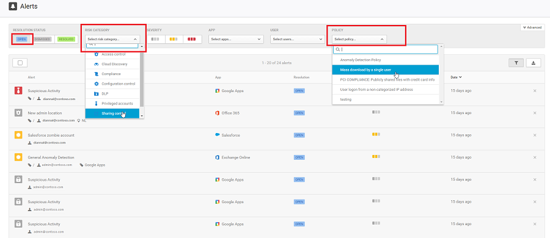

---
# required metadata

title: Use | Microsoft Docs
description: This article provides a foundation for what you must do in Cloud App Security on a regular basis to use Cloud App Security to monitor cloud app use in your organization. 
keywords:
author: rkarlin
manager: mbaldwin
ms.date: 10/15/2016
ms.topic: article
ms.prod:
ms.service: cloud-app-security
ms.technology:
ms.assetid: a835fa24-15c5-4bbb-a25a-688444040f1f

# optional metadata

#ROBOTS:
#audience:
#ms.devlang:
ms.reviewer: reutam
ms.suite: ems
#ms.tgt_pltfrm:
#ms.custom:

---

# Use
  After you get Cloud App Security up and running, and configure data streams, sanction any apps you want to allow people to use, and set up policies to monitor your cloud environment, it is time to use Cloud App Security to control and protect your cloud and manage risk.  
  
 This topic describes what you should do on a daily basis.  
  
## Check the dashboard  
 When you open the Cloud App Security portal, you are provided with an overview of open alerts, activity violations, content violations, an activity map which provides a map that plots where, geographically, user activity originates, and connected App usage trends in your  cloud environment.  
  
 It is recommended that you check the dashboard on a daily basis to see what new alerts were triggered and handle them. It is also a good place to keep an eye on the health of your cloud environment to get a sense of what's going on, on a high level, across your cloud environment.  
  
   
  
## Handle your alerts  
 Alerts are the entry point to understanding your cloud environment more deeply. You may want to create new policies based on what you find. For example, you might see an administrator logging on from Greenland, and decide that in the future you want to create a policy that automatically suspends an admin account when it is used to log on from Greenland.  
  
 It is a good idea to review all your alerts and to use them as a tool for modifying your policies. If harmless events are being considered violations to existing policies, you should refine your policies so that you receive fewer unnecessary alerts.  
  
-   Under **Open alerts**, click **View all alerts**.  
  
     This provides full visibility into any suspicious activity or violation of your established policies and helps you safeguard the security posture you defined for your cloud environment.  
  
       
  
-   For each alert, you need to investigate and determine the nature of the violation and the required response.  
  
     You can filter the alerts by **Alert type** or by **Severity** in order to process the most important ones first.  
  
     Click on a specific alert. Depending on what type of alert it is, you will receive various actions that can be taken before resolving the alert.  
  
     There are three types of violations you will need to deal with when investigating alerts:  
  
    -   **Serious violations** that require immediate response  
  
         Examples:  
  
         For a suspicious activity alert you might want to suspend the account until the user changes their password.  
  
         For a data leak you may want to restrict permissions or quarantine the file.  
  
         If a new, unsanctioned service is discovered you may want to block access to the service on your proxy or firewall.  
  
    -   **Questionable violations** that require further investigation  
  
         You can contact the  user or the user's manager about the nature of the activity.  
  
         Leave the activity open until you have more information.  
  
    -   **Authorized violations or anomalous behavior** that resulted from legitimate use.  
  
         Dismiss the alert.  
  
-   When you finish this process, mark the alert as resolved.  
  
 The following table provides a list of the types of alerts that can be triggered and recommended ways in which you can resolve them.  
  
|Alert type|Description|Recommended resolution|  
|----------------|-----------------|----------------------------|  
|Activity policy violation|This type of alert is the result of a policy you created.|-   To work with this type of alert in bulk, it is recommended that you work directly from within the Policy center to mitigate these. -   Fine-tune the policy to exclude noisy entities by adding more filters and more granular controls. -   If the policy is very accurate and the alert was warranted and it's a violation you want to stop immediately, consider moving to an automated response, by adding automatic remediation in the policy.|  
|File policy violation|This type of alert is the result of a policy you created.|-   To work with this type of alert in bulk, it is recommended that you work directly from within the Policy center to mitigate these. -   Fine-tune the policy to exclude noisy entities by adding more filters and more granular controls. -   If the policy is very accurate and the alert was warranted and it's a violation you want to stop immediately, consider moving to an automated response, by adding automatic remediation in the policy.|  
|Compromised account|This type of alert is triggered when Cloud App Security identifies an account that was compromised (very  high probability that the account was used in an unauthorized way).|It is recommended that you suspend the account until you can reach the user and make sure they change their password.|  
|Inactive account|This alert is triggered when an account is no longer used in one of your connected cloud apps.|Contact the user and the user's manager to determine  whether the account is still active. If not, suspend the user and terminate the license for the app.|  
|New admin user|This alerts you to changes in your privileged accounts for connected apps.|Confirm that the new admin permissions are in fact required for the user, and if not, recommend revoking administrator privileges to reduce exposure.|  
|New admin location|This alerts you to changes in your privileged accounts for connected apps.|Confirm that the log on from this anomalous location was legitimate, and if not, recommend revoking admin permissions or suspending the account to reduce exposure.|  
|New location|This is an informative alert about access to a connected app from a new location, and it's triggered only once per country.|Investigate the specific user's activity.|  
|New discovered service|This is an alert about Shadow IT - a new app was detected by Cloud Discovery.|<ul><li>Assess the risk of the service based on the App catalog.</li><li>Drill down into the activity to understand usage patterns and prevalence.</li><li>Decide whether to sanction or unsanction the app.       For unsanctioned apps:   <ul><li>You may want to block use in your proxy or firewall.</li><li>If it's unsanctioned and you have a sanctioned app in the same category, you can drill down and export a list of users of the unsanctioned app, and then contact them to migrate them to the sanctioned app.</li></ul></li></ul>|  
|Suspicious activity|This alert lets you know that anomalous activity has been detected that is not aligned with expected activities or users in your  organization.|Investigate the behavior and confirm it with the user.   This type of alert is a great place to start learning more about your environment and using these alerts to create new policies. For example, if someone suddenly uploads a large amount of data to one of your connected apps, you can set a rule to govern that type of anomalous behavior.|  
|Suspicious cloud use|This alert lets you know that anomalous activity has been detected that is not aligned with expected activities or users in your  organization.|Investigate the behavior and confirm it with the user.   This type of alert is a great place to start learning more about your environment and using these alerts to create new policies. For example, if someone suddenly uploads a large amount of data to one of your connected apps, you can set a rule to govern that type of anomalous behavior.|  
|Use of personal account|This alert lets  you know that a new personal account has access to resources in your connected apps.|In the external account, remove the user's collaborations.|  
  
## Use policies to assess risk  
 After you take a look at your open alerts, go to the **Policy center** to review policy violations that didn't trigger alerts.  
  
-   In the Cloud App Security portal, click on **Control** and then **Policies**.  
  
-   Click on a specific policy to see the **Violating now** list of policy matches that didn't trigger alerts.  
  
-   Click on the violations, one at a time, and decide what to do for each. For more information about governance actions, see below.  
  
     For example, if your policy is set to find compliance breaches and someone saves credit card numbers in files on OneDrive, you will have a match in the policy.  
  
       
  
-   Click on the match to see the actual files that breached the policy.  
  
       
  
     You can click on the file itself to get information about the files.  
  
     You can click on **Collaborators** to see who has access to this file.  
  
     You can click on the **Matches** to see the actual credit card numbers.  
  
       
  
## See Also  
 [Investigate](investigate.md)   
 [For technical support, please visit the Cloud App Security assisted support page.](http://support.microsoft.com/oas/default.aspx?prid=16031)   
 [Premier customers can also choose Cloud App Security directly from the Premier Portal.](https://premier.microsoft.com/)  
  
  