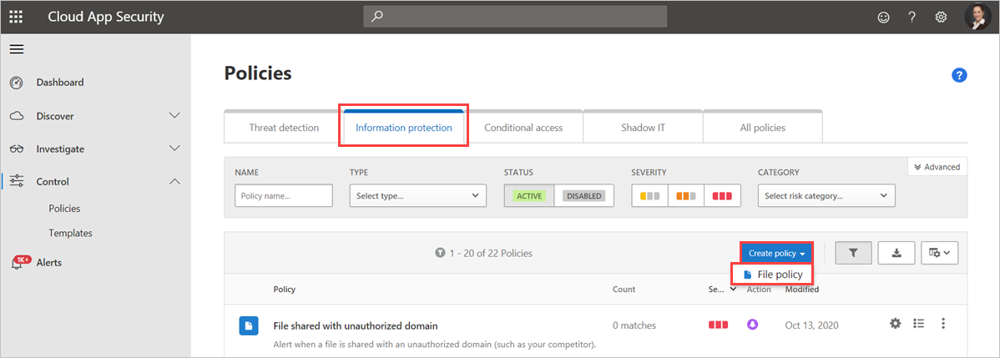
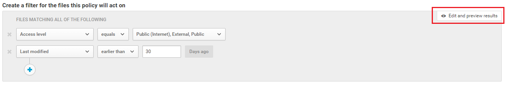
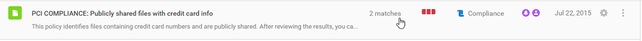
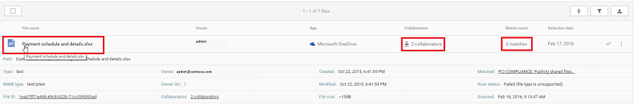
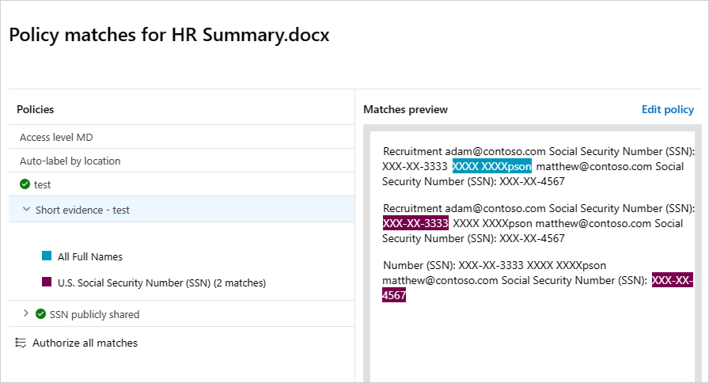

# File policies in Microsoft Defender for Cloud Apps

File policies support a range of automated processes using cloud provider APIs. Policies can be configured to provide continuous compliance scans, legal eDiscovery tasks, and Data Loss Prevention (DLP) for publicly shared  sensitive content. Defender for Cloud Apps monitors files across over 20 metadata filters, including access level and file type.

For a complete list of available filters, see [File filters in Microsoft Defender for Cloud Apps](file-filters.md)

## Supported file types

Defender for Cloud Apps inspects content by extracting text from over 100 common file types, including Office, Open Office, compressed files, rich text formats, XML, and HTML.

## Policies

Each policy includes three main components:

- Content scans using preset templates or custom expressions.
- Context filters, based on user roles, file metadata, sharing level, organizational group integration, collaboration context, and other customizable attributes.
- Automated actions for governance and remediation.

  > [!NOTE]
  > Only the governance action of the first triggered policy is guaranteed to apply. For example, if a file policy has applied a sensitivity label to a file, a second policy file cannot apply another sensitivity label.
  >

Once enabled, the policy continuously scans your cloud environment,identifies files that match the specified content and context filters, and applies the designated automated actions. These policies detect and address violations for data at rest and newly created content. Policies can be monitored using real-time alerts or using console-generated reports.

The following are examples of file policies that can be created:

- **Publicly shared files** - Receive alerts about any file in your cloud environment by selecting all files whose sharing level is public.
- **Publicly shared filename contains the organization's name** -
  Receive an alert about any file that contains your organization's name and is publicly shared. Select files with a filename containing the name of your organization that are publicly shared.
- **Sharing with external domains** - Receive an alert about any file shared with accounts owned by specific external domains. For example, files shared with a competitor's domain. Select the external domain with which you want to limit sharing.
- **Quarantine shared files not modified during the last period** - Receive an alert about shared files that have not been modified recently. Turn on the automated action to quarantine files. Exclude all Private files that weren't modified during a specified date range. In Google Workspace, select the 'quarantine file' checkbox on the policy creation page to quarantine these files.
- **Sharing with unauthorized users** - Receive an alert about files shared with an unauthorized group of users in your organization. Select the users for whom sharing is unauthorized.
- **Sensitive file extension** - Receive an alert about files with specific extensions that are potentially highly exposed. Select the specific extension (for example, crt for certificates) or filename and exclude those files with a private sharing level.

> [!NOTE]
> You are limited to 50 file policies in Defender for Cloud Apps.

## Create a new file policy

To create a new file policy, follow this procedure:

1. In the Microsoft Defender Portal, under **Cloud Apps**, go to **Policies** -> **Policy management**. Select the **Information Protection** tab.

1. Select **Create policy** and select **File policy**.

   
1. Assign a name and description to your policy. You can also base it on a template. For more details, see [Control cloud apps with policies](control-cloud-apps-with-policies.md).
1. **Assign a Policy severity level**. If you have set Defender for Cloud Apps to send you notifications on policy matches for a specific policy severity level, this level is used to determine whether the policy's matches trigger a notification.
1. In the **Category** field, allocate the policy to the most relevant risk type. This field is informational and assists with locating policies or alerts by risk type. Depending on the selected category, the risk type may already be preselected. By default, file policies are set to DLP.
1. **Create a filter for the files this policy will target**. Specify the discovered apps that should trigger this policy. Refine the policy filters to accurately define the intended file set, using restrictive settings to avoid false positives. For example, to remove public permissions, add the **Public** filter; to remove an external user, apply the "External" filter.

   > [!NOTE]
   > In policy filters, the **Contains** function searches for full words only, separated by commas, dots, spaces, or underscores. For example, searching for **malware** or **virus**, will find virus_malware_file.exe but not malwarevirusfile.exe. Searching for **malware.exe**, retrieves all files containing either malware or exe in their filename, whereas searching for **"malware.exe"** (with quotation marks) finds only files with the exact phrase "malware.exe". The **Equals** function searches only for the complete string. For example searching for **malware.exe** finds only malware.exe not malware.exe.txt.
   >
   > For more details on file policy filters, see [File filters in Microsoft Defender for Cloud Apps](file-filters.md#file-filters).
   >
1. Under the first **Apply to filter**, select **all files excluding selected folders** or **selected folders** for Box, SharePoint, Dropbox, or OneDrive, where you can enforce your file policy over all files on the app or on specific folders. You're redirected to sign in the cloud app, and then add the relevant folders.
1. Under the second **Apply to** filter, select either **all file owners**, **file owners from selected user groups** or **all file owners excluding selected groups**. Then select the relevant user groups to determine which users and groups should be included in the policy.

1. Select the **Content inspection method**. You can select either [**Built-in DLP**](content-inspection-built-in.md) or [**Data Classification Services**](content-inspection.md). We recommend using **Data Classification Services**.

   Once content inspection is enabled, you can choose to use preset expressions or to search for other customized expressions.

   In addition, you can specify a regular expression to exclude a file from the results. This option is useful if you have an inner classification keyword standard that you want to exclude from the policy.
1. Set the minimum number of content violations that you want to match before the file is considered a violation. For example, you can choose 10 if you want to be alerted on files with at least 10 credit card numbers found within its content.When content is matched against the selected expression, the violation text is replaced with "X" characters. By default, violations are masked and shown in their context displaying 100 characters before and after the violation. Numbers in the context of the expression are replaced with "#" characters and are never stored within Defender for Cloud Apps. You can select the option to **Unmask the last four characters of a violation** to unmask the last four characters of the violation itself. It's necessary to set which data types the regular expression searches: content, metadata and/or file name. By default it searches the content and the metadata.
1. Choose the **Governance** actions you want Defender for Cloud Apps to take when a match is detected.
1. **View and monitor your policy:** 
**After creating your policy,** you can view it by filtering for the **File policy** type. You can always edit a policy, adjust its filters, or change the automated actions as needed.
**Monitoring:** Once enabled,the policy starts scanning your cloud files. To view file policy matches and files suspected to violate the policy, go to **Policies** -> **Policy management**.Filter the results to display only the file policies using the **Type** filter at the top.  
For more information about the matches for each policy, under the **Count** column, select the number of **matches** for a policy. Alternatively, select the three dots at the end of the row for a policy and choose **View all matches**. This opens the **File policy report**. Select the **Matching now** tab to see files that currently match the policy or the **History** tab to view up to six months of past files that matched the policy.
For guidance, you can use the **Edit and preview results** button next to the filters.
    

## File policy best practices

1. Avoid resetting the file policy (by using the **Reset results and apply actions again** checkbox) in production environments unless it's absolutely necessary, as doing so will initiate a full scan of the files covered by the policy, which can have a negative impact on its performance.

1. When applying labels to files in a specific parent folder **and** its subfolders, use the **Apply to** -> **Selected folders** option. Then add each of the parent folders.

1. When applying labels to files in a specific folder only (excluding any subfolders), use the file policy filter **Parent Folder** with the **Equals** operator.

1. File policy is faster when narrow filtering criteria are used (as compared to wide criteria).

1. Consolidate several file policies for the same service (such as SharePoint, OneDrive, Box, and so on) to a single policy.

1. When enabling file monitoring (from the **Settings** page), create at least one file policy. When no file policy exists, or is disabled for seven consecutive days, file monitoring is autodisabled.

1. Take extra care when you set governance actions; they could lead to irreversible loss of access permissions to your files. 

## File policy reference

This section provides reference details about policies, providing explanations for each policy type and the fields that can be configured for each policy.

A **File policy** is an API-based policy that enables you to control your organization's content in the cloud, taking into account over 20 file metadata filters (including owner and sharing level) and content inspection results. Based on the policy results, governance actions can be applied. The content inspection engine can be extended via 3rd-party DLP engines and anti-malware solutions.

Each policy is composed of the following parts:

- **File filters** – Enable you to create granular conditions based on metadata.
- **Content inspection** – Enable you to narrow down the policy, based on DLP engine results. You can include a custom expression or a preset expression. Exclusions can be set and you can choose the number of matches. You can also use anonymization to mask the username.
- **Actions** – The policy provides a set of governance actions that can be automatically applied when violations are found. These actions are divided into collaboration actions, security actions, and investigation actions.
- **Extensions** - Content inspection can be performed via 3rd-party engines for improved DLP or anti-malware capabilities.

## View files policies results

You can go to the Policy center to review file policy violations.

1. In the Microsoft Defender Portal, under **Cloud Apps**, go to **Policies** -> **Policy management**, and then select the **Information protection** tab.
1. For each file policy, you can see the file policy violations by selecting the **matches**.  

    

1. You can select the file itself to get information about the files.  

    

1. For example, you can select **Collaborators** to see who has access to this file, and you can select **Matches** to see the Social Security numbers. 

## Related videos

> [!div class="nextstepaction"]
> [Information protection webinar](webinars.md#on-demand-webinars)

## Next steps

> [!div class="nextstepaction"]
> [Best practices for protecting your organization](best-practices.md)

[!INCLUDE [Open support ticket](includes/support.md)]
