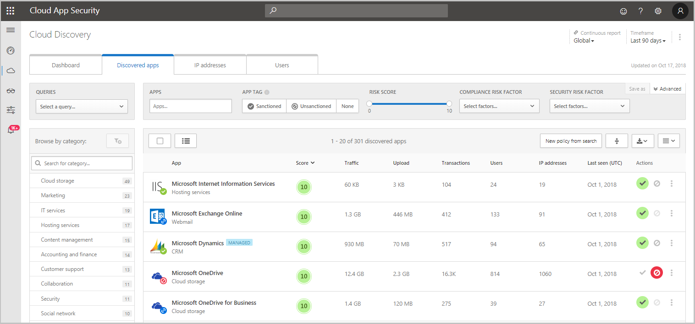
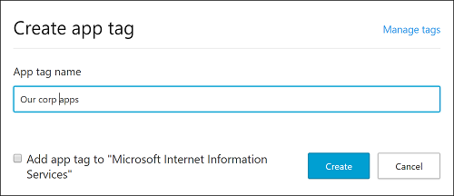
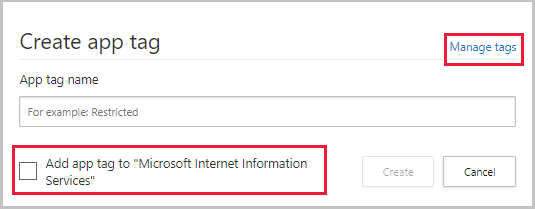
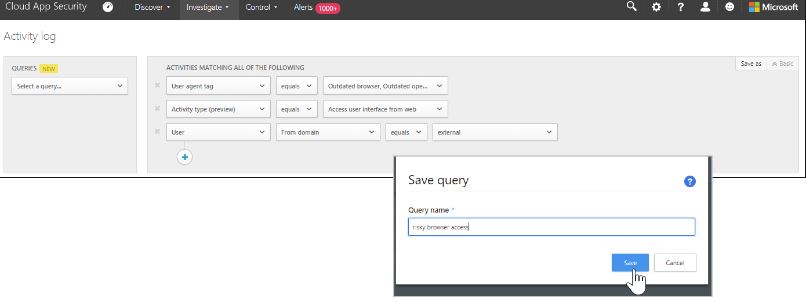
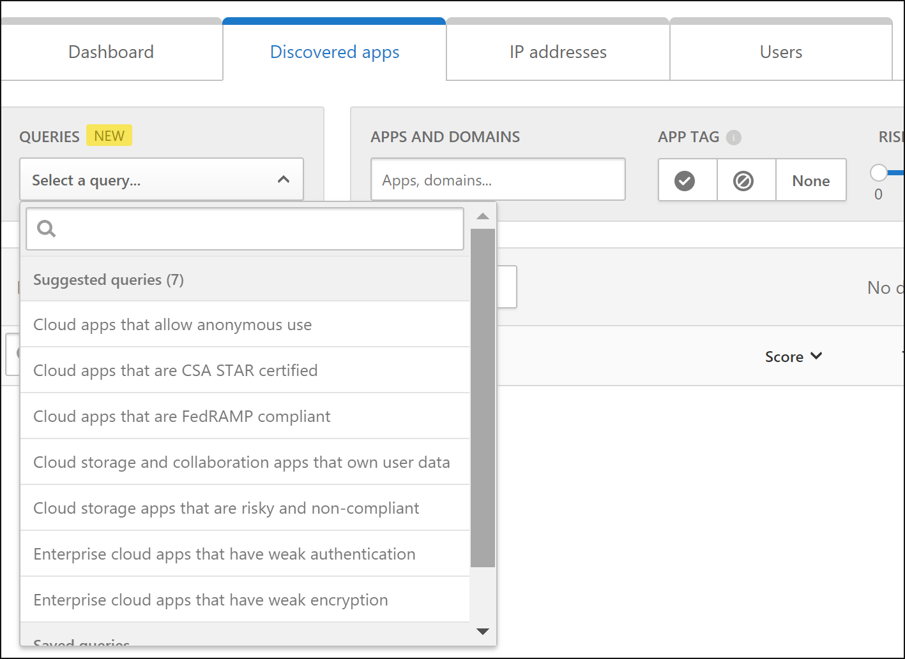
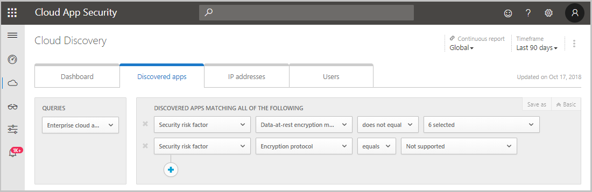

---
# required metadata

title: Cloud App Security discovered app filters and queries
description: This article provides a list of Cloud App Security discovered app filters and queries and explains how to work with them.
keywords:
author: shsagir
ms.author: shsagir
manager: shsagir
ms.date: 12/10/2018
ms.topic: conceptual
ms.collection: M365-security-compliance
ms.prod:
ms.service: cloud-app-security
ms.technology:

# optional metadata

#ROBOTS:
#audience:
#ms.devlang:
ms.reviewer: reutam
ms.suite: ems
#ms.tgt_pltfrm:
ms.custom: seodec18

---
# Discovered app filters and queries

*Applies to: Microsoft Cloud App Security*

When you have a large number of discovered apps, you'll find it useful to filter and query them. This article describes what filters are available and how to query your discovered apps.

## Discovered app filters

There are basic and advanced Discovered app filters. To achieve a complex filter (such as in the example above) use the advanced option, which includes all of the following filters:

- **App tag**: Select whether the app was sanctioned or unsanctioned or not tagged. Additionally, you can create a custom tag for your app and then use it to filter for specific types of apps.
- **Apps and domains**: Enables you to search for specific apps or apps used in specific domains.
- **Categories**: The categories filter, located on the left of the page, enables you to search for types of apps according to app categories. Example categories include social network apps, cloud storage apps, and hosting services. You can select multiple categories at a time, or a single category, then apply the basic and advanced filters on top.
- **Compliance risk factor**: Lets you search for a specific standards, certification, and compliance that the app may comply with (HIPAA, ISO 27001, SOC 2, PCI-DSS, and more.).
- **General risk factor**: Lets you search for general risk factors such as consumer popularity, data center locale, and more.
- **Risk score**: Lets you filter apps by risk score so that you can focus on, for example, reviewing only highly risky apps. You can also override the risk score set by Cloud App Security. For more information, see [Working with the risk score](risk-score.md).
- **Security risk factor**: Enables you to filter based on specific security measures (such as Encryption at rest, multi-factor authentication, etc.).
- **Usage**: Lets you filter based on the usage statistics of this app. Usage such as apps with less than or more than a specified number of **data uploads**, apps with more than or less than a specified number of **Users**.
- **Legal risk factor**: Lets you filter based on all the regulations and policies that are in-place to ensure data protection and privacy of the app's users. Examples include GDPR ready cloud apps, DMCA, and data retention policy.

### Creating and managing custom app tags

You can create a custom app tag.
These tags can then be used as filters for deeper diving into specific types of apps that you want to investigate. For example, custom watch list, assignment to a specific business unit, or custom approvals, such as “approved by legal”.

To create a custom app tag:

1. From the **Settings** cog, select **Cloud Discovery settings**, then the **App tags** tab. Click the plus icon. 

   

2. You can use the **App tags** table to view which apps are currently tagged with each app tag and you can delete unused app tags.

3. To apply an app tag, in the **Discovered apps** tab, click on the three dots at the far right of the app name. Select the app tag to apply.

> [!NOTE]
>You can also create a new app tag directly in the **Discovered apps** table by clicking **Create app tag** after selecting the three dots to the right of any selected app. When you create the tag from the discovered app, you can apply it to the app. You can also access the **App tags** screen by clicking the **Manage tags** link in the corner.
> 

## Discovered app queries

To make investigation even simpler, you can create custom queries and save them for later use.

1. In the **Discovered apps** page, use the filters as described above to drill down into your apps as necessary.

2. After you've achieved the wanted results, click the **Save as** button in the top right corner of the filters.

3. In the **Save query** popup, name your query.

    

4. To use this query again in the future, under **Queries**, scroll down to **Saved queries** and select your query.

    

Cloud App Security also provides you with **Suggested queries** and enables you to save custom queries you frequently use. Suggested queries provide you with recommended avenues of investigation that filter your discovered apps by using the following optional suggested queries:

- **Cloud apps that allow anonymous use** - filters all your discovered apps to display only apps that are security risks because they don't require user authentication and allow users to upload data.

- **Cloud apps that are CSA STAR certified** - filters all your discovered apps to display only apps that have CSA STAR certification either by self-assessment, certification, attestation, or continuous monitoring.

- **Cloud apps that are FedRAMP compliant** - filters all your discovered apps to display only apps whose FedRAMP compliance risk factor is high, medium, or low.

- **Cloud storage and collaboration apps that own user data** - filters all your discovered apps to display only apps that are risky because they don't allow you to have ownership over your data but they do retain your data.

- **Cloud storage apps that are risky and non-compliant** - filters all your discovered apps to display only apps in which they aren't SOC 2 or HIPAA compliant, they don't support PCI DSS version and they have a risk score of 5 or lower.

- **Enterprise cloud apps that have weak authentication** - filters all your discovered apps to display only apps that don't support SAML, have no password policy, and don't enable MFA.

- **Enterprise cloud apps that have weak encryption** - filters all your discovered apps to display only apps that are risky because they don't encrypt data-at-rest and don't support any encryption protocol.

- **GDPR ready cloud apps** - Filters all your discovered apps to display only apps that are GDPR ready. Because GDPR compliance is a top priority, this query helps you easily identify apps that are GDPR ready and mitigate threat by assessing the risk of those that aren’t.

Additionally, you can use the suggested queries as a starting point for a new query. First, select one of the suggested queries. Then, make changes as needed and finally click **Save as** to create a new **Saved query**.

## Next steps

> [!div class="nextstepaction"]
> [Create snapshot Cloud Discovery reports](create-snapshot-cloud-discovery-reports.md)

> [!div class="nextstepaction"]
> [Configure automatic log upload for continuous reports](configure-automatic-log-upload-for-continuous-reports.md)

> [!div class="nextstepaction"]
> [Working with Cloud Discovery data](working-with-cloud-discovery-data.md)
