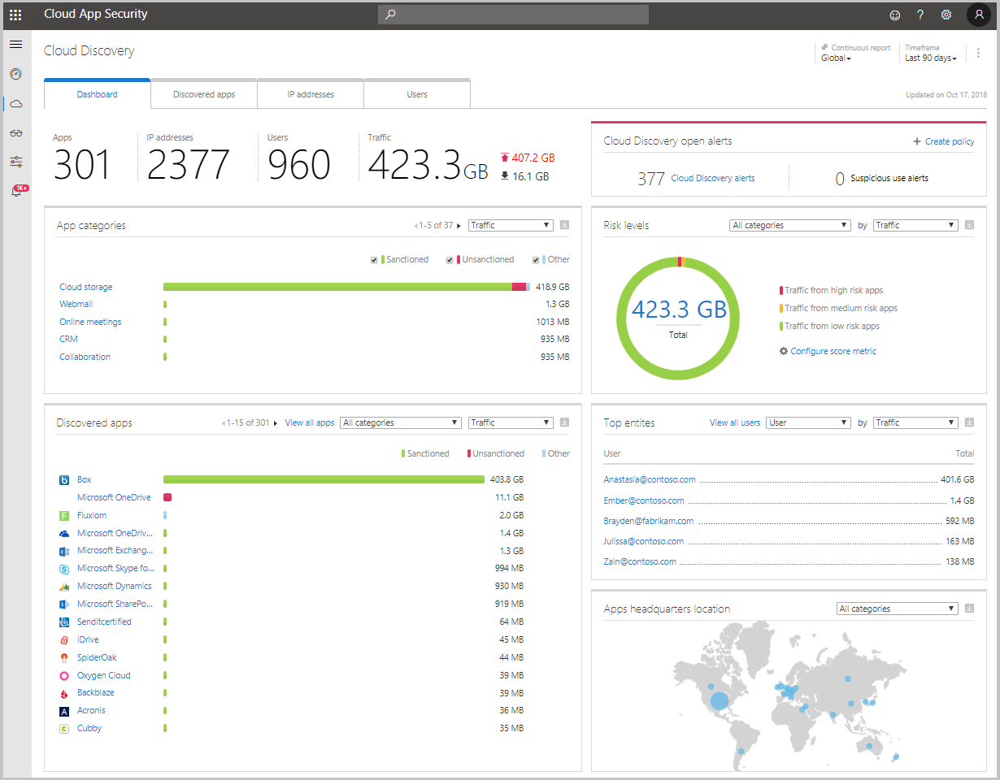
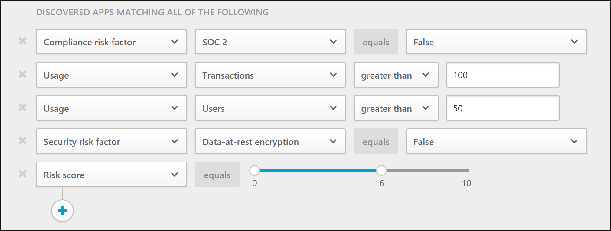
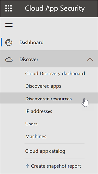
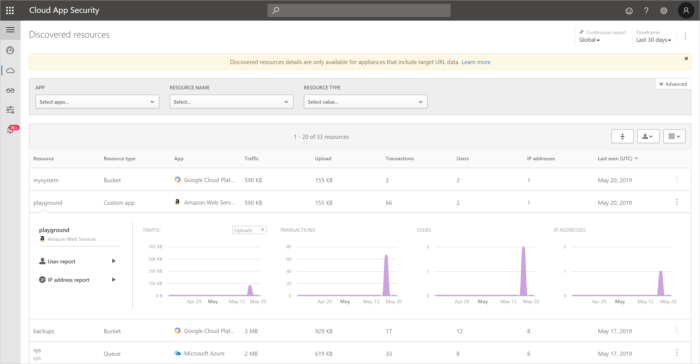
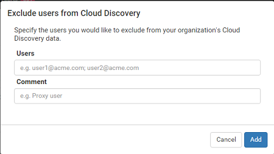
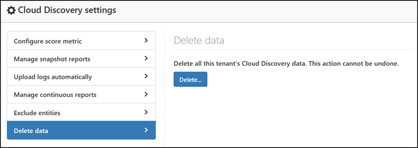

# Working with discovered apps

[!INCLUDE [Banner for top of topics](includes/banner.md)]

The Cloud Discovery dashboard is designed to give you more insight into how cloud apps are being used in your organization. It provides an at-a-glance overview of what kinds of apps are being used, your open alerts, and the risk levels of apps in your organization. It also shows you who your top app users are and provides an App Headquarter location map. The Cloud Discovery Dashboard has many options for filtering the data. Filtering allows you to generate specific views depending on what you're most interested in using easy-to-understand graphics to give you the full picture at a glance. For more information, see [Discovered app filters](discovered-app-queries.md#discovered-app-filters).

## Review the Cloud Discovery Dashboard

The first thing you should do to get a general picture of your Cloud Discovery apps is review the following information in the Cloud Discovery Dashboard:

1. First, look at the overall cloud app use in your organization in the **High-level usage overview**.

1. Then, dive one level deeper to see which are the **top categories** used in your org for each of the different use parameters. You can see how much of this usage is by Sanctioned apps.

1. Go even deeper and see all the apps in a specific category in the **Discovered apps** tab.

1. You can see the **top users and source IP addresses** to identify which users are the most dominant users of cloud apps in your organization.
1. Check how the discovered apps spread according to geographic location (according to their HQ) in the **App Headquarters map**.

1. Finally, don't forget to review the risk score of the discovered app in the **App risk overview**. Check the **discovery alerts status** to see how many open alerts should you investigate.

## Deep dive into Discovered apps

If you want to deep dive into the data Cloud Discovery provides, use the filters to review which apps are risky and which are commonly used.

For example, if you want to identify commonly used risky cloud storage and collaboration apps, you can use the Discovered apps page to filter for the apps you want. Then you can [unsanction or block](governance-discovery.md) them as follows:

1. In the **Discovered apps** page, under **Browse by category** select both **Cloud storage** and **Collaboration**.

1. Then, use the Advanced filters and set **Compliance risk factor** to **SOC 2** equals **No**.

1. For **Usage**, set **Users** to greater than 50 users and **Transactions** to greater than 100.

1. Set the **Security risk factor** for **Data at rest encryption** equals **Not supported**. Then set **Risk score** equals 6 or lower.

    

After the results are filtered, you can [unsanction and block](governance-discovery.md) them by using the bulk action checkbox to unsanction them all in one action. After they're unsanctioned, you can use a blocking script to block them from being used in your environment.

Cloud Discovery enables you to dive even deeper into your organization's cloud usage. You can identify specific instances that are in use by investigating the discovered subdomains.

For example, you can differentiate between different SharePoint sites:

:::image type="content" source="media/discovered-apps/subdomains-image.png" alt-text="Subdomain filter.":::

> [!NOTE]
> Deep dives into discovered apps are supported only only in firewalls and proxies that contain target URL data. For more information, see [Supported firewalls and proxies](set-up-cloud-discovery.md#supported-firewalls-and-proxies).
>
> If Defender for Cloud Apps can't match the subdomain detected in the traffic logs with the data stored in the App Catalogue, the subdomain is tagged as **Other**.

## Discover resources and custom apps

Cloud Discovery also enables you to deep dive into your IaaS and PaaS resources. You can discover activity across your resource-hosting platforms, viewing access to data across your self-hosted apps and resources including storage accounts, infrastructure and custom apps hosted on Azure, Google Cloud Platform, and AWS. Not only can you see overall usage in your IaaS solutions, but you can get visibility into the specific resources that are hosted on each, and the overall usage of the resources, to help mitigate risk per resource.

For example, from Defender for Cloud Apps you can monitor activity such as if a lot of data is uploaded, you can discover what resource it's uploaded to and drill down to see who performed the activity.

> [!NOTE]
> This is supported only in firewalls and proxies that contain target URL data. For more information, see the list of supported appliances in [Supported firewalls and proxies](set-up-cloud-discovery.md#supported-firewalls-and-proxies).

To view discovered resources:

1. In the Microsoft 365 Defender portal, under **Cloud Apps**, select **Cloud discovery**. Then choose the  **Discovered resources** tab.

    

1. In the Discovered resource page, you can drill down into each resource to see what kinds of transactions occurred, who accessed it, and then drill down to investigate the users even further.

   

1. For custom apps, you can select the three buttons at the end of the row and choose **Add new custom app**. This will open the **Add this app** window that lets you name and identify the app so it can be included in the Cloud Discovery dashboard.

## Generate Cloud Discovery executive report

The best way to get an overview of Shadow IT use across your organization is by generating a Cloud Discovery executive report. This report identifies the top potential risks and helps you plan a workflow to mitigate and manage risks until they're resolved.

To generate a Cloud Discovery executive report:

1. From the **Cloud Discovery dashboard**, select **Actions** in the upper-right corner of the dashboard, and then choose **Generate Cloud Discovery executive report**.

1. Optionally, change the report name.
1. Select **Generate**.

## Exclude entities

If you have system users, IP addresses, or devices that are noisy but uninteresting, or entities that shouldn't be presented in the Shadow IT reports, you may want to exclude their data from the Cloud Discovery data that's analyzed. For example, you might want to exclude all information originating from a local host.

To create an exclusion:

1. In the Microsoft 365 Defender portal, select **Settings**. Then choose **Cloud Apps**.

1. Under **Cloud Discovery**, select the **Exclude entities** tab.

1. Choose either the **Excluded users**, **Excluded groups**, **Excluded IP addresses**, or **Excluded devices** tab and select the **+Add** button to add your exclusion.

1. Add a user alias, IP address, or device name. We recommend adding information about why the exclusion was made.

    

>[!NOTE]
>Any entity exclusion applies to newly received data. Historical data of the excluded entities will remain through the retention period (90 days).

## Manage continuous reports

Custom continuous reports provide you more granularity when monitoring your organization's Cloud Discovery log data. By creating custom reports, it's possible to filter on specific geographic locations, networks, and sites, or organizational units. By default, only the following reports appear in your Cloud Discovery report selector:

- The **Global report** consolidates all the information in the portal from all the data sources you included in your logs.  The global report doesn't include data from Microsoft Defender for Endpoint.

- The **Data source specific report** displays only information from a specific data source.

To create a new continuous report:

1. In the Microsoft 365 Defender portal, select **Settings**. Then choose **Cloud Apps**.

1. Under **Cloud Discovery**, select **Continuous report**.

1. Select the **Create report** button.

1. Enter a report name.

1. Select the data sources you want to include (all or specific).

1. Set the filters you want on the data. These filters can be **User groups**, **IP address tags**, or **IP address ranges**. For more information on working with IP address tags and IP address ranges, see [Organize the data according to your needs](ip-tags.md).

    

> [!NOTE]
> All custom reports are limited to a maximum of 1 GB of uncompressed data. If there is more than 1 GB of data, the first 1 GB of data will be exported into the report.

## Deleting Cloud Discovery data

There are a number of reasons why you may want to delete your Cloud Discovery data. We recommend deleting it in the following cases:

- If you manually uploaded log files and a long time passed before you updated the system with new log files and you don't want old data affecting your results.

- When you set a new custom data view, it will apply only to new data from that point forward. So, you may want to erase old data and then upload your log files again to enable the custom data view to pick up events in the log file data.

- If many users or IP addresses recently started working again after being offline for some time, their activity will be identified as anomalous and may give you false positive violations.

To delete Cloud Discovery data:

1. In the Microsoft 365 Defender portal, select **Settings**. Then choose **Cloud Apps**.

1. Under **Cloud Discovery**, select the **Delete data** tab.

    It's important to be sure you want to delete data before continuing - it can't be undone and it deletes **all** Cloud Discovery data in the system.

1. Select the **Delete** button.

    

    > [!NOTE]
    > The deletion process takes a few minutes and is not immediate.

## Next steps

> [!div class="nextstepaction"]
> [Create snapshot Cloud Discovery reports](create-snapshot-cloud-discovery-reports.md)

> [!div class="nextstepaction"]
> [Configure automatic log upload for continuous reports](discovery-docker.md)

> [!div class="nextstepaction"]
> [Working with Cloud Discovery data](working-with-cloud-discovery-data.md)

> [!div class="nextstepaction"]
> [Discover apps using Microsoft Defender for Endpoint's integration](mde-integration.md)
