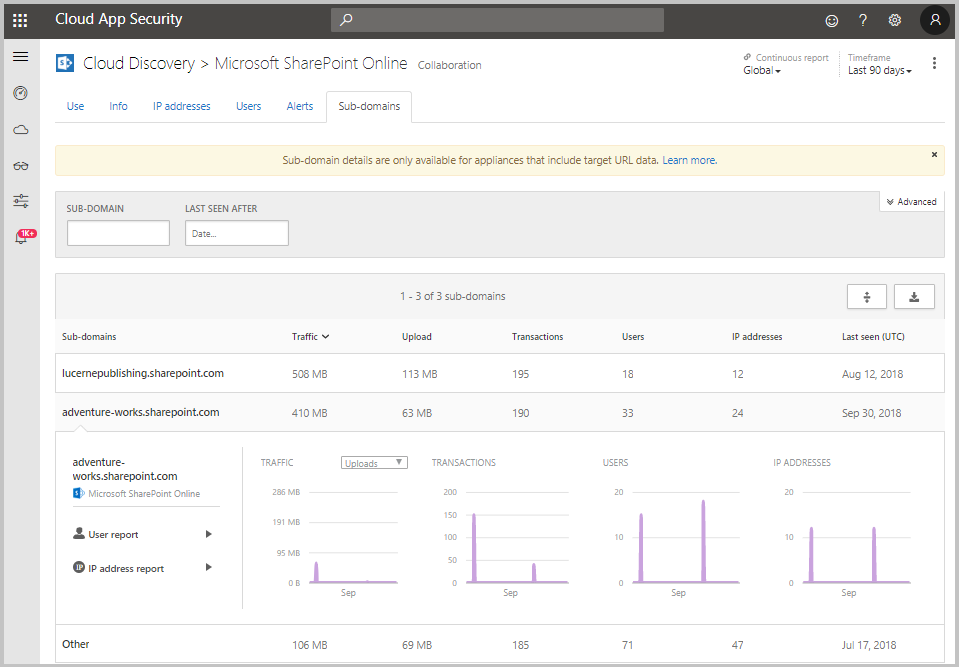

---
# required metadata

title: Working with discovered apps in Cloud App Security | Microsoft Docs
description: This topic describes the process for identifying and remediating risky cloud discovery apps in Cloud App Security.
keywords:
author: rkarlin
ms.author: rkarlin
manager: mbaldwin
ms.date: 9/26/2017
ms.topic: get-started-article
ms.prod:
ms.service: cloud-app-security
ms.technology:
ms.assetid: 645fd8c7-06d0-4f93-a85c-2976e7b3766d

# optional metadata

#ROBOTS:
#audience:
#ms.devlang:
ms.reviewer: reutam
ms.suite: ems
#ms.tgt_pltfrm:
#ms.custom:

---

# Working with discovered apps

## Review the Cloud Discovery Dashboard

The Cloud Discovery dashboard is designed to give you more insight into how cloud apps are being used in your organization. It provides an at-a-glance overview of what kinds of apps are being used, your open alerts, the risk levels of apps in your organization. It also shows you who your top app users are and provides an App Headquarter location map. The Cloud Discovery Dashboard has many options for filtering the data, to allow you to generate specific views, depending on what you're most interested in, and easy-to-understand graphics to give you the full picture at a glance.

The first thing you should do to get a general picture of your Cloud Discovery apps is to look at the Cloud Discovery Dashboard and review the following:
 
1. First look at the overall cloud app use in your organization in the **High level usage overview**.

2. Then, dive one level deeper to see which are the **top categories** being used in your org for each of the different use parameters and how much of this usage is by Sanction apps.

3. Go even deeper and see all the apps in a specific category in the **Discovered apps** widget.

4. You can see the **top users and source IP addresses** to identify which users are the most dominant users of cloud apps in your organization.
5. Check how the discovered apps spread according to geographic location (according to their HQ) in the **App Headquarters map**.

6. Finally, don’t forget to review the risk score of the discovered app in the **App risk overview** and check the **discovery alerts status** to see how many open alerts should you investigate.

## Deep dive into Discovered apps
If you want to deep dive into the data provided by Cloud Discovery use the filters to review which apps are risky and which are commonly used.

For example, if you want to identify commonly used risky cloud storage and collaboration apps, you can use the Discovered apps page to filter for the apps you want. Afterward you can [unsanction or block](governance-discovery.md) them, as follows:

In the **Discovered apps** page, under **Browse by category** select both **Cloud storage** and **Collaboration**. Then, use the Advanced filters and set **Compliance risk factor** to **SOC 2** equals **False**; **Usage** > **Users** to greater than 50 users; and **Usage** > **Transactions** to greater than 100; **Security risk factor** > **Data at rest encryption** equals **False** and then set **Risk score** equals less than 6.

After the results are filtered, you can [unsanction and block](governance-discovery.md) them by using the bulk action checkbox to unsanction them all in one action. After they are unsanctioned you can use a blocking script to block them from being used in your environment.

Cloud discovery enables you to dive even deeper into your organization’s cloud usage, and identify specific instances that are in use by investigating the discovered sub domains.

For example, you can differentiate between different SharePoint sites.

This is supported only in firewalls and proxies that contain target URL data. See the list of supported appliances in [Supported firewalls and proxies](set-up-cloud-discovery.md#supported-firewalls-and-proxies).

  

## Discovered app filters

There are basic and advanced Discovered app filters. To achieve a complex filter (such as in the example above) use the advanced option which includes all of the following:

  

- **App tag**: Select whether the app was sanctioned or unsanctioned or not tagged. In addition, you can create a custom tag for your app and then use it to filter for specific types of apps. 
- **Apps and domains**: Enables you to search for specific apps or apps used in specific domains. 
- **Categories**: The categories filter, which is located on the left of the page, enables you to search for types of apps according to app categories, for example Social network apps, Cloud storage apps, etc. You can select multiple categories at a time, or a single category, and then apply the basic and advanced filters on top of these.
- **Compliance risk factor**: Lets you search for a specific standards, certification and compliances that the app may comply with (HIPAA, ISO 27001, SOC 2, PCI-DSS, etc.).
- **General risk factor**: Lets you search for general risk factors such as Consumer popularity, Data center locale, etc.
- **Risk score**: Lets you filter apps by risk score so that you can focus on, for example, reviewing only very risky apps. You can also override the risk score set by Cloud App Security. For more information see [Working with the risk score](risk-score.md).
- **Security risk factor**: Enables you to filter based on specific security measures (such as Encryption at rest, multi-factor authentication, etc.).
- **Usage**: Lets you filter based on the usage statistics of this app, such as apps with less than or more than a specified amount of **data uploads**, apps with more than or less than a specified number of **Users**.

## Creating and managing custom app tags

You can create a custom app tag. 
These tags can then be used as filters for deeper diving into specific types of apps that you want to investigate. For example, custom watch list, assignment to a specific business unit, or custom approvals, such as “approved by legal”.

To create a custom app tag:

1. From the **Settings** cog, select **Cloud Discovery** and in the **Manage app tags** tab, click the icon . 

2. You can use the **Manage app tags** table to view which apps are currently tagged with each app tag and you can delete unused app tags.

3. To apply an app tag, in the **Discovered apps** tab, click on the three dots at the far right of the table and select the app tag to apply. 

> [!NOTE]
>You can also create a new app tag directly in the **Discovered apps** table by clicking **Create app tag** after selecting the three dots to the right of any selected app. You can also access the **Manage app tags** screen by clicking the link in the corner fo the **Create app tag** popup.

## Exclude entities  
If you have system users or IP addresses that are particularly noisy and uninteresting or apps that are not relevant, you may want to exclude their data from the Cloud Discovery data that is analyzed. For example, you might want to exclude all information originating from 127.0.0.1 or local host.  
  
To create an exclusion:  
  
1.  In the portal, under the settings icon, select **Cloud Discovery settings**.  
  
2.  Click the **Exclude entities** tab.  
  
3.  Choose either the **Excluded users** or **Excluded IP addresses** tab and click the button to **Add user** or **Add IP address**.  
  
4.  Add a user alias or IP address. We recommend adding information about why the user or IP address was excluded.  
  
       
  
## Manage continuous reports  
Custom continuous reports provide you more granularity when monitoring your organization's Cloud Discovery log data. By creating custom reports, it is possible to filter on specific geographic locations, networks and sites, or organizational units. By default, only the following reports appear in your Cloud Discovery report selector:  
  
-  The **Global report** consolidates all the information in the portal from all the data sources you included in your logs.  
  
- The **Data source specific report** displays only information from a specific data source.  
  
To create a new continuous report:  
  
1.  In the portal, under the settings icon, select **Cloud Discovery settings**.  
  
2.  Click the **Manage continuous report** tab.  
  
3.  Click the **Create report** button.  
  
4.  Enter a report name.  
  
5.  Select the data sources you want to include (all or specific).  
  
6.  Set the filters you want on the data, these can be **Organizational Units**, **IP address tags** or **IP address ranges**. For more information on working with IP address tags and IP address ranges, see [Organize the data according to your needs](ip-tags.md).  
  
     

> [!NOTE]
> All custom reports are limited to a maximum of 1 GB of uncompressed data. If there is more than 1 GB of data, the first 1 GB of data will be exported into the report.

## Deleting Cloud Discovery data  
There are a number of reasons why you may want to delete your Cloud Discovery data. We recommend deleting it in the following cases:  
  
-   If you manually uploaded log files and a long time passed before you updated the system with new log files and you don't want old data affecting your results.  
  
-   When you set a new custom data view, it will apply only to new data from that point forward, so you may want to erase old data, and then upload your log files again to enable the custom data view to pick up events in the log file data.  
  
-   If many users or IP addresses recently started working again after being offline for some time, their activity will be identified as anomalous and you may get many false positive violations.  
  
To delete Cloud Discovery data:  
  
1.  In the portal, under the settings icon, select **Cloud Discovery settings**.  
  
2.  Click the **Delete data** tab.  
  
     It is important to be sure you want to delete data before continuing - it cannot be undone and it deletes **all** Cloud Discovery data in the system.  
  
3.  Click the **Delete** button.  
  
       
  
   > [!NOTE]  
   >  The deletion process takes a few minutes and is not immediate.  

## See also
 
[Create snapshot Cloud Discovery reports](create-snapshot-cloud-discovery-reports.md)

[Configure automatic log upload for continuous reports](configure-automatic-log-upload-for-continuous-reports.md)

[Working with Cloud Discovery data](working-with-cloud-discovery-data.md)

