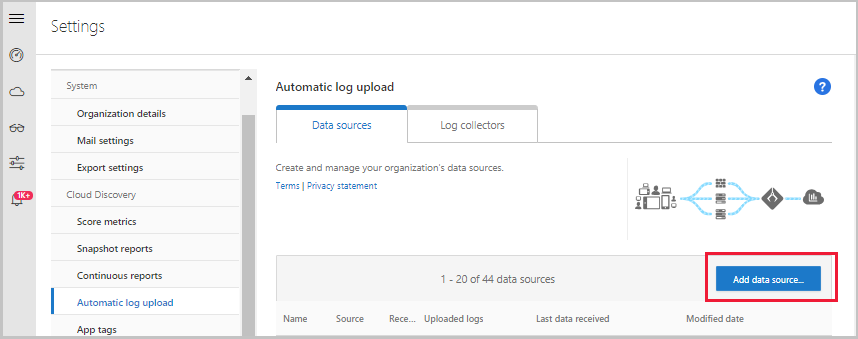
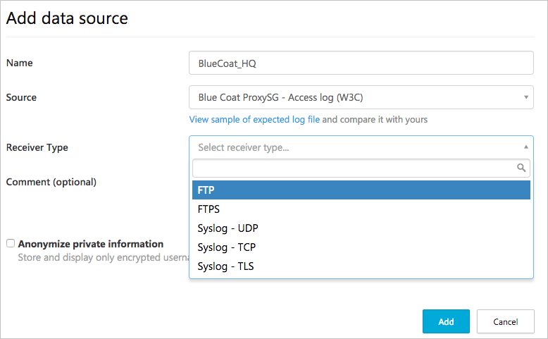
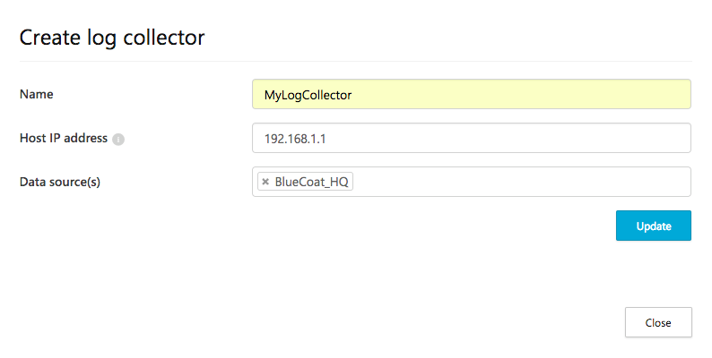
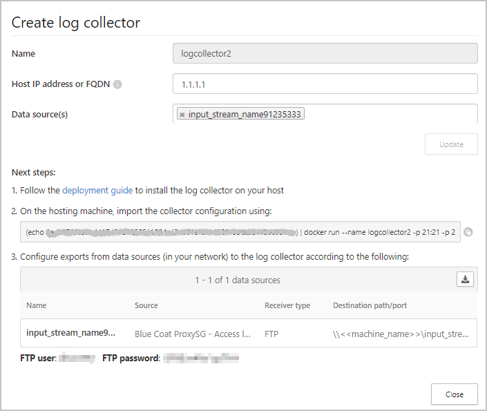
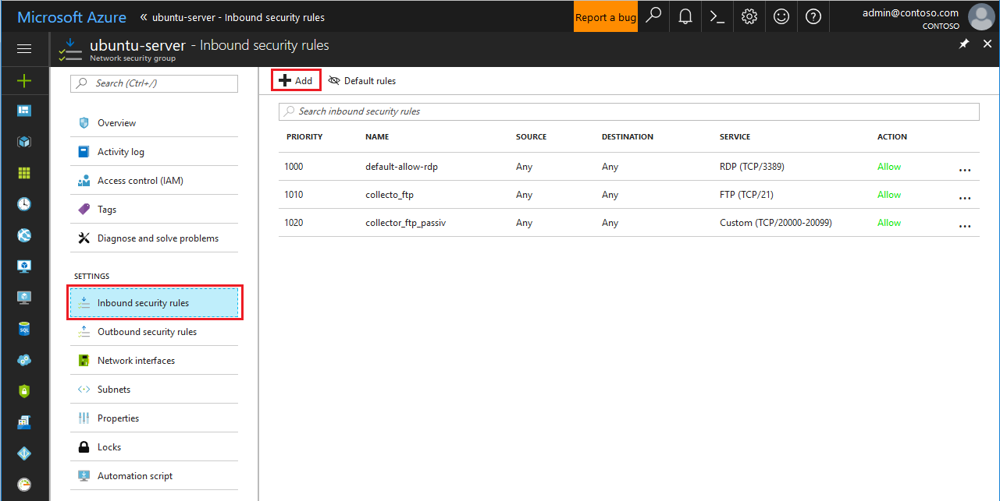
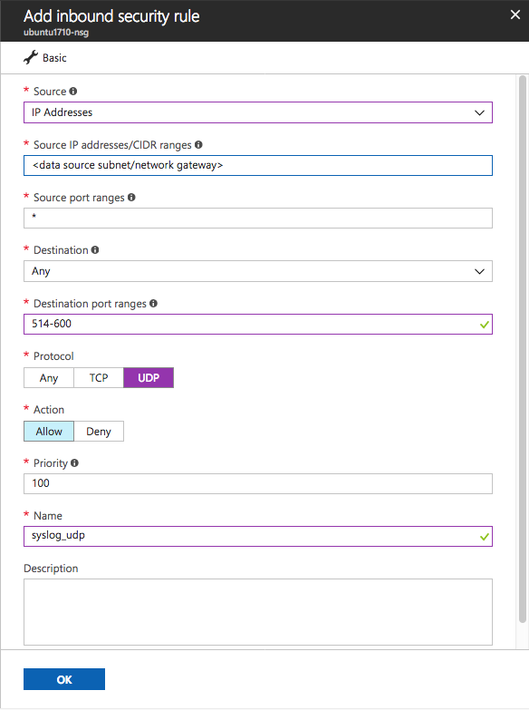
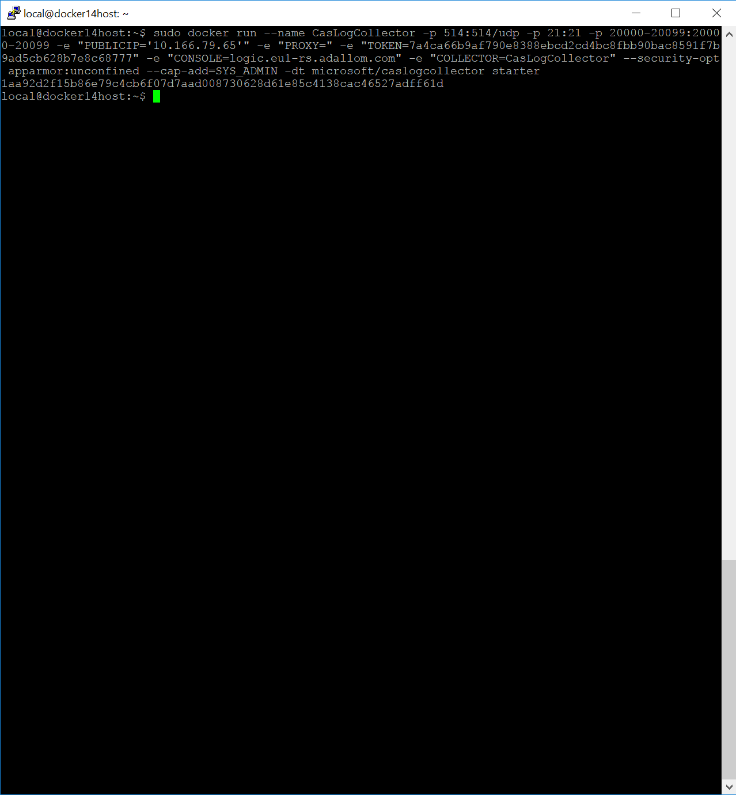
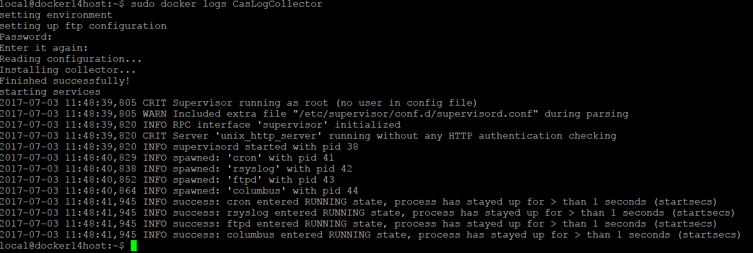
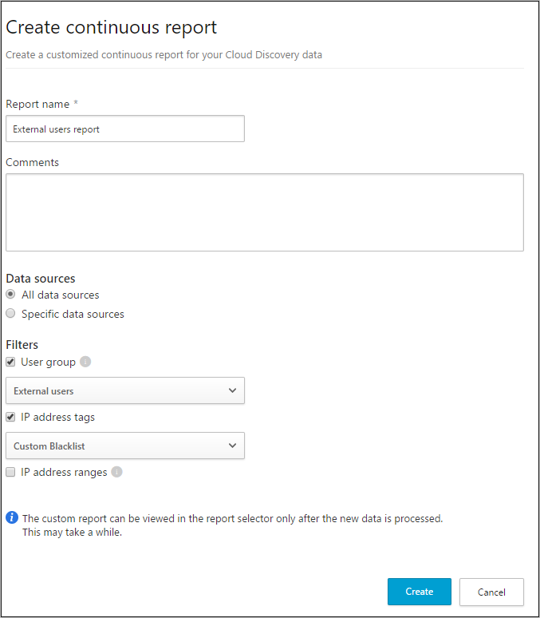

# Configure automatic log upload using Docker in Azure

[!INCLUDE [Banner for top of topics](includes/banner.md)]

You can configure automatic log upload for continuous reports in Defender for Cloud Apps using a Docker on Ubuntu, Red Hat Enterprise Linux (RHEL), or CentOS in Azure.

## Prerequisites

* OS:
  * Ubuntu 14.04, 16.04, 18.04, and 20.04
  * RHEL 7.2 or higher
  * CentOS 7.2 or higher

* Disk space: 250 GB

* CPU cores: 2

* CPU Architecture: Intel® 64 and AMD 64

* RAM: 4 GB

* Set your firewall as described in [Network requirements](network-requirements.md#log-collector)

> [!NOTE]
> If you have an existing log collector and want to remove it before deploying it again, or if you simply want to remove it, run the following commands:
>
> ```console
> docker stop <collector_name>
> docker rm <collector_name>
> ```

## Log collector performance

The Log collector can successfully handle log capacity of up to 50 GB per hour comprised of up to 10 data sources. The main bottlenecks in the log collection process are:

* Network bandwidth - Your network bandwidth determines the log upload speed.

* I/O performance of the virtual machine - Determines the speed at which logs are written to the log collector's disk. The log collector has a built-in safety mechanism that monitors the rate at which logs arrive and compares it to the upload rate. In cases of congestion, the log collector starts to drop log files. If your setup typically exceeds 50 GB per hour, we recommend that you split the traffic between multiple log collectors.

> [!NOTE]
> If you require more than 10 data sources, we recommend that you split the data sources between multiple log collectors.

## Set up and configuration  

### Step 1 – Web portal configuration: Define data sources and link them to a log collector

1. In the Microsoft 365 Defender portal, select **Settings**. Then choose **Cloud Apps**.
1. Under **Cloud Discovery**, select **Automatic log upload**.  Then select the **Data sources** tab.

1. For each firewall or proxy from which you want to upload logs, create a matching data source.

    1. Click **Add data source**.  
    
    1. **Name** your proxy or firewall.  
      
    1. Select the appliance from the **Source** list. If you select **Custom log format** to work with a network appliance that isn't listed, see [Working with the custom log parser](custom-log-parser.md) for configuration instructions.
    1. Compare your log with the sample of the expected log format. If your log file format doesn't match this sample, you should add your data source as **Other**.
    1. Set the **Receiver type** to either **FTP**, **FTPS**, **Syslog – UDP**, or **Syslog – TCP**, or **Syslog – TLS**.

    >[!NOTE]
    >Integrating with secure transfer protocols (FTPS and Syslog – TLS) often requires additional settings or your firewall/proxy.

    f. Repeat this process for each firewall and proxy whose logs can be used to detect traffic on your network. It's recommended to set up a dedicated data source per network device to enable you to:

    * Monitor the status of each device separately, for investigation purposes.
    * Explore Shadow IT Discovery per device, if each device is used by a different user segment.

1. Go to the **Log collectors** tab at the top.

    1. Click **Add log collector**.
    1. Give the log collector a **name**.
    1. Enter the **Host IP address** (private IP address) of the machine you'll use to deploy the Docker. The host IP address can be replaced with the machine name, if there is a DNS server (or equivalent) that will resolve the host name.
    1. Select all **Data sources** that you want to connect to the collector, and click **Update** to save the configuration.  
    

1. Further deployment information will appear. **Copy** the run command from the dialog. You can use the copy to clipboard icon. 

1. **Export** the expected data source configuration. This configuration describes how you should set the log export in your appliances.

    

    > [!NOTE]
    >
    > * A single Log collector can handle multiple data sources.
    > * Copy the contents of the screen because you will need the information when you configure the Log Collector to communicate with Defender for Cloud Apps. If you selected Syslog, this information will include information about which port the Syslog listener is listening on.
    > * For users sending log data via FTP for the first time, we recommend changing the password for the FTP user. For more information, see [Changing the FTP password](log-collector-advanced-management.md#change-the-ftp-password).

### Step 2 – Deployment of your machine in Azure

> [!NOTE]
> The following steps describe the deployment in Ubuntu. The deployment steps for other platforms are slightly different.

1. Create a new Ubuntu machine in your Azure environment.
1. After the machine is up, open the ports by:

    1. In the machine view, go to **Networking** select the relevant interface by double-clicking on it.
    1. Go to **Network security group** and select the relevant network security group.
    1. Go to **Inbound security rules** and click **Add**,
    
    1. Add the following rules (in **Advanced** mode):

    |Name|Destination port ranges|Protocol|Source|Destination|
    |----|----|----|----|----|
    |caslogcollector_ftp|21|TCP|`Your appliance's IP address's subnet`|Any|
    |caslogcollector_ftp_passive|20000-20099|TCP|`Your appliance's IP address's subnet`|Any|
    |caslogcollector_syslogs_tcp|601-700|TCP|`Your appliance's IP address's subnet`|Any|
    |caslogcollector_syslogs_udp|514-600|UDP|`Your appliance's IP address's subnet`|Any|

    

1. Go back to the machine and click **Connect** to open a terminal on the machine.

1. Change to root privileges using `sudo -i`.

1. If you accept the [software license terms](https://go.microsoft.com/fwlink/?linkid=862492), uninstall old versions and install Docker CE by running the commands appropriate for your environment:

#### [CentOS](#tab/centos)

1. Remove old versions of Docker: `yum erase docker docker-engine docker.io`
1. Install Docker engine prerequisites: `yum install -y yum-utils`
1. Add Docker repository:

    ```bash
    yum-config-manager --add-repo https://download.docker.com/linux/centos/docker-ce.repo
    yum makecache
    ```

1. Install Docker engine: `yum -y install docker-ce`
1. Start Docker

    ```bash
    systemctl start docker
    systemctl enable docker
    ```

1. Test Docker installation: `docker run hello-world`

#### [Red Hat 7](#tab/red-hat)

1. Remove old versions of Docker: `yum erase docker docker-engine docker.io`
1. Install Docker engine prerequisites:

    ```bash
    yum install -y yum-utils
    yum install -y https://download.docker.com/linux/centos/7/x86_64/stable/Packages/containerd.io-1.3.7-3.1.el7.x86_64.rpm
    ```

1. Add Docker repository:

    ```bash
    sudo yum-config-manager --add-repo https://download.docker.com/linux/centos/docker-ce.repo
    sudo yum-config-manager --setopt="docker-ce-stable.baseurl=https://download.docker.com/linux/centos/7/x86_64/stable" --save
    ```

1. Install dependencies:

    ```bash
    wget http://mirror.centos.org/centos/7/extras/x86_64/Packages/slirp4netns-0.4.3-4.el7_8.x86_64.rpm
    sudo yum localinstall slirp4netns-0.4.3-4.el7_8.x86_64.rpm
    wget https://download-ib01.fedoraproject.org/pub/epel/7/x86_64/Packages/f/fuse3-libs-3.6.1-2.el7.x86_64.rpm
    sudo yum localinstall fuse3-libs-3.6.1-2.el7.x86_64.rpm
    wget http://mirror.centos.org/centos/7/extras/x86_64/Packages/fuse-overlayfs-0.7.2-6.el7_8.x86_64.rpm
    sudo yum localinstall fuse-overlayfs-0.7.2-6.el7_8.x86_64.rpm
    wget http://mirror.centos.org/centos/7/extras/x86_64/Packages/container-selinux-2.119.2-1.911c772.el7_8.noarch.rpm
    sudo yum localinstall container-selinux-2.119.2-1.911c772.el7_8.noarch.rpm
    ```

1. Install Docker engine: `sudo yum install docker-ce`
1. Start Docker

    ```bash
    systemctl start docker
    systemctl enable docker
    ```

1. Test Docker installation: `docker run hello-world`

#### [Red Hat 8](#tab/red-hat-8)

1. Remove the container-tools module: `yum module remove container-tools`
1. Add the Docker CE repository: `yum-config-manager --add-repo https://download.docker.com/linux/centos/docker-ce.repo`
1. Modify the yum repo file to use CentOS 8/RHEL 8 packages: `sed -i s/7/8/g /etc/yum.repos.d/docker-ce.repo`
1. Install Docker CE: `yum install docker-ce`

1. Start Docker

    ```bash
    systemctl start docker
    systemctl enable docker
    ```

1. Test Docker installation: `docker run hello-world`

#### [Ubuntu](#tab/ubuntu)

1. Remove old versions of Docker: `apt-get remove docker docker-engine docker.io`
1. If you are installing on Ubuntu 14.04, install the linux-image-extra package.

    ```bash
    apt-get update -y
    apt-get install -y linux-image-extra-$(uname -r) linux-image-extra-virtual
    ```

1. Install Docker engine prerequisites:

    ```bash
    apt-get update -y
    (apt-get install -y apt-transport-https ca-certificates curl software-properties-common && curl -fsSL https://download.docker.com/linux/ubuntu/gpg | apt-key add - )
    ```

1. Verify that the apt-key fingerprint UID is docker@docker.com: `apt-key fingerprint | grep uid`
1. Install Docker engine:

    ```bash
    add-apt-repository "deb [arch=amd64] https://download.docker.com/linux/ubuntu $(lsb_release -cs) stable"
    apt-get update -y
    apt-get install -y docker-ce
    ```

1. Test Docker installation: `docker run hello-world`

---

1. In the Microsoft 365 Defender portal,  in the **Create log collector** window, copy the command to import the collector configuration on the hosting machine:

    

1. Run the command to deploy the log collector.

    ```bash
    (echo db3a7c73eb7e91a0db53566c50bab7ed3a755607d90bb348c875825a7d1b2fce) | docker run --name MyLogCollector -p 21:21 -p 20000-20099:20000-20099 -e "PUBLICIP='192.168.1.1'" -e "PROXY=192.168.10.1:8080" -e "CONSOLE=mod244533.us.portal.cloudappsecurity.com" -e "COLLECTOR=MyLogCollector" --security-opt apparmor:unconfined --cap-add=SYS_ADMIN --restart unless-stopped -a stdin -i mcr.microsoft.com/mcas/logcollector starter
    ```

    

1. To verify that the log collector is running properly, run the following command: `Docker logs <collector_name>`. You should get the results: **Finished successfully!**

    

### Step 3 - On-premises configuration of your network appliances

Configure your network firewalls and proxies to periodically export logs to the dedicated Syslog port of the FTP directory according to the directions in the dialog. For example:

```bash
BlueCoat_HQ - Destination path: \<<machine_name>>\BlueCoat_HQ\
```

### Step 4 - Verify the successful deployment in the Defender for Cloud Apps portal

Check the collector status in the **Log collector** table and make sure the status is **Connected**. If it's **Created**, it's possible the log collector connection and parsing haven't completed.

:::image type="content" source="media/collector-status-connected.png" alt-text="Verify that the collector status is Connected." lightbox="media/collector-status-connected.png":::

You can also go to the **Governance log** and verify that logs are being periodically uploaded to the portal.

Alternatively, you can check the log collector status from within the docker container using the following commands:

1. Log in to the container by using this command: `docker exec -it <Container Name> bash`
1. Verify the log collector status using this command: `collector_status -p`

If you have problems during deployment, see [Troubleshooting Cloud Discovery](troubleshooting-cloud-discovery.md).

### Optional - Create custom continuous reports

Verify that the logs are being uploaded to Defender for Cloud Apps and that reports are generated. After verification, create custom reports. You can create custom discovery reports based on Azure Active Directory user groups. For example, if you want to see the cloud use of your marketing department, import the marketing group using the import user group feature. Then create a custom report for this group. You can also customize a report based on IP address tag or IP address ranges.

1. In the Microsoft 365 Defender portal, select **Settings**. Then choose **Cloud Apps**.
1. Under **Cloud Discovery**, select **Continuous reports**.
1. Click the **Create report** button and fill in the fields.
1. Under the **Filters** you can filter the data by data source, by [imported user group](user-groups.md), or by [IP address tags and ranges](ip-tags.md).

    >[!NOTE]
    >When applying filters on continuous reports, the selection will be included, not excluded. For example, if you apply a filter on a certain user group, only that user group will be included in the report.

     

## Next steps

> [!div class="nextstepaction"]
> [Modify the log collector FTP configuration](log-collector-advanced-management.md)

[!INCLUDE [Open support ticket](includes/support.md)]
