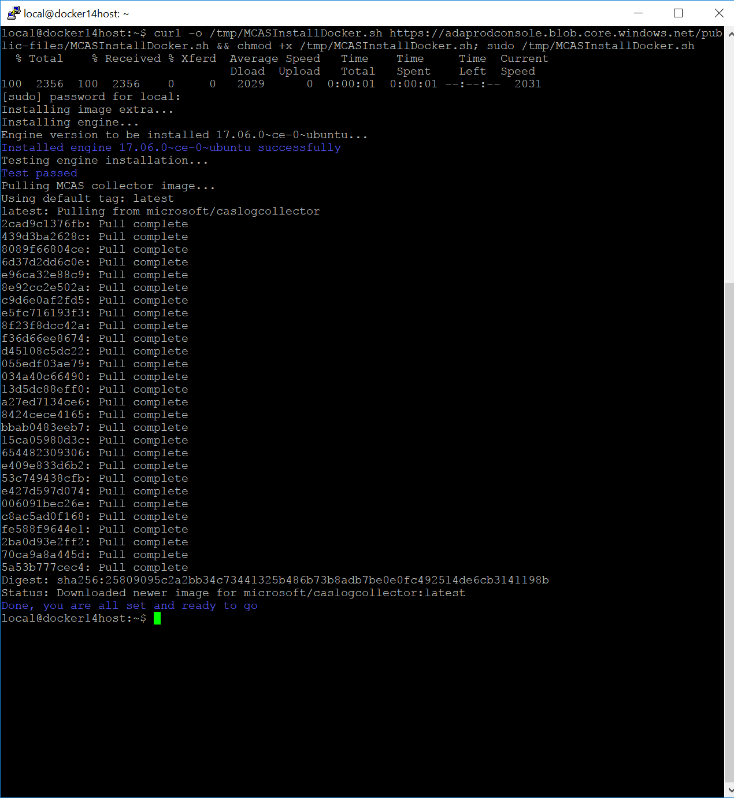

---
# required metadata

title: Configure automatic log upload using Docker in Azure 
description: This article describes the process configuring automatic log upload for continuous reports in Cloud App Security using a Docker on Ubuntu or RHEL in Azure.
keywords:
author: ShlomoSagir-MS
ms.author: shsagir
manager: ShlomoSagir-MS
ms.date: 7/18/2019
ms.topic: conceptual
ms.collection: M365-security-compliance
ms.prod:
ms.service: cloud-app-security
ms.technology:
ms.assetid: 9c51b888-54c0-4132-9c00-a929e42e7792

# optional metadata

#ROBOTS:
#audience:
#ms.devlang:
ms.reviewer: reutam
ms.suite: ems
#ms.tgt_pltfrm:
ms.custom: seodec18

---
# Set up and configuration on Ubuntu or RHEL in Azure

*Applies to: Microsoft Cloud App Security*

You can configure automatic log upload for continuous reports in Cloud App Security using a Docker on Ubuntu or Red Hat Enterprise Linux (RHEL) in Azure. This article describes how to set up the automatic log upload. 

## Prerequisites

<<<<<<< HEAD
- OS: Ubuntu 14.04 and 16.04 (for newer versions, contact support), RHEL 7.2 or higher, or CentOS 7.2 or higher
=======
- OS: Ubuntu 14.04 and 16.04 (for newer versions, contact support), or RHEL 7.2 or higher, or CentOS 7.2 or higher
>>>>>>> DOC-18 (Danny): Update log collector docs with CentOS

- Disk space: 250 GB

- CPU: 2

- RAM: 4 GB

- Set your firewall as described in [Network requirements](network-requirements.md#log-collector)

## Log collector performance

The Log collector can successfully handle log capacity of up to 50 GB per hour. The main bottlenecks in the log collection process are:

- Network bandwidth - Your network bandwidth determines the log upload speed.

- I/O performance of the virtual machine - Determines the speed at which logs are written to the log collector’s disk. The log collector has a built-in safety mechanism that monitors the rate at which logs arrive and compares it to the upload rate. In cases of congestion, the log collector starts to drop log files. If your setup typically exceeds 50 GB per hour, it's recommended that you split the traffic between multiple log collectors.

## Set up and configuration  

### Step 1 – Web portal configuration: Define data sources and link them to a log collector

1. Go to the **Automatic log upload** settings page. 

     a. In the Cloud App Security portal, click the settings icon followed by **Log collectors**.

      

2. For each firewall or proxy from which you want to upload logs, create a matching data source.

     a. Click **Add data source**.

      

     b. **Name** your proxy or firewall.

      

     c. Select the appliance from the **Source** list. If you select **Custom log format** to work with a network appliance that isn't listed, see [Working with the custom log parser](custom-log-parser.md) for configuration instructions.

     d. Compare your log with the sample of the expected log format. If your log file format doesn't match this sample, you should add your data source as **Other**.

     e. Set the **Receiver type** to either **FTP**, **FTPS**, **Syslog – UDP**, or **Syslog – TCP**, or **Syslog – TLS**.
     
     >[!NOTE]
     >Integrating with secure transfer protocols (FTPS and Syslog – TLS) often requires additional settings or your firewall/proxy.

     f. Repeat this process for each firewall and proxy whose logs can be used to detect traffic on your network. It's recommended to set up a dedicated data source per network device to enable you to:
     - Monitor the status of each device separately, for investigation purposes.
     - Explore Shadow IT Discovery per device, if each device is used by a different user segment.

     
3. Go to the **Log collectors** tab at the top.

     a. Click **Add log collector**.

     b. Give the log collector a **name**.

     c. Enter the **Host IP address** of the machine you'll use to deploy the Docker. The host IP address can be replaced with the machine name, if there is a DNS server (or equivalent) that will resolve the host name.

     d. Select all **Data sources** that you want to connect to the collector, and click **Update** to save the configuration see the next deployment steps.

      

     > [!NOTE]
     > - A single Log collector can handle multiple data sources.
     > - Copy the contents of the screen because you will need the information when you configure the Log Collector to communicate with Cloud App Security. If you selected Syslog, this information will include information about which port the Syslog listener is listening on.

4. Further deployment information will appear. **Copy** the run command from the dialog. You can use the copy to clipboard icon. 

5. **Export** the expected data source configuration. This configuration describes how you should set the log export in your appliances.

     

### Step 2 – Deployment of your machine in Azure

> [!NOTE]
> The following steps describe the deployment in Ubuntu. The deployment steps for other platforms are slightly different.

1. Create a new Ubuntu machine in your Azure environment. 
2. After the machine is up, open the ports by:

     a. In the machine view, go to **Networking** select the relevant interface by double-clicking on it.

     b. Go to **Network security group** and select the relevant network security group.

     c. Go to **Inbound security rules** and click **Add**,
      
      
    
     d. Add the following rules (in **Advanced** mode):

      |Name|Destination port ranges|Protocol|Source|Destination|
      |----|----|----|----|----|
      |caslogcollector_ftp|21|TCP|<Your appliance's IP address's subnet>|Any|
      |caslogcollector_ftp_passive|20000-20099|TCP|<Your appliance's IP address's subnet>|Any|
      |caslogcollector_syslogs_tcp|601-700|TCP|<Your appliance's IP address's subnet>|Any|
      |caslogcollector_syslogs_udp|514-600|UDP|<Your appliance's IP address's subnet>|Any|
      
      

3. Go back to the machine and click **Connect** to open a terminal on the machine.

4. Change to root privileges using `sudo -i`.

5. If you accept the [software license terms](https://go.microsoft.com/fwlink/?linkid=862492), uninstall old versions and install Docker CE by running the following command:
        
       curl -o /tmp/MCASInstallDocker.sh https://adaprodconsole.blob.core.windows.net/public-files/MCASInstallDocker.sh && chmod +x /tmp/MCASInstallDocker.sh; /tmp/MCASInstallDocker.sh

     

6. In the Cloud App Security portal in the **Create new log collector** window, copy the command to import the collector configuration on the hosting machine:

      

7. Run the command to deploy the log collector.
     
        (echo db3a7c73eb7e91a0db53566c50bab7ed3a755607d90bb348c875825a7d1b2fce) | docker run --name MyLogCollector -p 21:21 -p 20000-20099:20000-20099 -e "PUBLICIP='192.168.1.1'" -e "PROXY=192.168.10.1:8080" -e "CONSOLE=mod244533.us.portal.cloudappsecurity.com" -e "COLLECTOR=MyLogCollector" --security-opt apparmor:unconfined --cap-add=SYS_ADMIN --restart unless-stopped -a stdin -i microsoft/caslogcollector starter

     

8. To verify that the log collector is running properly, run the following command: `Docker logs <collector_name>`. You should get the results: **Finished successfully!**

   

### Step 3 - On-premises configuration of your network appliances

Configure your network firewalls and proxies to periodically export logs to the dedicated Syslog port of the FTP directory according to the directions in the dialog. For example:

    BlueCoat_HQ - Destination path: \<<machine_name>>\BlueCoat_HQ\

### Step 4 - Verify the successful deployment in the Cloud App Security portal

Check the collector status in the **Log collector** table and make sure the status is **Connected**. If it's **Created**, it's possible the log collector connection and parsing haven't completed.

 

You can also go to the **Governance log** and verify that logs are being periodically uploaded to the portal.

If you have problems during deployment, see [Troubleshooting Cloud Discovery](troubleshooting-cloud-discovery.md).

### Optional - Create custom continuous reports

Verify that the logs are being uploaded to Cloud App Security and that reports are generated. After verification, create custom reports. You can create custom discovery reports based on Azure Active Directory user groups. For example, if you want to see the cloud use of your marketing department, import the marketing group using the import user group feature. Then create a custom report for this group. You can also customize a report based on IP address tag or IP address ranges.

1. In the Cloud App Security portal, under the Settings cog, select Cloud Discovery settings, and then select **Continuous reports**. 
2. Click the **Create report** button and fill in the fields.
3. Under the **Filters** you can filter the data by data source, by [imported user group](user-groups.md), or by [IP address tags and ranges](ip-tags.md). 

     

## Next steps
[Troubleshooting Cloud Discovery docker deployment](troubleshoot-docker.md)

[Premier customers can also choose Cloud App Security directly from the Premier Portal](https://premier.microsoft.com/)

