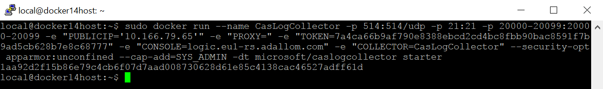

---
# required metadata

title: Configure automatic log upload for continuous reports | Microsoft Docs
description: This topic describes the process configuring automatic log upload for continuous reports in Cloud App Security using a Docker on Ubuntu.
keywords:
author: rkarlin
ms.author: rkarlin
manager: mbaldwin
ms.date: 10/9/2017
ms.topic: get-started-article
ms.prod:
ms.service: cloud-app-security
ms.technology:
ms.assetid: cc29a6cb-1c03-4148-8afd-3ad47003a1e3

# optional metadata

#ROBOTS:
#audience:
#ms.devlang:
ms.reviewer: reutam
ms.suite: ems
#ms.tgt_pltfrm:
#ms.custom:

---

# Set up and configuration on Ubuntu

> [!NOTE]
> This feature is being gradually rolled out across tenants. Contact support if you would like to be added to the preview.

## Technical requirements

-   OS: Ubuntu 14.04 or higher

-   Disk space: 250 GB

-   CPU: 2

-   RAM: 4 GB

-   Firewall settings:

    -   Allow the log collector to receive inbound FTP and Syslog traffic.

    -   Allow the log collector to initiate outbound traffic to the portal (for example contoso.cloudappsecurity.com) on port 443.

    - Allow the log collector to initiate outbound traffic to the Azure blob storage (https://adaprodconsole.blob.core.windows.net/) on port 80 and 443.

> [!NOTE]
> If your firewall requires a static IP address access list and does not support whitelisting based on URL, allow the log collector to initiate outbound traffic to the [Microsoft Azure datacenter IP ranges on port 443](https://www.microsoft.com/download/details.aspx?id=41653&751be11f-ede8-5a0c-058c-2ee190a24fa6=True).

## Log collector performance

The Log collector can successfully handle log capacity of up to 50 GB per hour. The main bottlenecks in the log collection process are:

-   Network bandwidth - your network bandwidth determines the log upload speed.

-   I/O performance of the virtual machine allocated by your IT - determines the speed at which logs are written to the log collector’s disk. The log collector has a built-in safety mechanism that monitors the rate at which logs arrive and compares it to the upload rate. In cases of congestion, the log collector starts to drop log files. If your setup generally exceeds 50 GB per hour, it is recommended that you split the traffic between multiple log collectors.

## Set up and configuration  

### Step 1 – Web portal configuration: Define data sources and link them to a log collector

1.  Go to the automated upload setting page:    In the Cloud App Security portal, click the settings icon  followed by **Log collectors**.

2.  For each firewall or proxy from which you want to upload logs, create a matching data source:

    

    a. Click **Add data source**.

    b. **Name** your proxy or firewall.

    c. Select the appliance from the **Source** list. If you select **Custom log format** to work with a network appliance that is not specifically listed, see [Working with the custom log parser](custom-log-parser.md) for configuration instructions.

    d. Compare your log with the sample of the expected log format. If your log file format does not match this sample, you should add your data source as **Other**.

    e. Set the **Receiver type** to either **FTP**, **FTPS**, **Syslog – UDP**, or **Syslog – TCP**, or **Syslog – TLS**.
    >[!NOTE]
    >Integrating with secure transfer protocols (FTPS and Syslog – TLS) often requires additional settings or your firewall/proxy.

    f. Repeat this process for each firewall and proxy whose logs can be used to detect traffic on your network.

3.  Go to the **Log collectors** tab at the top.

    a. Click **Add log collector**.

    b. Give the log collector a **name**.

    c. Enter the **Host IP address** of the machine you will use to deploy the Docker.

    d. Select all **Data sources** that you want to connect to the collector, and click **Update** to save the configuration see the next deployment steps.

    

    >  [!NOTE]
    > - A single Log collector can handle multiple data sources.
    >- Copy the contents of the screen because you will need the information when you configure the Log Collector to communicate with Cloud App Security. If you selected Syslog, this information will include information about which port the Syslog listener is listening on.

4.  Further deployment information will appear.

 

5.  **Copy** the run command from the dialog. You can use the copy to clipboard icon .

6.  **Export** the expected data source configuration. This configuration describes how you should set the log export in your appliances.

  

### Step 2 – On-premises deployment of your machine

> [!Note]
> The following steps describe the deployment in Ubuntu. The deployment steps for other platforms are slightly different.

1.  Open a terminal on your Ubuntu machine.

2.  Change to root privileges using the command: `sudo -i`

3.  Uninstall old versions and install Docker CE by running the following command:

    `curl -o /tmp/MCASInstallDocker.sh
    https://adaprodconsole.blob.core.windows.net/public-files/MCASInstallDocker.sh
    && chmod +x /tmp/MCASInstallDocker.sh; sudo /tmp/MCASInstallDocker.sh`

    

4.  Deploy the collector image using the run command generated in the portal.

    

    >[!NOTE]
    >If you need to configure a proxy add the proxy IP address and port under. For example, if your proxy details are 192.168.10.1:8080, your updated run command is:  
     `sudo docker run --name MyLogCollector -p 21:21 -p 20000-20099:20000-20099 -e
    "PUBLICIP='192.168.1.1'" -e "PROXY=192.168.10.1:8080" -e
    "TOKEN=41f8f442c9a30519a058dd3bb9a19c79eb67f34a8816270dc4a384493988863a" -e
    "CONSOLE=tenant2.eu1-rs.adallom.com" -e "COLLECTOR=MyLogCollector" --security-opt
    apparmor:unconfined --cap-add=SYS_ADMIN -dt microsoft/caslogcollector starter`

    

5.  Verify that the collector is running properly by running the following command: `docker logs \<collector_name\>`

You should see the message: **Finished successfully!**

  

### Step 3 - On-premises configuration of your network appliances

Configure your network firewalls and proxies to periodically export logs to the dedicated Syslog port of the FTP directory according to the directions in the dialog, for example:

    BlueCoat_HQ - Destination path: \<<machine_name>>\BlueCoat_HQ\

### Step 4 - Verify the successful deployment in the Cloud App Security portal

Check the collector status in the **Log collector** table and make sure the status is **Connected**. If it is **Created**, it is possible that the log collector connection and parsing has not completed.

 

You can also go to the **Governance log** and verify that logs are being
periodically uploaded to the portal.

If you encounter problems during deployment, see [Troubleshooting Cloud
Discovery](troubleshooting-cloud-discovery.md).

### Optional - Create custom continuous reports

After you have verified that the logs are being uploaded to Cloud App Security and the reports are being generated, you can create custom reports. You can now create custom discovery reports based on Azure Active Directory user groups. For example, if you want to see the cloud use of your marketing department, you can import the marketing group using the import user group feature, and then create a custom report for this group. You can also customize a report based on IP address tag or IP address ranges.

1. In the Cloud App Security portal, under the Settings cog, select **Cloud Discovery settings** and then select **Manage continuous reports**. 
2. Click the **Create report** button and fill in the fields.
3. Under the **Filters** you can filter the data by data source, by [imported user group](user-groups.md), or by [IP address tags and ranges](ip-tags.md). 

## See Also
[Working with Cloud Discovery
data](working-with-cloud-discovery-data.md)  
[For technical support, please visit the Cloud App Security assisted support
page](http://support.microsoft.com/oas/default.aspx?prid=16031)  
[Premier customers can also choose Cloud App Security directly from the Premier
Portal](https://premier.microsoft.com/)

